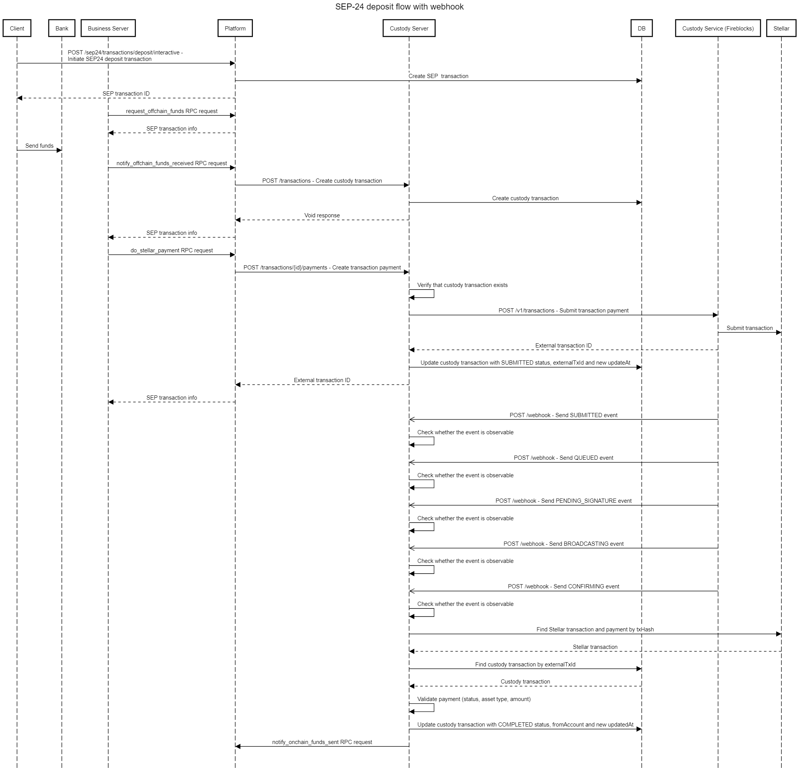
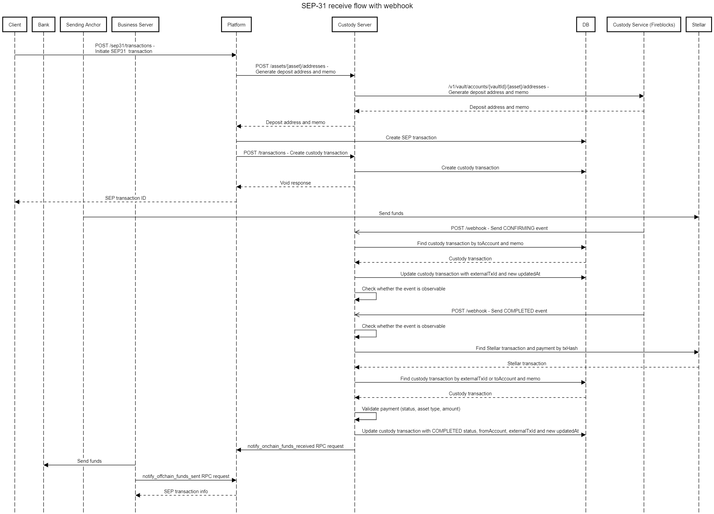

import { CodeExample } from "@site/src/components/CodeExample";

[comment]: # "Sequence diagram definitions are located in /static/definitions folder"
[comment]: # "To updated them, use https://sequencediagram.org"

### SEP-24 deposit flow with webhook:

- request_offchain_funds
- notify_offchain_funds_received
- do_stellar_payment
- notify_onchain_funds_sent 
   

### SEP-24 deposit flow with reconciliation job:

- request_offchain_funds
- notify_offchain_funds_received
- do_stellar_payment
- notify_onchain_funds_sent 
   

### SEP-24 withdrawal flow with webhook:

- do_stellar_payment
- notify_onchain_funds_received
- notify_offchain_funds_sent 
   

### SEP-24 withdrawal flow with reconciliation job:

- request_onchain_funds
- notify_onchain_funds_received
- notify_offchain_funds_sent 
   

### SEP-31 receive flow with webhook:

- notify_onchain_funds_received
- notify_offchain_funds_sent 
   

### SEP-31 receive flow with reconciliation job:

- notify_onchain_funds_received
- notify_offchain_funds_sent 
