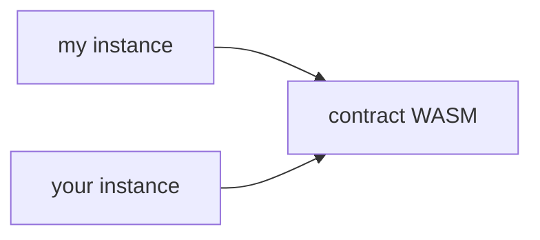

As you can imagine, if your deployed contract instance or the code that backs it is archived, it can't be loaded to execute your invocations. Remember, there's a distinct, one-to-many relationship on the chain between a contract's code and deployed instances of that contract:



We need **both** to be live for our contract calls to work.

Let's work through how these can be recovered. The recovery process is slightly different for a convenient reason: we don't need simulation to figure out the footprints. Instead, we can leverage [`Contract.getFootprint()`](https://stellar.github.io/js-soroban-client/Contract.html#getFootprint), which prepares a footprint with the ledger keys used by a given contract instance (including its backing WASM code).

Unfortunately, we still need simulation to figure out the _fees_ for our restoration. This, however, can be easily covered by the SDK's [`Server.prepareTransaction()`](https://stellar.github.io/js-soroban-client/Server.html#prepareTransaction) helper, which will do simulation and assembly for us.

:::info

This guide makes use of the (aptly named) `submitTx` function we created in [another guide](../transactions/submit-transaction-wait-js.mdx).

:::

```typescript
import {
  BASE_FEE,
  Contract,
  Keypair,
  Networks,
  TransactionBuilder,
  SorobanDataBuilder,
  Operation
} from "@stellar/stellar-sdk";
import { Server, Api } from "@stellar/stellar-sdk/rpc";

const server = new Server("https://soroban-testnet.stellar.org");

async function restoreContract(
  signer: Keypair,
  c: Contract,
): Promise<Api.GetTransactionResponse> {
  const instance = c.getFootprint();

  const account = await server.getAccount(signer.publicKey());
  const wasmEntry = await server.getLedgerEntries(
    getWasmLedgerKey(instance)
  );

  const restoreTx = new TransactionBuilder(account, { fee: BASE_FEE })
    .setNetworkPassphrase(Networks.TESTNET)
    .setSorobanData(
      // Set the restoration footprint (remember, it should be in the
      // read-write part!)
      new SorobanDataBuilder().setReadWrite([
        instance,
        wasmEntry
      ]).build(),
    )
    .addOperation(Operation.restoreFootprint({}))
    .build();

  const preppedTx = await server.prepareTransaction(restoreTx);
  preppedTx.sign(signer);
  return submitTx(preppedTx);
}

function getWasmLedgerKey(entry: xdr.ContractDataEntry):  {
  return xdr.LedgerKey.contractCode(
    new xdr.LedgerKeyContractCode({
      hash: entry.val().instance().wasmHash()
    })
  );
}
```
