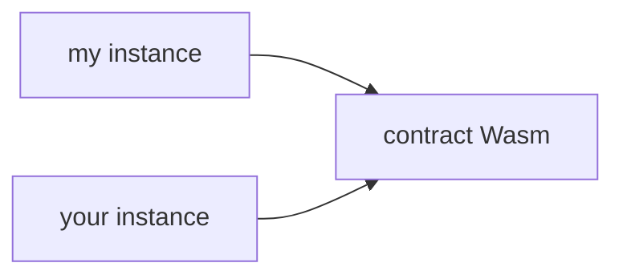

This section provides an overview of Stellar contracts, outlining their key concepts of smart contracts on the Stellar network.

Learn to write your first Stellar smart contract in the [Getting Started Guide](../../../build/smart-contracts/getting-started/setup.mdx).

## Smart Contract in WebAssembly (Wasm)

A smart contract on Stellar is a programmable set of executable binary in WebAssembly (Wasm). WebAssembly (Wasm) is a lightweight, portable binary instruction format designed for high-performance execution across various environments, including blockchains, web browsers, and cloud services. In Stellar, Wasm serves as the foundation for smart contracts by enabling a secure and efficient execution environment.

- **Compilation**: Once smart contract is written in a supported language, such as Rust, the contract is compiled into a Wasm executable file. This file contains low-level bytecode that can be efficiently executed within a sandboxed environment.
- **Upload and stored**: After compilation, the Wasm executable is first uploaded on the Stellar network, where it is stored in a `CONTRACT_DATA` ledger entry. The `CONTRACT_DATA` ledger entry is created to store the Wasm binary data.
- **Unique hash is created**: An unique identifier for this `CONTRACT_DATA` entry is the hash of the executable file, called `Wasm hash`. To note, this binary executable is stored independently from its deployed contract(s).
- **Multiple contract instances**: Multiple contract instances can be deployed that references the same Wasm bytecode, with each instances maintaining its own contract storage, state, and configurations.

## Contract Instances

After the executable bytecode is uploaded on-chain, contract instances can be deployed that reference the same bytecode. **A contract Wasm executable can have a one-to-many relationship with its contract instances which function independently.** This means the same executable code can be used by multiple contract instances that all behave identically, because of the shared executable code, while maintaining separate and distinct state data, because the data is tied to the contract instance. A contract instance is stored as its own ledger entry, and any of the contract's instance storage is stored in that same ledger entry alongside the contract instance. Therefore, data stored in contract's instance storage has a TTL as the contract instance itself. If a contract is live and unexpired, the instance storage is guaranteed to be available as well.

:::info Important Takeway

The Wasm bytecode itself is stored separately from the deployed contract instances. This separation allows multiple contract instances to reference the same Wasm executable while maintaining their own contract storage, state, and configurations.

:::

## Contract Storage

In addition to the ledger entries that are created during the contract upload/deploy process, each contract can create and access its own set of ledger entries. These ledger entries (as well as the contract code and the contract instance ledger entries) are subject to [state archival](./storage/state-archival.mdx) lifetimes, or TTL (time-to-live) behavior. Each storage type has distinct fee structures, TTL (time-to-live) behavior, and is designed to store specific types of data. Using the incorrect storage can lead to logical errors in your application, in addition to impacting costs.

| **Attribute** | **Temporary Storage** | **Persistent Storage** | **Instance Storage** |
| --- | --- | --- | --- |
| **Fees** | Cheapest | Most expensive (same as Instance) | Most expensive (same as Persistent) |
| **Persistence** | Permanently deleted when TTL ledger is reached | Can be archived even if contract instance is active. Lifetime is independent from contract instance. | Shares the lifetime of the contract instance. Data accessible if instance TTL not reached. |
| **Recovery** | Cannot be restored | `RestoreFootprintOp` | `extendFootprintTTLOp` |
| **Capacity** | Unlimited | Unlimited | Limited |
| **Use Cases** | Time-bounded or easily re-creatable data (e.g. price oracles, signatures). Not suitable for correctness checks | Long-term user data that must persist beyond TTL (e.g. balances) | Shared contract state tied to contract instance (e.g. admin accounts, contract metadata) |

## Invoke Contracts

Now that you have learned the basics of a Stellar contract, let's understand some concepts about contract invocation. When a transaction attempts invokes a function on the contract, the Wasm bytecode is first retrieved from the ledger, and a secure, isolated runtime virtual machine ("VM") is instantiated so it can run the bytecode for the contract and then exit. This approach offers several benefits, including security as the virtual machine (VM) operates in a sandboxed environment and provides deterministic execution.

To test out invoking contracts on Testnet, please see [Stellar Lab's contract explorer](https://lab.stellar.org/smart-contracts/contract-explorer?$=network$id=testnet&label=Testnet&horizonUrl=https:////horizon-testnet.stellar.org&rpcUrl=https:////soroban-testnet.stellar.org&passphrase=Test%20SDF%20Network%20/;%20September%202015;&smartContracts$explorer$contractId=CB2RXGQVNGOMHW3XYCPKREXHD45M4DMJ2PTBETV6P3EMV22QLJFUQHWB;;).

## Contract Info

A Stellar contract's Wasm contains dedicated custom sections. They provide useful meta data that implementations can make use of to improve user experience.

- Environment Meta
- Contract Meta
- Contract Spec

_Explore contract info at [Stellar Lab's Contract Explorer](https://lab.stellar.org/smart-contracts/contract-explorer)._

### Environment Meta

Contracts must contain a Wasm custom section with name `contractenvmetav0` and containing a serialized `SCEnvMetaEntry`. The interface version stored within should match the version of the host functions supported. For reference, please see [CAP-46-1 Env Meta](https://github.com/stellar/stellar-protocol/blob/603a55b018a8ce12ac16aa8621d189d5b78d0d02/core/cap-0046-01.md?plain=1#L508).

To view the Environment Meta, please consider using Stellar Lab's Contract Explorer, or Stellar CLI's command `stellar contract info env-meta --contract-id <contract-id>`.

### Contract Meta

Contracts can optionally include a custom Wasm section named `contractmetav0`, which contains a serialized `SCMetaEntry`. This section is not used by the network itself, but allows contracts to embed arbitrary metadata, including contract name, version, author, supported interfaces, source repo, or home domain. Applications and tooling can read this metadata to provide richer developer experiences, better indexing, or enhanced contract discovery. For reference, please see [SEP-46 Contract Meta](https://github.com/stellar/stellar-protocol/blob/master/ecosystem/sep-0046.md).

To add metadata to Contract Meta, please use the Stellar CLI command `stellar contract build --meta <meta>`, or use the Rust SDK (e.g. `contractmeta!(key="name", val="Defi Swap Contract")`).

To view the Contract Meta, please use the Stellar Lab's Contract Explorer, or the Stellar CLI command `stellar contract info meta --contract-id <contract-id>`.

### Contract Spec

Contracts should contain a Wasm custom section with name `contractspecv0` and containing a serialized stream of [`SCSpecEntry`](https://github.com/stellar/stellar-xdr/blob/next/Stellar-contract-spec.x). There should be a [`SCSpecEntry`](https://github.com/stellar/stellar-xdr/blob/next/Stellar-contract-spec.x) for every function, struct, and union exported by the contract. For reference, please see [SEP-48 Contract Interface Specification](https://github.com/stellar/stellar-protocol/blob/master/ecosystem/sep-0048.md).

A contract spec is just like an ABI (Application Binary Interface) in Ethereum. It is a standardized description of a smart contract's interface, typically in JSON format or XDR format. It defines the contract's functions, data structures, events, and errors in a way that external applications can understand and use.

When you compile a smart contract using the Rust SDK, the resulting Wasm file includes a special section containing a complete description of your contract's interface types. This is often referred to as the contract's `spec` or `contract spec`. Stellar smart contract specification, known as the `contract spec`, is a foundational element for interacting with contracts and for building dApps on the Stellar network. The contract Spec provides a robust and fully typed definitions for interacting with smart contracts, offering functionality equivalent to Ethereum's ABI while addressing its limitations.

The contract spec serves as a standardized interface for interacting with Stellar smart contracts. Similar to Ethereum's ABIs, but with key advantages:

- On-chain Availability: Every contract spec is stored on-chain
- Developer Comments: Comments from the contract author are preserved
- Seamless communication between contracts and external applications
- Ecosystem-wide compatibility with tools like wallets, explorers, and SDKs

This standardization simplifies integrations and accelerates the development process.

#### Fully Typed Contract Definitions

The Contract Spec enforces fully typed definitions for all contract functions, inputs, and outputs. This ensures that:

- Developers can define contract behavior explicitly, reducing ambiguity.
- Type mismatches and runtime errors are minimized, leading to more reliable smart contracts.
- Tools can provide intelligent suggestions and validations during development.

By embedding type safety at the protocol level, Stellar’s Contract Spec creates a more predictable and robust development environment.

#### Comparison to Ethereum ABI

Stellar’s Contract Spec shares many similarities with Ethereum’s ABI but also introduces enhancements:

| Feature                 | Ethereum ABI       | Stellar Contract Spec       |
| ----------------------- | ------------------ | --------------------------- |
| Fully typed contracts   | Partial            | Yes                         |
| Decoding and validation | Manual or external | Built-in                    |
| Security focus          | Moderate           | High (type safety enforced) |

#### Generating contract specs

[The Stellar CLI](https://github.com/stellar/stellar-cli) provides a command to generate a contract spec from a contract's source code. This process is easy but requires you to have the Wasm binary of the contract.

Sometimes, you may not have access to the contract's source code or the ability to compile it. In such cases, you must use the [`stellar contract fetch`](../../../tools/cli/stellar-cli.mdx#stellar-contract-fetch) command to download the contract's Wasm binary and generate the spec.

Finally, we use the [`stellar bindings`](../../../tools/cli/stellar-cli.mdx#stellar-contract-bindings-json) command to generate the contract spec from the Wasm binary.

The Stellar Lab has a [Contract Explorer](https://lab.stellar.org/smart-contracts/contract-explorer) also provides the ability to view and to download a contract's contract spec.

:::note

Having read the introduction of a Stellar contract, let's try to write a smart contract by following the [Getting Started guide](../../../build/smart-contracts/getting-started/README.mdx).

:::
