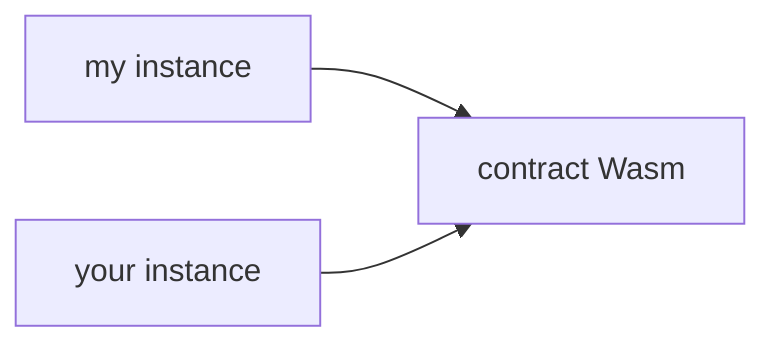

:::note

Stellar has integrated a smart contracts platform called "Soroban" into the core protocol. Write a smart contract on Stellar by following this [Getting Started guide](../../../build/smart-contracts/getting-started/README.mdx).

:::

A smart contract is a programmed set of executable code and state that can be invoked or used on the Stellar network.

## WebAssembly (Wasm)

Once a smart contract has been written by a developer and compiled into a Wasm executable file, it can then be "installed" onto the Stellar network. A `CONTRACT_DATA` [ledger entry](./ledgers.mdx) is created to store this binary data and its unique identifier is the hash of the executable file. This binary executable is stored independently from its deployed contract(s). When a Stellar transaction attempts to invoke a contract function, the Wasm bytecode is first retrieved from the ledger and a secure, isolated runtime virtual machine ("VM") is instantiated so it can run the bytecode for the contract and then exit.

## Contract instances

After the executable bytecode is installed on-chain, contract instances can be deployed that reference the aformentioned bytecode. A smart contract executable can have a one-to-many relationship with "contract instances" which function independently. This means the same executable code can be used by multiple contract instances that all behave identically (because of the shared executable code), while maintaining separate and distinct state data (because the data is tied to the contract instance). A contract instance is stored as its own ledger entry, and any of the contract's [instance storage](#instance-storage) is stored in that same ledger entry alongside the contract instance.

## Contract storage

In addition to the ledger entries that are created during the contract install/deploy process, each contract can create and access its own set of ledger entries. These ledger entries (as well as the contract code and the contract instance ledger entries) are subject to [state archival](../../encyclopedia/storage/state-archival.mdx) lifetimes (a ledger entry's "TTL ledger"). While they all function similarly, each type has its own fee and TTL behavior.

### Temporary storage

- Cheapest fees.
- Permanently deleted when its TTL ledger is reached, cannot be restored.
- Suitable for time-bounded data (i.e. price oracles, signatures, etc.) and easily recreateable data.
- Unlimited amount of storage.

### Persistent storage

- Most expensive fees (same price as `Instance` storage).
- Recoverable after archival, can be restored using the [`RestoreFootprintOp`](../transactions/list-of-operations.mdx#restore-footprint) operation.
- Does not share the same lifetime as the contract instance. If the contract instance has not reached its TTL ledger, `Persistent` data may still be archived and need to be restored before invoking the contract.
- Unlimited amount of storage.
- Suitable for user data that cannot be `Temporary` (i.e. balances).

### Instance storage

:::info

While we are making a distinction here between "persistent" and "instance" storage, instance storage is really just a convenient, abstracted type of persistent storage. Under the hood, the instance storage works the same as persistent storage, except its own TTL is tied to that of the contract instance.

:::

- Most expensive fees (same price as `Persistent` storage).
- Recoverable after archival, can be restored using the [`extendFootprintTTLOp`](../transactions/list-of-operations.mdx#extend-footprint-ttl) operation.
- Shares the same lifetime as the contract instance. If the contract instance has not reached its TTL ledger, instance data is guaranteed to be accessible.
- Limited amount of storage available.
- Suitable for "shared" contract state that cannot be `Temporary` (i.e. admin accounts, contract metadata, etc.).
