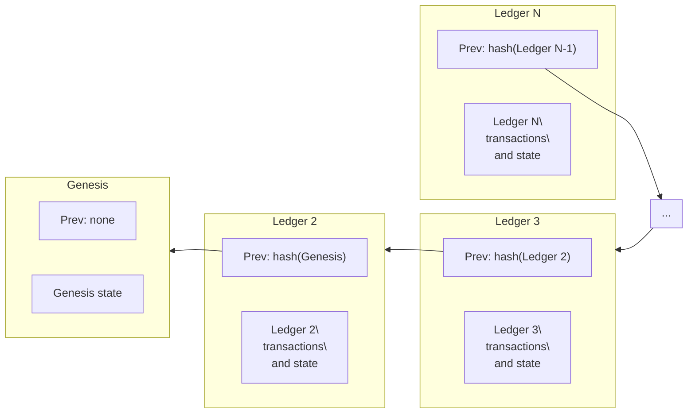

# Ledger Headers

Every ledger has a header that references the data in that ledger and the previous ledger. These references are cryptographic hashes of the content which behave like pointers in typical data structures but with added security guarantees. Think of a historical ledger chain as a linked list of ledger headers. Time flows forward from left to right, hashes point backwards in time, from right to left. Each hash in the chain links a ledger to its previous ledger, which authenticates the entire history of ledgers in its past:

The genesis ledger has a sequence number of 1. The ledger directly following a ledger with sequence number `N` has a sequence number of `N + 1`. Ledger `N + 1` contains a hash of ledger `N` in its previous ledger field.

## Consensus Fields

### Version

The protocol version of this ledger.

### Previous Ledger Hash

Hash of the previous ledger.

### SCP Value

During consensus, all the validating nodes in the network run SCP and agree on a particular value, which is a transaction set they will apply to a ledger. This value is stored here and in the following three fields (transaction set hash, close time, and upgrades).

### Transaction Set Hash

Hash of the transaction set applied to the previous ledger.

### Transaction Set Result Hash

Hash of the results of applying the transaction set. This data is not necessary for validating the results of the transactions. However, it makes it easier for entities to validate the result of a given transaction without having to apply the transaction set to the previous ledger.

### Close Time

The close time is a UNIX timestamp indicating when the ledger closes. Its accuracy depends on the system clock of the validator proposing the block. Consequently, SCP may confirm a close time that lags a few seconds behind or up to 60 seconds ahead. It is strictly monotonic - guaranteed to be greater than the close time of an earlier ledger.

### Upgrades

How the network adjusts overall values (like the base fee) and agrees to network-wide changes (like switching to a new protocol version). This field is usually empty. When there is a network-wide upgrade, the SDF will inform and help coordinate participants using the #validators channel on the Dev Discord and the Stellar Validators Google Group.

### Bucket List Hash

Hash of all the objects in this ledger. The data structure that contains all the objects is called the bucket list.

### Ledger Sequence

The sequence number of this ledger.

### Total Coins

Total number of lumens in existence.

### Fee Pool

Number of lumens that have been paid in fees. Note this is denominated in lumens, even though a transaction's fee field is in stroops.

### Inflation Sequence

Number of times inflation has been run. The inflation operation was stopped when validators voted to upgrade the network to Protocol 12 on 28 Oct 2019. This number does not change without inflation.

### ID Pool

The last used global ID. These IDs are used for generating objects. The number is a single monotonically increasing counter which corresponds to unique identifiers like OfferIDs or ClaimableBalanceIDs.

### Maximum Number of Transactions

The maximum number of operations validators have agreed to process in a given ledger. If more transactions are submitted than this number, the network will enter surge pricing mode. For more about surge pricing and fee strategies, see the [Fees section](../../fees-resource-limits-metering.mdx).

### Base Fee

The fee the network charges per operation in a transaction. Calculated in stroops. See the [Fees section](../../fees-resource-limits-metering.mdx) for more information.

### Base Reserve

The reserve the network uses when calculating an account's minimum balance.

### Skip List

Hashes of ledgers in the past. Intended to accelerate access to past ledgers without walking back ledger by ledger. Currently unused.

## Extension Flags

A field that validators can flip through `LEDGER_UPGRADE_FLAGS`, directly changing header flags bitmasks. Unlike the config settings above, these are not durable ledger entries with keys and tunable parameters. This feature can be extended like all of the [Ledger Entries](./entries.mdx) for arbitrary future expansion of network functions that could require an "emergency switch."
