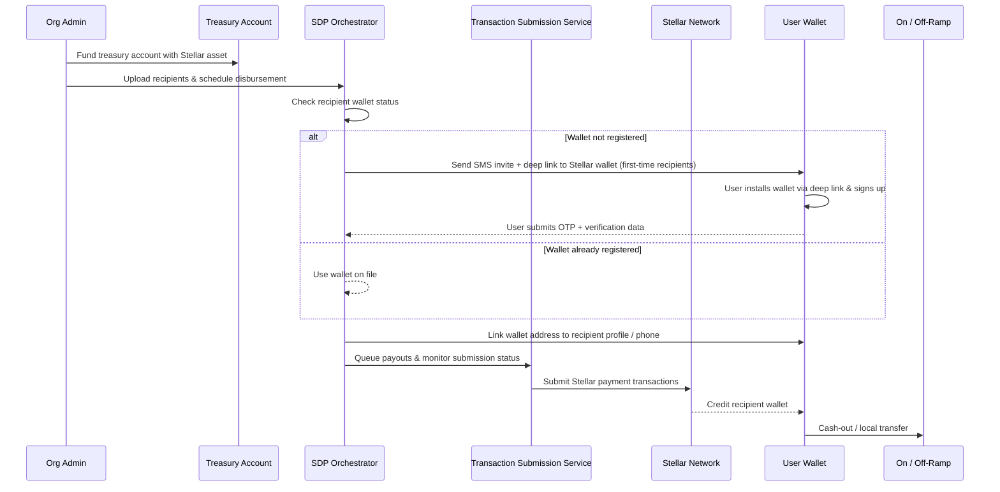

## What is SDP?

The Stellar Disbursement Platform (SDP) is an orchestration layer for sending bulk payments over the Stellar network, combining operator-facing dashboards with APIs that cover onboarding, compliance, and funds delivery. It removes the friction of high-volume disbursements—recipient messaging, wallet registration, treasury controls, and Stellar transaction submission—so organizations can stand up programs quickly. SDP is built for NGOs, fintech platforms, payroll teams, and marketplaces that need predictable, traceable payouts without building Stellar plumbing themselves.

## When to Use SDP

SDP is the right fit when you need:

- **Humanitarian aid / cash assistance:** Register recipients with OTP-secured flows, send invite messages over SMS or WhatsApp, and push scheduled disbursements as soon as wallets are verified (while still handling admin notifications over email).
- **Payroll or stipend programs:** Enforce MFA and reCAPTCHA for admins, expose Prometheus metrics for reliability teams, and keep treasury funds in a managed hot wallet while still settling quickly on Stellar.
- **Merchant, gig, or platform payouts:** Use the Admin/Dashboard APIs plus native SEP-10/SEP-24 flows so funds land in trusted anchors, connect to custody or off-ramps, and deliver global payouts through a single control plane.

## What SDP Does Well

- High-volume batch payments with queueing, schedulers, and automated submission to Stellar ledgers.
- Compliance-friendly flows (MFA, reCAPTCHA, SEP-10 auth, SEP-24 interactive deposits, trusted wallets).
- Fast settlement via Stellar with real-time monitoring from the Transaction Submission Service.
- Integrations across custody, wallets, and fiat ramps with configurable messaging channels.
- Clear Admin/Dashboard APIs and Prometheus metrics for observability.
- Works globally with multi-tenant isolation via tenant-specific schemas and tunable resource limits per deployment.

## Key Features

### Core

- Admin API for tenant provisioning and Dashboard API for operator workflows.
- Message Service for invitations, OTPs, and notifications via AWS SES, Twilio SendGrid, Twilio SMS/WhatsApp, and AWS SNS.
- Wallet Registration UI hosted by SDP so recipients can self-serve verification and connect Stellar wallets.
- Native SEP-10/SEP-24 endpoints plus `stellar.toml` generation for wallet compatibility.
- Transaction Submission Service (TSS) that picks up queued payouts, submits them to Stellar, and feeds back status.

### Enterprise

- Environment- or tenant-level controls for MFA, reCAPTCHA, and wallet policies, with guidance on hot vs. cold treasury wallets.
- Multi-tenant mode with isolated admin, TSS, and tenant schemas inside Postgres plus per-tenant configuration.
- Helm, Docker Compose, and CLI tooling for reproducible deployments and migrations.

### Operational

- Scheduler-driven jobs for invitations, payment submission, and reconciliation, each with tunable intervals.
- Tunable PostgreSQL connection pools to keep multi-tenant workloads stable.
- Prometheus metrics export plus extensible APIs for external automation.

## Architecture at a High Level

- **SDP Orchestrator:** Core services plus the Transaction Submission Service manage recipient onboarding, messaging, scheduling, and Stellar transaction lifecycles.
- **Treasury Account:** Organizations fund payouts from a controlled hot wallet, with policies to move excess funds to cold custody.
- **User & Trusted Wallets:** Recipient's wallet to receive funds and initiate local off-ramp journeys.
- **On/Off-Ramps & Stellar:** Anchors, custody providers, or fiat ramps bridge SDP-managed payouts to local rails while Stellar provides fast, low-cost settlement.

The entire SDP step-by-step process usually looks something like the following after the SDP is deployed and organizational users have been set up:

1. The organization funds the SDP’s distribution account with a Stellar-based asset (e.g. USDC)
2. An administrator logs in to the SDP’s dashboard and uploads a CSV file containing the payment information to initiate a new disbursement
3. The SDP sends a text message to every first-time recipient in the CSV inviting them to download a Stellar-enabled wallet application
4. Meanwhile, the SDP immediately begins making payments to each recipient that already has a wallet registered to them
5. Each first-time recipient clicks a deep link to download the Stellar-enabled wallet application chosen by the organization for this disbursement, downloads the app, and goes through the wallet sign-up process
6. Once the recipient has signed up and their Stellar account has been created, the wallet immediately authenticates with the SDP using parameters from the deep link and opens the SDP registration web view for the recipient to complete verification
7. The user confirms their identity by providing an OTP code sent to their phone number and an additional piece of verification information for security purposes. The SDP supports three different types of verification information: Date of Birth, Personal PIN, and National ID. This information is input by the recipient in a web flow and passes directly to the SDP, meaning the wallet does not need to process or store this information.
8. The SDP verifies the recipient’s information. If it matches the information from the CSV, the SDP automatically makes the payment to the recipient’s Stellar account
