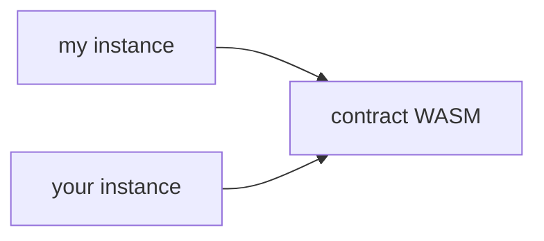

    <head>
          <title>Smart contract state archival.</title>

  <meta charSet="utf-8" />
  <meta property="og:title" content="Smart contract state archival." />
  <meta
          property="og:description"
          content="Learn about how state archival works on the Soroban smart contract platform."
        />
  <link
    rel="canonical"
    href="https://soroban.stellar.org/docs/soroban-internals/state-archival"
  />
</head>

Contract data is made up of three different types: `Persistent`, `Temporary`, and `Instance`. In a contract, these are accessed with `env.storage().persistent()`, `env.storage().temporary()`, and `env.storage().instance()` respectively; see the [`storage()` docs](https://docs.rs/soroban-sdk/latest/soroban_sdk/storage/struct.Storage.html).

All contract data has a Time To Live (TTL) that must be periodically extended. If an entry's TTL is not periodically extended, the entry's TTL will eventually go to 0 and either become "archived" or permanently deleted depending on the storage type. Each type of storage functions similarly, but has different fees and archival behavior:

- When a `Temporary` entry's TTL is 0, it is deleted from the ledger and is permanently inaccessible.
- When a `Persistent` or `Instance` entry TTL is 0, it becomes inaccessible and is "archived", but can be "restored" and used again via the [`RestoreFootprintOp`].

## Contract Data Type Descriptions

The general usage and interface are identical for all storage types. They differ only in fees and archival behavior as follows:

### `Temporary`

- Cheapest fees.
- Permanently deleted when TTL goes to 0, cannot be restored.
- Suitable for time-bounded data (i.e. price oracles, signatures, etc.) and easily recreateable data.
- Unlimited amount of storage.

### `Instance`

- Most expensive fees (same price as `Persistent` storage).
- Archived when TTL goes to 0, can be restored using the [`RestoreFootprintOp`] operation.
- Shares the same TTL as the contract instance. If the contract instance has not been archived, instance data is guaranteed to be accessible and not archived.
- Limited amount of storage available.
- Suitable for "shared" contract state that cannot be `Temporary` (i.e. admin accounts, contract metadata, etc.).

### `Persistent`

- Most expensive fees (same price as `Instance` storage).
- Archived when TTL goes to 0, can be restored using the [`RestoreFootprintOp`] operation.
- Does not share the same TTL as the contract instance. If the contract instance is not archived, `Persistent` data may be archived and need to be restored before invoking the contract.
- Unlimited amount of storage.
- Suitable for user data that cannot be `Temporary` (i.e. balances).

## Contract Data Best Practices

As a general rule, `Temporary` storage should only be used for data that can be easily recreated or is only valid for a period of time, whereas `Persistent` or `Instance` storage should be used for data that cannot be recreated and should be kept permanently, such as a user's token balance.

Each storage type is in a separate key space. To demonstrate this, see the code snippet below:

```rust
const EXAMPLE_KEY: Symbol = symbol_short!("KEY");
env.storage().persistent().set(&EXAMPLE_KEY, 1);
env.storage().temporary().set(&EXAMPLE_KEY, 2);

env.storage().persistent().get(&EXAMPLE_KEY); // Returns Ok(1)
env.storage().temporary().get(&EXAMPLE_KEY); // Returns Ok(2)
```

All `Instance` storage is stored in a single contract instance `LedgerEntry` and shares a single TTL. This means that one call to `Env.storage().instance().extend_ttl()` will extend the TTL of all `Instance`
entries, as well as the contract instance itself. For `Temporary` and `Persistent` storage, each entry has its own TTL and must be extended individually. The interface is slightly different and takes the key
of the entry being extended as well as the TTL extension value.

A call to `extend_ttl(N)` ensures that the current TTL of the contract instance entry is _at least_ N ledgers. For example, if `extend_ttl(100)` is called and the contract instance entry has a current TTL of 50 ledgers, the TTL will be extended up to 100 ledgers. If `extend_ttl(100)` is called and the contract instance entry has a current TTL of 150 ledgers, the TTL will not be extended and the `extend_ttl()` call is a no-op.

In addition to contract-defined TTL extensions using the `extend_ttl()` function, a contract data entry's TTL can be extended via the [`ExtendFootprintTTLOp`] operation.

## Terms and Semantics

### Live Until Ledger

Each `ContractData` and `ContractCode` entry has a `liveUntilLedger` field stored in its `LedgerEntry`.
The entry is no longer live (i.e. either archived or deleted depending on storage type) when `current_ledger > liveUntilLedger`.

### TTL

An entry's Time To Live (TTL) is defined as how many ledgers remain until the entry is no longer live.
For example, if the current ledger is 5 and an entry's live until ledger is 15, then
the entry's TTL is 10 ledgers.

### Minimum TTL

For each entry type, there is a minimum TTL that the entry must have when being created
or restored. This TTL minimum is enforced automatically at the protocol level. This minimum
is a network parameter and defaults to 16 ledgers for `Temporary` entries and 4,096 ledgers for
`Persistent` and `Instance` entries.

### Maximum TTL

On any given ledger, an entry's TTL can be extended up to the maximum TTL. This is a
network parameter (see the [resource limits table](../soroban-internals/fees-and-metering.mdx#resource-limits)
for the current maximum TTL). Maximum TTL is not enforced
based on when an entry was created, but based on the current ledger. For example, if an entry is
created on January 1st, 2024, its TTL could initially be extended up to January 1st, 2025.
After this initial TTL extension, if the entry received another TTL extension later on January 10th, 2024,
the TTL could be extended up to January 10th, 2025. The `max_ttl()` function can be used to determine
the current maximum allowed TTL.

## Operations

### ExtendFootprintTTLOp

#### Semantics

XDR:

```
/*
    Threshold: low
    Result: ExtendFootprintTTLResult
*/
struct ExtendFootprintTTLOp
{
    ExtensionPoint ext;
    uint32 extendTo;
};
```

`ExtendFootprintTTLOp` is a Soroban operation that will extend the live until
ledger of the entries specified in the _read-only set of the footprint_. The
read-write set must be empty. The extension will make sure that the entries'
TTL will be at least extendTo ledgers from now.

Let's look at this example below.

```
Ex. Last closed ledger (LCL) = 5, Current Ledger = 6, liveUntilLedger = 8

entry1.liveUntilLedger = 10
entry2.liveUntilLedger = 14
entry3.liveUntilLedger = 10000

entry1.liveUntilLedger will be updated to 14 so it will live for 8 more ledgers, including
the current ledger, and the entry can be accessed in ledgers [6, 13].

entry2 and entry3 will not be updated because they already have an
liveUntilLedger that is large enough.
```

#### Transaction resources

`ExtendFootprintTTLOp` is a Soroban operation, and therefore must be the
only operation in a transaction. The transaction also needs to populate
`SorobanTransactionData` transaction extension explained
[here](contract-interactions/stellar-transaction.mdx#transaction-resources). To fill
out `SorobanResources`, use the transaction simulation mentioned in the provided link, or make
sure `readBytes` includes the key and entry size of every entry in the
`readOnly` set.

### RestoreFootprintOp

XDR:

```
/*
    Threshold: low
    Result: RestoreFootprintOp
*/
struct RestoreFootprintOp
{
    ExtensionPoint ext;
};
```

`RestoreFootprintOp` is a Soroban operation that will restore archived entries
specified in the _read-write set of the footprint_ and make them accessible
again. The read-only set of the footprint must be empty. An archived entry is one
where its liveUntilLedger is less than the current ledger number. **Only persistent entries can be restored.**

The restored entry will have its live until ledger extended to the [minimum] the
network allows for newly created entries, which is `current_ledger_number + 4095` for
persistent entries. The minimum TTL value is a network configuration
parameter and is subject to be updated (likely increased) via network upgrades.

[minimum]: https://github.com/stellar/stellar-core/blob/2109a168a895349f87b502ae3d182380b378fa47/src/ledger/NetworkConfig.h#L77-L78

#### Transaction resources

`RestoreFootprintOp` is a Soroban operation, and therefore must be the only
operation in a transaction. The transaction also needs to populate
`SorobanTransactionData` transaction extension explained
[here](contract-interactions/stellar-transaction.mdx#transaction-resources). To fill
out `SorobanResources`, use the transaction simulation mentioned in the provided link, or make
sure `writeBytes` includes the key and entry size of every entry in the
`readWrite` set and make sure `extendedMetaDataSizeBytes` is at least double of
`writeBytes`.

---

## Examples

We've done our best to build tooling around state archival in both the Soroban RPC server as well as the JavaScript SDK to make it easier to deal with, and this set of examples demonstrates how to leverage it.

### Overview

Both restoring and extending the TTL of ledger entries follows a three-step process regardless of their nature (contract data, instances, etc.):

1. **Identify the ledger entries**. This usually means acquiring them from a Soroban RPC server as part of your initial transaction simulation (see the [transaction simulation docs](contract-interactions/transaction-simulation.mdx) and the [`simulateTransaction`](/api/methods/simulateTransaction) RPC method).

2. **Prepare your operation**. This means describing the ledger entries within the corresponding operation (i.e. `ExtendFootprintTTLOp` or `RestoreFootprintOp`) and its ledger footprint (the `SorobanTransactionData` field), then simulating it to fill out fee and resource usage information (when restoring, you usually have simulation results already).

3. **Submit the transaction** and start again with what you were trying to do in the first place.

Each of the examples below will follow a structure like this. We'll work our way through two different scenarios:

1. [a piece of persistent data in my contract is archived](#example-my-data-is-archived)
2. [my contract instance or the WASM is archived](#example-my-contract-is-archived)

Remember, though, that any combination of these scenarios can occur in reality.

### Preparation

In order to help the scaffolding of the code, we'll introduce some reusable components. The following is a simple, rudimentary looping mechanism to submit a transaction to Soroban RPC and wait for a result:

```typescript
import {
  Transaction,
  FeeBumpTransaction,
  SorobanRpc,
} from "@stellar/stellar-sdk";

const RPC_SERVER = "https://soroban-testnet.stellar.org/";
const server = new SorobanRpc.Server(RPC_SERVER);

// Submits a tx and then polls for its status until a timeout is reached.
async function yeetTx(
  tx: Transaction | FeeBumpTransaction,
): Promise<SorobanRpc.Api.GetTransactionResponse> {
  return server.sendTransaction(tx).then(async (reply) => {
    if (reply.status !== "PENDING") {
      throw reply;
    }

    let status;
    let attempts = 0;
    while (attempts++ < 5) {
      const tmpStatus = await server.getTransaction(reply.hash);
      switch (tmpStatus.status) {
        case "FAILED":
          throw tmpStatus;
        case "NOT_FOUND":
          await sleep(500);
          continue;
        case "SUCCESS":
          status = tmpStatus;
          break;
      }
    }

    if (attempts >= 5 || !status) {
      throw new Error(`Failed to find transaction ${reply.hash} in time.`);
    }

    return status;
  });
}

function sleep(ms: number) {
  return new Promise((resolve) => setTimeout(resolve, ms));
}
```

We'll use this helper below to submit transactions and report their status reliably.

:::caution

Remember: You should always handle errors gracefully! This is a fail-hard and fail-fast approach that should only be used in these examples.

:::

In the following code, we will also leverage [`Server.prepareTransaction`](https://stellar.github.io/js-soroban-client/Server.html#prepareTransaction). This is a helpful method that, given a transaction, will simulate it, then amend the transaction with the simulation results (fees, etc.) and return that. Then, it can just be signed and submitted. We will also use [`SorobanDataBuilder`](https://stellar.github.io/js-stellar-sdk/SorobanDataBuilder.html), a convenient abstraction that lets us use a [builder pattern](https://en.wikipedia.org/wiki/Builder_pattern) to set the appropriate storage footprints for a transaction.

### Example: My data is archived!

We'll start with the likeliest occurrence: my piece of persistent data is archived because I haven't interacted with my contract in a while. How do I make it accessible again?

In this example, we will assume two things: the contract itself is still live (i.e. others have been extending its TTL while you've been away) and you don't know how your archived data is represented on the ledger. If you did, you could skip the steps below where we figure that out and just set up the restoration footprint directly. The process involves three discrete steps:

1. Simulate our transaction as we normally would.
2. If the simulation indicated it, we perform restoration via [`Operation.restoreFootprint`](https://stellar.github.io/js-stellar-sdk/Operation.html#.restoreFootprint) using its hints.
3. We retry running our initial transaction.

Let's see that in code:

```typescript
import {
  BASE_FEE,
  Networks,
  Keypair,
  TransactionBuilder,
  SorobanDataBuilder,
  SorobanRpc,
  xdr,
} from "@stellar/stellar-sdk"; // add'l imports to preamble
const { Api, assembleTransaction } = SorobanRpc;

// assume that `server` is the Server() instance from the preamble

async function submitOrRestoreAndRetry(
  signer: Keypair,
  tx: Transaction,
): Promise<Api.GetTransactionResponse> {
  // We can't use `prepareTransaction` here because we want to do
  // restoration if necessary, basically assembling the simulation ourselves.
  const sim = await server.simulateTransaction(tx);

  // Other failures are out of scope of this tutorial.
  if (!Api.isSimulationSuccess(sim)) {
    throw sim;
  }

  // If simulation didn't fail, we don't need to restore anything! Just send it.
  if (!Api.isSimulationRestore(sim)) {
    const prepTx = assembleTransaction(tx, sim);
    prepTx.sign(signer);
    return yeetTx(prepTx);
  }

  //
  // Build the restoration operation using the RPC server's hints.
  //
  const account = await server.getAccount(signer.publicKey());
  let fee = parseInt(BASE_FEE);
  fee += parseInt(sim.restorePreamble.minResourceFee);

  const restoreTx = new TransactionBuilder(account, { fee: fee.toString() })
    .setNetworkPassphrase(Networks.TESTNET)
    .setSorobanData(sim.restorePreamble.transactionData.build())
    .addOperation(Operation.restoreFootprint({}))
    .build();

  restoreTx.sign(signer);

  const resp = await yeetTx(restoreTx);
  if (resp.status !== Api.GetTransactionStatus.SUCCESS) {
    throw resp;
  }

  //
  // now that we've restored the necessary data, we can retry our tx using
  // the initial data from the simulation (which, hopefully, is still
  // up-to-date)
  //
  const retryTxBuilder = TransactionBuilder.cloneFrom(tx, {
    fee: (parseInt(tx.fee) + parseInt(sim.minResourceFee)).toString(),
    sorobanData: sim.transactionData.build(),
  });
  // because we consumed a sequence number when restoring, we need to make sure
  // we set the correct value on this copy
  retryTxBuilder.source.incrementSequenceNumber();

  const retryTx = retryTxBuilder.build();
  retryTx.sign(signer);

  return yeetTx(retryTx);
}
```

Notice that when restoration is required, **simulation still succeeds**. The way that we know that something needs to be restored is the presence of a `restorePreamble` structure in the RPC's response. This contains both the footprint and fee needed for restoration, while the rest of the response contains the invocation simulation **as if** that restoration was done first.

This is great, as it means fewer round-trips to get going again!

### Example: My contract is archived!

As you can imagine, if your deployed contract instance or the code that backs it is archived, it can't be loaded to execute your invocations. Remember, there's a distinct, one-to-many relationship on the chain between a contract's code and deployed instances of that contract:



We need **both** to be live for our contract calls to work.

Let's work through how these can be recovered. The recovery process is slightly different: while we don't need simulation to figure out the footprints, we do need to do an additional ledger entry fetch. We can leverage [`Contract.getFootprint()`](https://stellar.github.io/js-stellar-sdk/Contract.html#getFootprint) to get the ledger key used by a given contract instance, but that won't give us its backing WASM code. For that, we'll recreate [this example](/api/methods/getLedgerEntries#requesting-a-contracts-wasm-code) here.

We also need simulation to figure out the fees for our restoration. This, however, can be easily covered by the SDK's [`Server.prepareTransaction`](https://stellar.github.io/js-stellar-sdk/Server.html#prepareTransaction) helper, which will do simulation and assembly for us:

```typescript
import {
  BASE_FEE,
  Contract,
  Keypair,
  Networks,
  TransactionBuilder,
  SorobanDataBuilder,
  Operation,
  SorobanRpc,
} from "@stellar/stellar-sdk";

async function restoreContract(
  signer: Keypair,
  c: Contract,
): Promise<SorobanRpc.Api.GetTransactionResponse> {
  const instance = c.getFootprint();

  const account = await server.getAccount(signer.publicKey());
  const wasmEntry = await server.getLedgerEntries(
    getWasmLedgerKey(instance)
  );

  const restoreTx = new TransactionBuilder(account, { fee: BASE_FEE })
    .setNetworkPassphrase(Networks.TESTNET)
    .setSorobanData(
      // Set the restoration footprint (remember, it should be in the
      // read-write part!)
      new SorobanDataBuilder().setReadWrite([
        instance,
        wasmEntry
      ]).build(),
    )
    .addOperation(Operation.restoreFootprint({}))
    .build();

  const preppedTx = await server.prepareTransaction(restoreTx);
  preppedTx.sign(signer);
  return yeetTx(preppedTx);
}

function getWasmLedgerKey(entry: xdr.ContractDataEntry):  {
  return xdr.LedgerKey.contractCode(
    new xdr.LedgerKeyContractCode({
      hash: entry.val().instance().wasmHash()
    })
  );
}
```

The nice part about this approach is that it will restore both the instance and the backing WASM code if necessary, skipping either if they're already in the ledger state.

[`RestoreFootprintOp`]: #RestoreFootprintOp
[`ExtendFootprintTTLOp`]: #ExtendFootprintTTLOp
