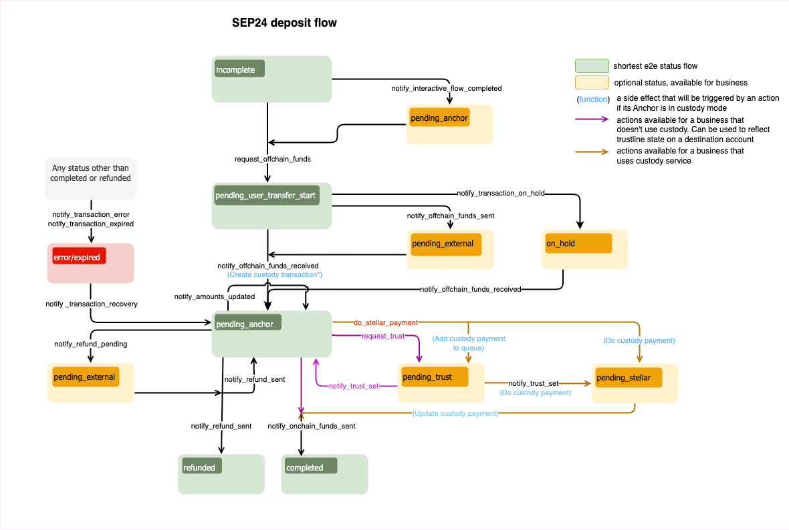

import { CodeExample } from "@site/src/components/CodeExample";
import { AttributeTable } from "@site/src/components/AttributeTable";
import Security from "../component/security/security.mdx";
import UsingApiKey from "../component/security/api_key.mdx";
import UsingJwt from "../component/security/jwt.mdx";
import Rpc from "../component/rpc/rpc.mdx";
import RpcRequest from "../component/rpc/request.mdx";
import RpcResponse from "../component/rpc/response.mdx";
import RpcError from "../component/rpc/error.mdx";
import Observer from "../component/observer/observer.mdx";

Uno de los principales puntos de interacción con la Anchor Platform es notificar a la Anchor Platform sobre eventos relacionados con la transacción.

En general, querrás proporcionar actualizaciones para los siguientes eventos:

- Tu negocio está procesando la información KYC proporcionada por el usuario
- Tu negocio está listo para recibir fondos del usuario
- Tu negocio ha recibido fondos del usuario
- Tu negocio ha enviado fondos al usuario
- Tu negocio ha procesado una devolución para la transacción del usuario
- Tu negocio experimentó un error inesperado

Esto se hace realizando solicitudes JSON-RPC al endpoint de la API de la plataforma. Las solicitudes JSON-RPC te permiten actualizar el estado de la transacción. Para mover la transacción a un estado específico, es necesario realizar una solicitud JSON-RPC correspondiente y pasar los datos que se requieren por este método RPC.

La API JSON-RPC de la Anchor Platform está diseñada para notificar a la plataforma sobre cambios en el estado de la transacción. Dado esto, la API será llamada cada vez que un usuario o el anchor realice alguna acción que avance el estado de la transacción en el flujo.

La comunicación desde la Anchor Platform sobre actualizaciones de transacciones, actualizaciones de clientes y creación de cotizaciones se maneja a través del servicio de eventos. Esta es una función opcional que necesita ser configurada por separado de la integración SEP-6. Para más información, consulta [Manejo de eventos](../events/README.mdx).

Puedes encontrar más información sobre el flujo y los estados de la transacción en el [documento del protocolo SEP-24](https://github.com/stellar/stellar-protocol/blob/master/ecosystem/sep-0024.md)

## Callbacks

La Anchor Platform depende del servidor de negocios para proporcionar y almacenar información sobre cotizaciones.

### Cotizaciones y Tarifas

Para admitir el exchange de activos no equivalentes, la Anchor Platform expone una API compatible con SEP-38 para proporcionar cotizaciones para el exchange. La API de cotizaciones se utiliza para proporcionar al usuario la cantidad esperada del activo que recibirá a cambio del activo que está enviando. La API de cotizaciones también se utiliza para proporcionar al usuario las tarifas esperadas para la transacción. Por lo tanto, tu servidor de negocios debe implementar la [API de tarifas](../../api-reference/callbacks/README.mdx) para proporcionar cotizaciones a la Anchor Platform.

## Asegurando la API de la Plataforma

<Security />

### Usando Clave API

<UsingApiKey />

### Usando JWT

<UsingJwt />

## Realizando Solicitudes JSON-RPC

<Rpc />

### Solicitud JSON-RPC

<RpcRequest />

### Respuesta JSON-RPC

<RpcResponse />

### Códigos de Error

<RpcError />

## Actualizando la Transacción de Depósito a Través de JSON-RPC

El diagrama de flujo de depósito SEP-24 define la secuencia/reglas de la transición del estado de la transacción y un conjunto de métodos JSON-RPC que deberían ser llamados para cambiar ese estado. No puedes definir el estado que quieres establecer para una transacción específica en tus solicitudes. Cada método JSON-RPC define estructuras de datos que espera en la solicitud. Si la solicitud no contiene un atributo requerido, la Anchor Platform devolverá un error y no cambiará el estado de la transacción.

[](../../assets/sep24-deposit-flow-diagram.png)

:::tip

Los estados en <span style={{color: "green"}}>verde</span> son obligatorios y definen la manera más corta.

Los estados en <span style={{color: "#B0BF1A"}}>amarillo</span> son opcionales y pueden ser omitidos.

Los estados en <span style={{color: "red"}}>rojo</span> significan que la transacción está en un estado de error o ha caducado.

:::

### Listo para Recibir Fondos

El primer paso del flujo de depósito después de iniciar el depósito en sí es recolectar KYC. Generalmente se realiza en la aplicación web, pero también puede ser proporcionada opcionalmente por la aplicación de billetera, usando [SEP-9](https://github.com/stellar/stellar-protocol/blob/master/ecosystem/sep-0009.md). Una vez que se recolecta la KYC necesaria, se debe realizar una solicitud JSON-RPC `request_offchain_funds`.

<CodeExample>

```json
// request-offchain-funds.json
[
  {
    "id": 1,
    "jsonrpc": "2.0",
    "method": "request_offchain_funds",
    "params": {
      "transaction_id": "<transaction_id>",
      "message": "Request offchain funds",
      "amount_in": {
        "amount": 10,
        "asset": "iso4217:USD"
      },
      "amount_out": {
        "amount": 9,
        "asset": "stellar:USDC:GBBD47IF6LWK7P7MDEVSCWR7DPUWV3NY3DTQEVFL4NAT4AQH3ZLLFLA5"
      },
      "fee_details": {
        "total": 1,
        "asset": "iso4217:USD"
      },
      "amount_expected": {
        "amount": 10
      }
    }
  }
]
```

</CodeExample>

- `amount_in` es la cantidad que el usuario debe enviar al negocio.
- `amount_out` es la cantidad que el usuario recibirá.
- `fee_details` es el total de tarifas cobradas por el negocio.
- `asset` es parte del campo `amount_x` y está en un formato SEP-38. En este ejemplo, está configurado en USD, asumiendo que el usuario realizó una transferencia bancaria al sistema usando USD.

La información sobre las cantidades (entrada/salida/tarifa) es requerida si quieres mover la transacción del estado `incompleto` al estado `pending_user_transfer_start`. Si el estado de la transacción cambia de `pending_anchor` a `pending_user_transfer_start`, puedes omitir definir las cantidades.

Para procesar esto, necesitas ejecutar:

<CodeExample>

```bash
./call-json-rpc.sh request-offchain-funds.json
```

</CodeExample>

:::tip

Cuando el proceso KYC es largo (por ejemplo, verificación de ID), se aconseja primero establecer el estado de la transacción a `pending_anchor` utilizando la solicitud JSON-RPC `notify_interactive_flow_completed`. Esto indicará al usuario que se está procesando el KYC.

:::

### Procesando Información KYC

:::tip

Este paso es opcional. La mayoría de los negocios no lo utilizan. Puedes omitirlo y pasar al [siguiente paso](#funds-received).

Usar este estado es recomendable cuando la verificación de KYC pueda necesitar ser realizada de manera asincrónica.

:::

Debes especificar los campos `amount_x`.

<CodeExample>

```json
// kyc-in-process.json
[
  {
    "id": 1,
    "jsonrpc": "2.0",
    "method": "notify_interactive_flow_completed",
    "params": {
      "transaction_id": "<transaction_id>",
      "message": "Interactive flow completed.",
      "amount_in": {
        "amount": 10,
        "asset": "iso4217:USD"
      },
      "amount_out": {
        "amount": 9,
        "asset": "stellar:USDC:GBBD47IF6LWK7P7MDEVSCWR7DPUWV3NY3DTQEVFL4NAT4AQH3ZLLFLA5"
      },
      "fee_details": {
        "total": 1,
        "asset": "iso4217:USD"
      },
      "amount_expected": {
        "amount": 10
      }
    }
  }
]
```

</CodeExample>

Para procesar esto, necesitas ejecutar:

<CodeExample>

```bash
./call-json-rpc.sh kyc-in-process.json
```

</CodeExample>

### Fondos Recibidos

Si se recibieron fondos offchain, querrás proporcionar una información de transacción actualizada.

<CodeExample>

```json
// offchain-funds-received.json
[
  {
    "id": 1,
    "jsonrpc": "2.0",
    "method": "notify_offchain_funds_received",
    "params": {
      "transaction_id": "<transaction_id>",
      "message": "Offchain funds received",
      "funds_received_at": "2023-07-04T12:34:56Z",
      "external_transaction_id": "7...9",
      "amount_in": {
        "amount": 10
      },
      "amount_out": {
        "amount": 9
      },
      "fee_details": {
        "total": 1
      },
      "amount_expected": {
        "amount": 10
      }
    }
  }
]
```

</CodeExample>

- `funds_received_at` es la fecha y hora de recepción de fondos
- `external_transaction_id` es el ID de la transacción en la red externa

Los campos de cantidad son opcionales. Si se omiten, se tomarán los valores de solicitudes JSON-RPC anteriores.

Para procesar esto, necesitas ejecutar:

<CodeExample>

```bash
./call-json-rpc.sh offchain-funds-received.json
```

</CodeExample>

### Esperando Fondos del Usuario

En el mundo real, el proceso de confirmación de transferencia puede tardar. En tales casos, las transacciones deben establecerse en un nuevo estado que indique que se ha recibido la confirmación de la transferencia pero que los fondos propiamente dichos aún no han sido recibidos.

<CodeExample>

```json
// offchain-funds-sent.json
[
  {
    "id": 1,
    "jsonrpc": "2.0",
    "method": "notify_offchain_funds_sent",
    "params": {
      "transaction_id": "<transaction_id>",
      "message": "Offchain funds sent",
      "funds_received_at": "2023-07-04T12:34:56Z",
      "external_transaction_id": "7...9"
    }
  }
]
```

</CodeExample>

Para procesar esto, necesitas ejecutar:

<CodeExample>

```bash
./call-json-rpc.sh offchain-funds-sent.json
```

</CodeExample>

### Enviando Fondos Enchain

A continuación, envía una transacción en la red Stellar para satisfacer una solicitud del usuario. Después de la finalización de la transacción, es necesario enviar la solicitud JSON-RPC `notify_onchain_funds_sent` para notificar al usuario que los fondos se enviaron con éxito.

<CodeExample>

```json
// onchain-funds-sent.json
[
  {
    "id": 1,
    "jsonrpc": "2.0",
    "method": "notify_onchain_funds_sent",
    "params": {
      "transaction_id": "<transaction_id>",
      "message": "Onchain funds sent",
      "stellar_transaction_id": "7...9"
    }
  }
]
```

</CodeExample>

- `stellar_transaction_id` is the transaction id on Stellar network of the transfer

Para procesar esto, necesitas ejecutar:

<CodeExample>

```bash
./call-json-rpc.sh onchain-funds-sent.json
```

</CodeExample>

Después de esta solicitud JSON-RPC, la transacción se transferirá al estado `completed`.

### Envío de Pago a Través de Servicio de Custodia

La Anchor Platform proporciona la posibilidad de enviar un pago a través de servicios de custodia, como Fireblocks. Para realizar un pago a través del servicio de custodia, es necesario realizar la siguiente solicitud JSON-RPC:

<CodeExample>

```json
// do-stellar-payment.json
[
  {
    "id": 1,
    "jsonrpc": "2.0",
    "method": "do_stellar_payment",
    "params": {
      "transaction_id": "<transaction_id>",
      "message": "Custody payment started"
    }
  }
]
```

</CodeExample>

Para procesar esto, necesitas ejecutar:

<CodeExample>

```bash
./call-json-rpc.sh do-stellar-payment.json
```

</CodeExample>

Después del procesamiento exitoso del pago en un servicio de custodia, la Anchor Platform automáticamente realizará la solicitud JSON-RPC `notify_onchain_funds_sent` y el estado de la transacción cambiará a `completed`.

:::caution

Una cuenta de usuario puede no estar lista para recibir fondos. Puedes verificar que la cuenta haya establecido una [trustline](/docs/learn/glossary#trustline). De lo contrario, puedes establecer el estado de la transacción a `pending_trust` para indicar que el anchor está esperando que el usuario establezca la trustline.

Si la integración de custodia está habilitada, la Anchor Platform validará esto automáticamente por ti.

:::

### Trust Pendiente

Este estado debe ser establecido si un pago requiere una trustline de activo que no fue configurada por el usuario. Hay dos maneras en las que la transacción puede ser movida al estado `pending_trust`. La primera es procesando un pago a través de un servicio de custodia en caso de que detecte que la trustline no está configurada. La segunda es cuando el propio negocio detecta que falta la trustline y quiere notificar al usuario que debe ser configurada. Para mover la transacción al estado `pending_trust`, es necesario realizar la siguiente solicitud JSON-RPC:

<CodeExample>

```json
// request-trust.json
[
  {
    "id": 1,
    "jsonrpc": "2.0",
    "method": "request_trust",
    "params": {
      "transaction_id": "<transaction_id>",
      "message": "Asset trustine not configured"
    }
  }
]
```

</CodeExample>

Para procesar esto, necesitas ejecutar:

<CodeExample>

```bash
./call-json-rpc.sh request-trust.json
```

</CodeExample>

:::info

El pago a través del servicio de custodia verifica periódicamente si la trustline fue configurada. Si lo fue, automáticamente enviará un pago a un servicio de custodia y cambiará el estado de la transacción a `pending_stellar`.

:::

### Configuración de Confianza

Este estado debe ser establecido si el negocio ha detectado que la trustline fue o no fue configurada por el usuario.

<CodeExample>

```json
// trust-set.json
[
  {
    "id": 1,
    "jsonrpc": "2.0",
    "method": "notify_trust_set",
    "params": {
      "transaction_id": "<transaction_id>",
      "message": "Asset trustine set",
      "success": "true"
    }
  }
]
```

</CodeExample>

- `success` flag que define si la trustline fue o no configurada por el usuario

Para procesar esto, necesitas ejecutar:

<CodeExample>

```bash
./call-json-rpc.sh trust-set.json
```

</CodeExample>

:::info

Dependiendo del `success` flag, el estado de la transacción cambiará a `pending_stellar` si la trustline fue establecida, o a `pending_anchor` si no lo fue.

:::

### Envío de Reembolso a Través de Servicio de Custodia

Existe la posibilidad de devolver fondos al usuario (reembolso). Puedes reembolsar la suma completa (reembolso completo) o realizar un conjunto de reembolsos parciales. Además, si el usuario envió más dinero del esperado, puedes reembolsar una parte de la suma al usuario y enviar el resto como fondos enchain.

<CodeExample>

```json
// refund-sent.json
[
  {
    "id": 1,
    "jsonrpc": "2.0",
    "method": "notify_refund_sent",
    "params": {
      "transaction_id": "<transaction_id>",
      "message": "Refund sent",
      "refund": {
        "id": "1c186184-09ee-486c-82a6-aa7a0ab1119c",
        "amount": {
          "amount": 10,
          "asset": "iso4217:USD"
        },
        "amount_fee": {
          "amount": 1,
          "asset": "iso4217:USD"
        }
      }
    }
  }
]
```

</CodeExample>

Para procesar esto, necesitas ejecutar:

<CodeExample>

```bash
./call-json-rpc.sh refund-sent.json
```

</CodeExample>

:::info

Si la suma de los reembolsos es menor que `amount_in`, el estado de la transacción se establecerá en `pending_anchor`. Solo si la suma de los reembolsos es igual a `amount_in`, el estado de la transacción se establecerá en `refunded`.

:::

### Reembolso Pendiente

Es similar a [Reembolso enviado](#refund-sent), pero maneja un caso cuando un reembolso ha sido enviado a la red externa pero aún no está confirmado. El estado de la transacción se establece en `pending_external`. Este es el estado que se establecerá cuando se espera que Bitcoin u otra red de cripto externa complete una transacción, o cuando se espera una transferencia bancaria.

### Error de Transacción

Si encuentras un error irrecuperable al procesar la transacción, se requiere establecer el estado de la transacción en `error`. Puedes usar el campo de mensaje para describir los detalles del error.

<CodeExample>

```json
// transaction-error.json
[
  {
    "id": 1,
    "jsonrpc": "2.0",
    "method": "notify_transaction_error",
    "params": {
      "transaction_id": "<transaction_id>",
      "message": "Error occurred"
    }
  }
]
```

</CodeExample>

Para procesar esto, necesitas ejecutar:

<CodeExample>

```bash
./call-json-rpc.sh transaction-error.json
```

</CodeExample>

:::tip

Si un usuario ha realizado una transferencia, debes hacer una recuperación de la transacción, y luego puedes volver a procesar la transacción o iniciar un reembolso.

:::

### Transacción Caducada

Tu negocio puede querer manejar transacciones abandonadas caducando aquellas que han permanecido inactivas durante un cierto período. Para lograr esto, verifica el estado de la transacción utilizando el endpoint `GET /transactions` y ordena los resultados por la marca de tiempo `user_action_required_by`. Si la marca de tiempo ha pasado, ejecuta manualmente la lógica apropiada, como caducar la transacción o iniciar un reembolso automático, según el estado actual de la transacción. Por ejemplo, para caducar la transacción, el negocio debería cambiar el estado de la transacción a `expired`:

<CodeExample>

```json
// transaction-expired.json
[
  {
    "id": 1,
    "jsonrpc": "2.0",
    "method": "notify_transaction_expired",
    "params": {
      "transaction_id": "<transaction_id>",
      "message": "Transaction expired"
    }
  }
]
```

</CodeExample>

Para procesar esto, necesitas ejecutar:

<CodeExample>

```bash
./call-json-rpc.sh transaction-expired.json
```

</CodeExample>

:::tip

Este método JSON-RPC no se puede usar después de que el usuario ha realizado una transferencia.

:::

### Transacción en Espera

En casos raros, puedes querer pausar la transacción actual y solicitar más información del usuario (después de haber recibido la transferencia). Esto podría usarse para casos de uso de cumplimiento.

<CodeExample>

```json
// transaction-hold.json
[
  {
    "id": 1,
    "jsonrpc": "2.0",
    "method": "notify_transaction_on_hold",
    "params": {
      "transaction_id": "<transaction_id>",
      "message": "Transaction is on hold. Please contact customer support to resolve the hold."
    }
  }
]
```

</CodeExample>

Para procesar esto, necesitas ejecutar:

<CodeExample>

```bash
./call-json-rpc.sh transaction-hold.json
```

</CodeExample>

### Recuperación de Transacción

El estado de la transacción puede ser cambiado de `error/expired` a `pending_anchor`. Después de la recuperación, puedes reembolsar los activos recibidos o proceder con el procesamiento de la transacción. Para recuperar una transacción, es necesario realizar la siguiente solicitud JSON-RPC:

<CodeExample>

```json
// transaction-recovery.json
[
  {
    "id": 1,
    "jsonrpc": "2.0",
    "method": "notify_transaction_recovery",
    "params": {
      "transaction_id": "<transaction_id>",
      "message": "Transaction recovered"
    }
  }
]
```

</CodeExample>

Para procesar esto, necesitas ejecutar:

<CodeExample>

```bash
./call-json-rpc.sh transaction-recovery.json
```

</CodeExample>

## Actualizando transacciones de retirada de fondos vía JSON-RPC

Este diagrama define una secuencia/reglas de la transición del estado de las transacciones para el flujo de retirada de SEP-24.

[](../../assets/sep24-withdrawal-flow-diagram.png)

:::tip

Los estados en <span style={{color: "green"}}>verde</span> son obligatorios y definen el camino más corto.

Los estados en <span style={{color: "#B0BF1A"}}>amarillo</span> son opcionales y pueden ser omitidos.

Los estados en <span style={{color: "red"}}>rojo</span> significan que la transacción está en un estado de error o ha caducado.

:::

Una vez que el flujo de depósito ha terminado, implementar la retirada de fondos es sencillo. Algunas partes del flujo son similares y se pueden reutilizar.

El punto de partida tanto para la retirada como para el depósito es el mismo.

### Listo para recibir fondos

Similar al depósito, el siguiente paso es notificar al usuario que el anchor está listo para recibir fondos. Sin embargo, dado que tu servicio estará recibiendo transacciones a través de la red Stellar, la actualización se verá diferente.

<CodeExample>

```json
// request-onchain-funds.json
[
  {
    "id": 1,
    "jsonrpc": "2.0",
    "method": "request_onchain_funds",
    "params": {
      "transaction_id": "<transaction_id>",
      "message": "Request onchain funds",
      "amount_in": {
        "amount": 10,
        "asset": "stellar:USDC:GBBD47IF6LWK7P7MDEVSCWR7DPUWV3NY3DTQEVFL4NAT4AQH3ZLLFLA5"
      },
      "amount_out": {
        "amount": 9,
        "asset": "iso4217:USD"
      },
      "fee_details": {
        "total": 1,
        "asset": "stellar:USDC:GBBD47IF6LWK7P7MDEVSCWR7DPUWV3NY3DTQEVFL4NAT4AQH3ZLLFLA5"
      },
      "amount_expected": {
        "amount": 10
      },
      "destination_account": "GD...G",
      "memo": "12345",
      "memo_type": "id"
    }
  }
]
```

</CodeExample>

- `memo` Valor del memo que debe anexarse a la transacción
- `memo_type` Tipo de memo que el anchor debe anexar a la transacción
- `destination_account` Cuenta de destino

Para procesar esto, necesitas ejecutar:

<CodeExample>

```bash
./call-json-rpc.sh request-onchain-funds.json
```

</CodeExample>

:::tip

Configurar `memo`, `memo_type` y `destination_account` es opcional.

Si la integración con un custodio de terceros está habilitada, la Anchor Platform puede generar `memo`, `memo_type` y `destination_address` si se elige un `deposit_info_generator_type` correspondiente. Además, puedes proporcionar `memo` y `memo_type` a la solicitud como se muestra arriba. Ten en cuenta que el memo debe ser único, esto es lo que ayuda a asociar las transacciones de Stellar con las transacciones de SEP.

Si tu negocio gestiona los activos, la Anchor Platform puede generar memos para ti. Cuando el estado cambia a `pending_user_transfer_start`, la Anchor Platform establece `memo` y `memo_type` automáticamente (solo si no están incluidos en la solicitud).

:::

:::note

La cuenta de Stellar que se utilizará para recibir fondos debe estar configurada.

:::

### Procesando información de KYC

Este paso es opcional y es similar a [Procesando información de KYC](#processing-kyc-information) del flujo de depósito.

### Fondos recibidos

Si se recibieron fondos en cadena, necesitas proporcionar montos y cambiar el estado de la transacción a `pending_anchor`.

<CodeExample>

```json
// onchain-funds-received.json
[
  {
    "id": 1,
    "jsonrpc": "2.0",
    "method": "notify_onchain_funds_received",
    "params": {
      "transaction_id": "<transaction_id>",
      "message": "Onchain funds received",
      "stellar_transaction_id": "7...9",
      "amount_in": {
        "amount": 10
      },
      "amount_out": {
        "amount": 9
      },
      "fee_details": {
        "total": 1
      }
    }
  }
]
```

</CodeExample>

Para procesar esto, necesitas ejecutar:

<CodeExample>

```bash
./call-json-rpc.sh onchain-funds-received.json
```

</CodeExample>

:::tip

Este método será llamado automáticamente por el servidor de custodia si la integración de custodia está habilitada.

:::

### Monto actualizado

Si se recibieron fondos en cadena, pero por alguna razón el `amount_in` difiere del especificado en el flujo interactivo (`amount_expected`), puedes actualizar `amount_out` y `fee_details` para que correspondan al `amount_in` real. El estado de la transacción en este caso no cambiará y será igual a `pending_anchor`.

<CodeExample>

```json
// amounts-updated.json
[
  {
    "id": 1,
    "jsonrpc": "2.0",
    "method": "notify_amounts_updated",
    "params": {
      "transaction_id": "<transaction_id>",
      "message": "Amounts updated",
      "amount_out": {
        "amount": 9
      },
      "fee_details": {
        "total": 1
      }
    }
  }
]
```

</CodeExample>

Para procesar esto, necesitas ejecutar:

<CodeExample>

```bash
./call-json-rpc.sh amounts-updated.json
```

</CodeExample>

:::note

Solo `amount_out` y `fee_details` pueden ser actualizados utilizando esta solicitud JSON-RPC, y no necesitas especificar los activos de los montos.

:::

### Fondos fuera de la cadena enviados

Para completar la transacción y cambiar su estado a `completed`, necesitas hacer la solicitud JSON-RPC `notify_offchain_funds_sent`.

<CodeExample>

```json
// offchain-funds-sent.json
[
  {
    "id": 1,
    "jsonrpc": "2.0",
    "method": "notify_offchain_funds_sent",
    "params": {
      "transaction_id": "<transaction_id>",
      "message": "Offchain funds sent",
      "funds_sent_at": "2023-07-04T12:34:56Z",
      "external_transaction_id": "a...c"
    }
  }
]
```

</CodeExample>

Para procesar esto, necesitas ejecutar:

<CodeExample>

```bash
./call-json-rpc.sh offchain-funds-sent.json
```

</CodeExample>

### Fondos fuera de la cadena disponibles

Puedes mover el estado de la transacción a `pending_user_transfer_complete` si se enviaron fondos fuera de la cadena, y si está listo para que el usuario / destinatario lo recoja.

<CodeExample>

```json
// offchain-funds-available.json
[
  {
    "id": 1,
    "jsonrpc": "2.0",
    "method": "notify_offchain_funds_available",
    "params": {
      "transaction_id": "<transaction_id>",
      "message": "Offchain funds available",
      "external_transaction_id": "a...c"
    }
  }
]
```

</CodeExample>

Para procesar esto, necesitas ejecutar:

<CodeExample>

```bash
./call-json-rpc.sh offchain-funds-available.json
```

</CodeExample>

### Fondos fuera de la cadena pendientes

Otra opción es mover el estado de la transacción a `pending_external`. Este estado significa que el pago ha sido enviado a una red externa, pero aún no está confirmado.

<CodeExample>

```json
// offchain-funds-pending.json
[
  {
    "id": 1,
    "jsonrpc": "2.0",
    "method": "notify_offchain_funds_pending",
    "params": {
      "transaction_id": "<transaction_id>",
      "message": "Offchain funds pending",
      "external_transaction_id": "a...c"
    }
  }
]
```

</CodeExample>

Para procesar esto, necesitas ejecutar:

<CodeExample>

```bash
./call-json-rpc.sh offchain-funds-pending.json
```

</CodeExample>

### Reembolso enviado

La lógica de reembolso funciona de la misma manera que para el flujo de depósito. Para más detalles, consulta [Reembolso enviado](#refund-sent) del flujo de depósito.

### Enviando reembolso vía servicio de custodia

La integración con un servicio de custodia te permite hacer un reembolso a través de un servicio de custodia, como Fireblocks.

<CodeExample>

```json
// do-stellar-refund.json
[
  {
    "id": 1,
    "jsonrpc": "2.0",
    "method": "do_stellar_refund",
    "params": {
      "transaction_id": "<transaction_id>",
      "message": "Do stellar refund",
      "refund": {
        "amount": {
          "amount": 9,
          "asset": "stellar:USDC:GBBD47IF6LWK7P7MDEVSCWR7DPUWV3NY3DTQEVFL4NAT4AQH3ZLLFLA5"
        },
        "amount_fee": {
          "amount": 1,
          "asset": "stellar:USDC:GBBD47IF6LWK7P7MDEVSCWR7DPUWV3NY3DTQEVFL4NAT4AQH3ZLLFLA5"
        }
      }
    }
  }
]
```

</CodeExample>

Para procesar esto, necesitas ejecutar:

<CodeExample>

```bash
./call-json-rpc.sh do-stellar-refund.json
```

</CodeExample>

:::note

Similar al flujo de depósito, puedes hacer un reembolso completo o un conjunto de reembolsos parciales. La transacción permanecerá en estado `pending_anchor` hasta que la suma de los reembolsos sea inferior a `amount_in`. Si la suma de los reembolsos es igual a `amount_in`, la Anchor Platform cambiará automáticamente el estado de la transacción a `refunded`.

:::

### Error de transacción

Funciona de la misma manera que para el flujo de depósito. Para más detalles, consulta [Error de transacción](#transaction-error) del flujo de depósito.

### Transacción caducada

Funciona de la misma manera que para el flujo de depósito. Para más detalles, consulta [Transacción caducada](#expired-transaction) del flujo de depósito.

### Transacción en espera

Funciona de la misma manera que para el flujo de depósito. Para más detalles, consulta [Transacción en espera](#on-hold-transaction) del flujo de depósito.

### Recuperación de transacción

Funciona de la misma manera que para el flujo de depósito. Para más detalles, consulta [Recuperación de transacción](#transaction-recovery) del flujo de depósito.

## Seguimiento de transacciones de Stellar

<Observer />
