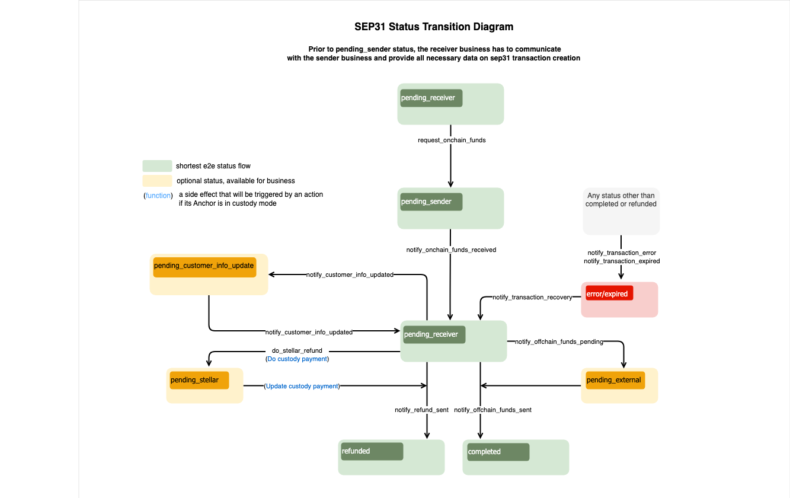

import { CodeExample } from "@site/src/components/CodeExample";

Integrarse con la Anchor Platform para facilitar pagos transnacionales implica implementar lo siguiente, como mínimo:

- [`GET /customer`](../../api-reference/callbacks/get-customer.api.mdx) & [`PUT /customer`](../../api-reference/callbacks/put-customer.api.mdx) puntos finales de la API KYC para solicitar y recopilar datos KYC de los clientes
- [`GET /rate`](../../api-reference/callbacks/get-rates.api.mdx) punto final de la API RFQ para proporcionar tasas de FX entre los activos on-chain y off-chain admitidos
- `GET /transactions` solicitudes para obtener actualizaciones sobre los estados de las transacciones de la Anchor Platform (documentación próximamente)
- [`JSON-RPC`](../../api-reference/platform/rpc/methods/README.mdx) solicitudes para actualizar los estados de las transacciones de la Anchor Platform

Lo siguiente también puede ser requerido dependiendo de tu caso de uso:

- [`DELETE /customer`](../../api-reference/callbacks/del-customer.api.mdx) si tu negocio desea o está obligado a permitir que los remitentes soliciten la eliminación de datos del cliente

## Crear un Servidor Empresarial

Primero, vamos a crear un servidor empresarial y añadirlo a nuestro archivo de docker compose.

<CodeExample>

```yaml
version: "3.8"

services:
  sep-server:
    image: stellar/anchor-platform:latest
    command: --sep-server
    env_file:
      - ./dev.env
    volumes:
      - ./config:/home
    ports:
      - "8080:8080"
    depends_on:
      - db
  platform-server:
    image: stellar/anchor-platform:latest
    command: --platform-server
    env_file:
      - ./dev.env
    volumes:
      - ./config:/home
    ports:
      - "8085:8085"
    depends_on:
      - db

  server:
    build: .
    ports:
      - "8081:8081"
    env_file:
      - ./dev.env
  db:
    image: postgres:14
    ports:
      - "5432:5432"
    env_file:
      - ./dev.env
```

</CodeExample>

A continuación, crea un servidor web simple utilizando el lenguaje de programación de tu preferencia y un `Dockerfile` que inicie el servidor. `docker compose up` debería iniciar correctamente los tres servicios.

Esta guía no proporciona una implementación de ejemplo de los puntos finales, pero puedes encontrar más información sobre los esquemas de solicitud y respuesta en la [Anchor Platform API Reference](../../README.mdx), y las secciones a continuación ampliarán los conceptos importantes para entender al implementar los puntos finales.

## Puntos Finales de Callback de Clientes

La Anchor Platform nunca almacena la PII de tus clientes y, en su lugar, actúa como un servidor proxy entre las aplicaciones cliente y tu negocio, reenvíando solicitudes y respuestas a la otra parte. Actualmente, las solicitudes y respuestas son casi idénticas a las definidas en la [SEP-12 KYC API specification](https://github.com/stellar/stellar-protocol/blob/master/ecosystem/sep-0012.md).

### Identificando Clientes

Los clientes pueden ser identificados utilizando dos enfoques.

El primer enfoque utiliza una cuenta Stellar y un memo. Al usar la Anchor Platform para facilitar pagos transnacionales, la organización remitente utiliza su propia cuenta Stellar, la que se usó para autenticarse a través de [SEP-10 Stellar Authentication](../sep10/README.mdx), al registrar clientes con tu negocio. Los memos se utilizan para distinguir clientes únicos que provienen de la misma organización remitente.

El segundo enfoque utiliza IDs de clientes generados por tu servicio. Por ejemplo, si una organización remitente está registrando un cliente, tu negocio recibirá una solicitud `PUT /customer` como la siguiente:

<CodeExample>

```json
{
  "account": "GDJUOFZGW5WYBK4GIETCSSM6MTTIJ4SUMCQITPTLUWMQ6B4UIX2IEX47",
  "memo": "780284017",
  "type": "sep31-sender",
  "first_name": "John",
  "last_name": "Doe",
  "email": "johndoe@example.com"
}
```

</CodeExample>

En este ejemplo, la clave pública `GDJ...X47` identifica la organización remitente, y el memo `780284017` identifica al cliente. Los memos son normalmente enteros de 64 bits, pero también pueden ser otros tipos de datos, por lo que deben guardarse como cadenas. En respuesta, tu negocio debe devolver un ID de cliente.

<CodeExample>

```json
{
  "id": "fb5ddc93-1d5d-490d-ba5f-2c361cea41f7"
}
```

</CodeExample>

Tu servidor empresarial puede usar cualquier identificador para los clientes siempre que sea una cadena.

Después del registro de un cliente, la organización remitente puede usar cualquiera de los enfoques al verificar el estado del cliente. Por ejemplo, puedes obtener una solicitud `GET /customer` como la siguiente:

<CodeExample>

```
/customer?account=GDJUOFZGW5WYBK4GIETCSSM6MTTIJ4SUMCQITPTLUWMQ6B4UIX2IEX47&memo=780284017&type=sep31-sender
```

</CodeExample>

O, la organización remitente podría usar el identificador que devolviste cuando registraron originalmente al cliente.

<CodeExample>

```
/customer?id=fb5ddc93-1d5d-490d-ba5f-2c361cea41f7&type=sep31-sender
```

</CodeExample>

Tu negocio necesitará mantener un mapeo entre la cuenta y el memo utilizados para registrar originalmente al cliente y el ID que devuelves en la respuesta, así como los datos KYC proporcionados. En futuras iteraciones de la Anchor Platform, es posible que mantengamos este mapeo para tu negocio para que solo tengas que trabajar con los IDs que generas.

### Tipos de Clientes

Tu negocio probablemente requiera diferentes conjuntos de información KYC dependiendo del tipo de cliente. Puedes definir las etiquetas para cada uno de estos tipos de clientes en tu archivo `dev.assets.yaml`, y tus organizaciones remitentes necesitarán entender qué etiqueta utilizar al registrar o consultar el estado de los clientes.

En las solicitudes `PUT /customer`, deberías usar el tipo enviado para evaluar si el remitente ha proporcionado todos los campos requeridos. En las solicitudes `GET /customer`, deberías usar el tipo para determinar el estado del cliente.

### Probar con la Billetera Demo

Puedes probar tu implementación con la [Stellar Demo Wallet](https://demo-wallet.stellar.org) siguiendo los pasos a continuación.

1. Selecciona "Generar keypair para nueva cuenta"
2. Selecciona "Crear cuenta"
3. Selecciona "Agregar Activo" e introduce el código del activo y el dominio principal de la Anchor Platform, `localhost:8080`
4. Selecciona "Agregar línea de confianza"
5. Financia tu cuenta con un saldo del activo
6. Selecciona "SEP-31 Enviar" en el menú desplegable

Deberías ver que la billetera demo encuentra las URL de tu servicio, se autentica y verifica qué campos KYC necesita recopilar. Luego debería presentar un formulario para que introduces los detalles KYC para el remitente y el receptor.


Una vez que hayas introducido la información solicitada, se enviará esa información a la Anchor Platform, que la enviará a tu servidor empresarial. Una vez que la billetera demo tenga los IDs de los clientes que generaste, iniciará una transacción que debería fallar.

## Punto Final de Callback de Tasas

Una vez que la organización remitente haya registrado a los clientes involucrados en la transacción, necesitará solicitar una cotización, o tasa FX, de tu negocio. La Anchor Platform solicita esta información a tu servidor empresarial utilizando el [`GET /rate` endpoint](../../api-reference/callbacks/get-rates.api.mdx).

### Cotizaciones Firmes vs. Indicativas

Las solicitudes de cotizaciones tendrán un parámetro `type` que puede ser [`indicative`](https://www.investopedia.com/terms/i/indicativequote.asp) o [`firm`](https://www.investopedia.com/terms/f/firmquote.asp). Si `type=firm`, tu respuesta debe incluir el campo `id` y `expires_at` y reservar la liquidez necesaria para cumplir con esta cotización hasta que la cotización expire. Si `type=indicative`, no devuelvas los campos `id` o `expires_at` porque la tasa proporcionada no se utilizará en una transacción.

Ten en cuenta que el cliente puede solicitar que la cotización expire después de una fecha y hora específica usando el parámetro `expires_after`. Tu negocio debe honrar esta solicitud devolviendo un valor `expires_at` que esté en o después de la fecha y hora solicitadas o rechazar la solicitud con una respuesta 400 Bad Request, que será reenviada al cliente.

### Usando el ID del Cliente

Las solicitudes pueden incluir un parámetro `client_id` que identifica a la organización remitente que solicita la tasa. Puedes usar este parámetro para adherirte a los términos comerciales acordados con esa organización remitente, como ofrecer tarifas con descuento. `client_id` puede no estar presente para solicitudes indicativas, en cuyo caso debe devolverse tu precio de mercado. Actualmente, `client_id` siempre será la clave pública Stellar que la organización remitente utilizó para autenticarse con la Anchor Platform.

### Métodos de Entrega

Es común que las tarifas y comisiones de las empresas difieran dependiendo de los rails de pago utilizados para enviar fondos al destinatario. Si tus métodos de entrega están configurados en tu archivo `asset.yaml`, los clientes siempre proporcionarán el rail de pago que desean que tu negocio use para solicitudes de cotización firme.

Debido a que este punto final se utiliza actualmente solo para pagar remesas en activos off-chain, se usará el `buy_delivery_method`. Si este punto final alguna vez se utiliza en otros flujos de transacciones como depósitos SEP-24, entonces también se puede pasar `sell_delivery_method` para empresas que admiten estos tipos de transacciones.

## Obtener Actualizaciones de Estado de Transacciones

Para facilitar pagos transnacionales, necesitarás poder detectar cuándo una organización remitente ha enviado tu negocio un pago on-chain y determinar qué transacción estaba destinada a cumplir.

La forma más fácil de hacerlo es ejecutar el Stellar Observer, que detectará estos pagos y actualizará el registro de transacciones correspondiente con información sobre el pago. Tu negocio podrá detectar estas actualizaciones consultando el punto final API `GET /transactions` de la Platform.

### Ejecutar el Stellar Observer

El Stellar Observer monitorea el ledger Stellar para pagos realizados a tu(s) cuenta(s) y actualiza los registros de transacciones correspondientes con información de pago on-chain. Para ejecutar el observador, añade lo siguiente a tu archivo de docker compose.

<CodeExample>

```yaml
services:
  ...
  observer:
    image: stellar/anchor-platform:latest
    command: --stellar-observer
    env_file:
      - ./dev.env
    volumes:
      - ./config:/home
```

</CodeExample>

### Polling de Pagos Recibidos

El Stellar Observer realiza solicitudes JSON-RPC a la API de la Platform cada vez que detecta pagos recibidos por transacciones iniciadas por organizaciones remitentes, actualizando así la fecha y hora `transfer_received_at` de la transacción.

Tu negocio debería consultar periódicamente el punto final API `GET /transactions` de la Platform para detectar estas actualizaciones. Puedes referirte al siguiente ejemplo:

<CodeExample>

```bash
curl http://localhost:8080/transactions?sep=31&order_by=transfer_received_at&order=desc
```

</CodeExample>

La respuesta incluirá una lista de transacciones de pago transnacionales iniciadas por organizaciones remitentes. Esta lista estará ordenada según el momento en que se recibió un pago por esa transacción. Para cada transacción devuelta, tu negocio debería verificar si ya ha detectado el pago por esa transacción. Si lo has hecho, has detectado todos los pagos realizados a tu(s) cuenta(s).

## Actualizar Transacciones a Través de JSON-RPC

El diagrama de flujo SEP-31 define la secuencia/reglas de la transición de estado de la transacción y un conjunto de métodos JSON-RPC que deben llamarse para cambiar ese estado. No puedes definir el estado que deseas establecer para una transacción específica en tus solicitudes. Cada método JSON-RPC define estructuras de datos que espera en la solicitud. Si la solicitud no contiene los atributos requeridos, la Anchor Platform devolverá un error y no cambiará el estado de la transacción.

[](../../assets/sep31-transition-diagram.png)

:::tip

Los estados en <span style={{color: "green"}}>verde</span> son obligatorios y definen el flujo más corto.

Los estados en <span style={{color: "#B0BF1A"}}>amarillo</span> son opcionales y pueden omitirse.

Los estados en <span style={{color: "red"}}>rojo</span> significan que la transacción está en un estado de error o ha caducado.

:::

Puedes crear una [plantilla](../sep24/integration.mdx#making-json-rpc-requests) para realizar solicitudes JSON-RPC a la Anchor Platform.

Este capítulo también contiene información sobre el formato de [solicitud](../sep24/integration.mdx#json-rpc-request)/[respuesta](../sep24/integration.mdx#json-rpc-response) y [códigos de error](../sep24/integration.mdx#error-codes) que pueden ser devueltos por la Anchor Platform.

### Listo para Recibir Fondos

Las transacciones SEP-31 deberían estar inicialmente en el estado `pending_receiver`. Para solicitar fondos del Sending Anchor, el Receiving Anchor debería cambiar el estado de la transacción a `pending_sender` haciendo la siguiente solicitud RPC:

<CodeExample>

```json
// request-onchain-funds.json
[
  {
    "id": 1,
    "jsonrpc": "2.0",
    "method": "request_onchain_funds",
    "params": {
      "transaction_id": "<transaction_id>",
      "message": "Request onchain funds",
      "destination_account": "GD...G",
      "memo": "12345",
      "memo_type": "id"
    }
  }
]
```

</CodeExample>

Para procesar esto, necesitas ejecutar:

<CodeExample>

```bash
./call-json-rpc.sh request-onchain-funds.json
```

</CodeExample>

El estado de la transacción cambiará a `pending_sender`.

### Fondos Recibidos

Si el Sending Anchor ha enviado los fondos, el Receiving Anchor debería cambiar el estado de la transacción a `pending_receiver` haciendo la siguiente solicitud JSON-RPC:

<CodeExample>

```json
// onchain-funds-received.json
[
  {
    "id": 1,
    "jsonrpc": "2.0",
    "method": "notify_onchain_funds_received",
    "params": {
      "transaction_id": "<transaction_id>",
      "message": "Onchain funds received",
      "stellar_transaction_id": "7...9",
      "amount_in": {
        "amount": 10
      },
      "amount_out": {
        "amount": 9
      },
      "fee_details": {
        "total": 1
      }
    }
  }
]
```

</CodeExample>

Para procesar esto, necesitas ejecutar:

<CodeExample>

```bash
./call-json-rpc.sh onchain-funds-received.json
```

</CodeExample>

El estado de la transacción cambiará a `pending_receiver`.

### Fondos Offchain Enviados

Para completar la transacción y cambiar su estado a `completed`, necesitas hacer una solicitud JSON-RPC `notify_offchain_funds_sent`.

<CodeExample>

```json
// offchain-funds-sent.json
[
  {
    "id": 1,
    "jsonrpc": "2.0",
    "method": "notify_offchain_funds_sent",
    "params": {
      "transaction_id": "<transaction_id>",
      "message": "Offchain funds sent",
      "funds_sent_at": "2023-07-04T12:34:56Z",
      "external_transaction_id": "a...c"
    }
  }
]
```

</CodeExample>

Para procesar esto, necesitas ejecutar:

<CodeExample>

```bash
./call-json-rpc.sh offchain-funds-sent.json
```

</CodeExample>

### Fondos Offchain Pendientes

Otra opción es mover el estado de la transacción a `pending_external`. Este estado significa que el pago ha sido enviado a la red externa, pero aún no está confirmado.

<CodeExample>

```json
// offchain-funds-pending.json
[
  {
    "id": 1,
    "jsonrpc": "2.0",
    "method": "notify_offchain_funds_pending",
    "params": {
      "transaction_id": "<transaction_id>",
      "message": "Offchain funds pending",
      "external_transaction_id": "a...c"
    }
  }
]
```

</CodeExample>

Para procesar esto, necesitas ejecutar:

<CodeExample>

```bash
./call-json-rpc.sh offchain-funds-pending.json
```

</CodeExample>

### Verificando la Información del Cliente

En algunos casos, el Receiving Anchor puede necesitar solicitar información actualizada al Sending Anchor. Por ejemplo, el banco le dice al Receiving Anchor que el nombre del Cliente Receptor proporcionado es incorrecto o le falta un segundo nombre. Dado que esta información fue enviada a través de SEP-12, la transacción debería ir al estado `pending_customer_info_update` hasta que el Sending Anchor realice otra solicitud SEP-12 `PUT /customer` para actualizar. El Sending Anchor puede verificar qué campos necesitan ser actualizados al hacer una solicitud SEP-12 `GET /customer` incluyendo los parámetros id o cuenta y memo. El Receiving Anchor debería responder con un estado `NEEDS_INFO` y `last_name` incluido en los campos descritos.

Después de que el Sending Anchor realice una solicitud SEP-12 `PUT /customer`, llama al método JSON-RPC `notify_customer_info_updated` para actualizar el estado de la transacción. Adicionalmente, llama a este método cada vez que cambie el estado SEP-12 de un cliente, como cuando se está validando la información del cliente y el estado cambia de `NEEDS_INFO` a `PROCESSING`. Esto asegura que cualquier cliente configurado con una URL de callback sea notificado del último estado del cliente, permitiendo al cliente solicitar al usuario que actualice su información.

<CodeExample>

```json
// notify-customer-info-updated.json
[
  {
    "id": 1,
    "jsonrpc": "2.0",
    "method": "notify_customer_info_updated",
    "params": {
      "transaction_id": "<transaction_id>",
      "message": "Customer info updated",
      "customer_id": "45f8884d-d6e1-477f-a680-503179263359",
      "customer_type": "sep31-receiver" // or sep31-sender
    }
  }
]
```

</CodeExample>

Para procesar esto, necesitas ejecutar:

<CodeExample>

```bash
./call-json-rpc.sh notify-customer-info-updated.json
```

</CodeExample>

### Hacer Reembolso Stellar

La integración con el servicio de custodia te permite hacer reembolsos a través del servicio de custodia, como Fireblocks.

<CodeExample>

```json
// do-stellar-refund.json
[
  {
    "id": 1,
    "jsonrpc": "2.0",
    "method": "do_stellar_refund",
    "params": {
      "transaction_id": "<transaction_id>",
      "message": "Do stellar refund",
      "refund": {
        "amount": {
          "amount": 9,
          "asset": "stellar:USDC:GBBD47IF6LWK7P7MDEVSCWR7DPUWV3NY3DTQEVFL4NAT4AQH3ZLLFLA5"
        },
        "amount_fee": {
          "amount": 1,
          "asset": "stellar:USDC:GBBD47IF6LWK7P7MDEVSCWR7DPUWV3NY3DTQEVFL4NAT4AQH3ZLLFLA5"
        }
      }
    }
  }
]
```

</CodeExample>

Para procesar esto, necesitas ejecutar:

<CodeExample>

```bash
./call-json-rpc.sh do-stellar-refund.json
```

</CodeExample>

:::note

No puedes hacer múltiples reembolsos en el flujo SEP-31. Por esta razón, el monto total del reembolso más la cantidad de la tarifa debería ser igual a `amount_in`. De lo contrario, recibirás un error.

:::

### Reembolso Enviado

Existe la posibilidad de enviar todos los fondos de vuelta al `Sending Anchor` (reembolso). Debes reembolsar la suma total (reembolso completo).

<CodeExample>

```json
// refund-sent.json
[
  {
    "id": 1,
    "jsonrpc": "2.0",
    "method": "notify_refund_sent",
    "params": {
      "transaction_id": "<transaction_id>",
      "message": "Refund sent",
      "refund": {
        "id": "1c186184-09ee-486c-82a6-aa7a0ab1119c",
        "amount": {
          "amount": 10,
          "asset": "iso4217:USD"
        },
        "amount_fee": {
          "amount": 1,
          "asset": "iso4217:USD"
        }
      }
    }
  }
]
```

</CodeExample>

Para procesar esto, necesitas ejecutar:

<CodeExample>

```bash
./call-json-rpc.sh refund-sent.json
```

</CodeExample>

:::note

No puedes hacer múltiples reembolsos en el flujo SEP-31. Por esta razón, la cantidad a reembolsar más la tarifa debería ser igual a `amount_in`. De lo contrario, recibirás un error.

:::

### Error de Transacción

Si encuentras un error irrecuperable al procesar la transacción, es necesario establecer el estado de la transacción en `error`. Puedes usar el campo de mensaje para describir los detalles del error.

<CodeExample>

```json
// transaction-error.json
[
  {
    "id": 1,
    "jsonrpc": "2.0",
    "method": "notify_transaction_error",
    "params": {
      "transaction_id": "<transaction_id>",
      "message": "Error occurred"
    }
  }
]
```

</CodeExample>

Para procesar esto, necesitas ejecutar:

<CodeExample>

```bash
./call-json-rpc.sh transaction-error.json
```

</CodeExample>

:::tip

Si un usuario ha realizado una transferencia, deberías hacer una recuperación de la transacción, y luego puedes volver a intentar procesar la transacción o iniciar un reembolso.

:::

### Transacción Caducada

Tu negocio puede querer caducar aquellas transacciones que han sido abandonadas por el usuario después de un tiempo. Es una buena práctica limpiar las transacciones inactivas en estado `incompleto`. Para hacerlo, simplemente cambia el estado de la transacción a `caducado`.

<CodeExample>

```json
// transaction-expired.json
[
  {
    "id": 1,
    "jsonrpc": "2.0",
    "method": "notify_transaction_expired",
    "params": {
      "transaction_id": "<transaction_id>",
      "message": "Transaction expired"
    }
  }
]
```

</CodeExample>

Para procesar esto, necesitas ejecutar:

<CodeExample>

```bash
./call-json-rpc.sh transaction-expired.json
```

</CodeExample>

:::tip

Este método JSON-RPC no se puede usar después de que el usuario haya realizado una transferencia.

:::

### Recuperación de Transacción

El estado de la transacción puede cambiar de `error/expired` a `pending-anchor`. Después de la recuperación, puedes devolver los activos recibidos o continuar con el procesamiento de la transacción. Para recuperar la transacción, es necesario hacer la siguiente solicitud JSON-RPC:

<CodeExample>

```json
// transaction-recovery.json
[
  {
    "id": 1,
    "jsonrpc": "2.0",
    "method": "notify_transaction_recovery",
    "params": {
      "transaction_id": "<transaction_id>",
      "message": "Transaction recovered"
    }
  }
]
```

</CodeExample>

Para procesar esto, necesitas ejecutar:

<CodeExample>

```bash
./call-json-rpc.sh transaction-recovery.json
```

</CodeExample>

### Configuración

Puedes habilitar estos tipos de transacciones actualizando la configuración de tu archivo `assets.yaml`:

<CodeExample>

```yaml
items:
  - ...
    sep31:
      quotes_required: false
```

</CodeExample>
