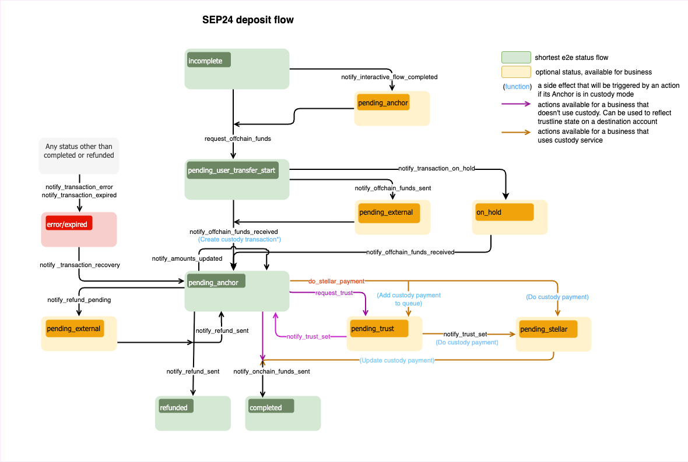

import { CodeExample } from "@site/src/components/CodeExample";
import { AttributeTable } from "@site/src/components/AttributeTable";
import Security from "../../admin-guide/component/security/security.mdx";
import UsingApiKey from "../../admin-guide/component/security/api_key.mdx";
import UsingJwt from "../../admin-guide/component/security/jwt.mdx";
import Rpc from "../../admin-guide/component/rpc/rpc.mdx";
import RpcRequest from "../../admin-guide/component/rpc/request.mdx";
import RpcResponse from "../../admin-guide/component/rpc/response.mdx";
import RpcError from "../../admin-guide/component/rpc/error.mdx";
import Observer from "../../admin-guide/component/observer/observer.mdx";

Uno de los principales puntos de interacción con la Anchor Platform es notificar a la Anchor Platform sobre eventos relacionados con la transacción.

En general, querrás proporcionar actualizaciones para los siguientes eventos:

- Tu negocio está procesando la información KYC proporcionada por el usuario
- Tu negocio está listo para recibir fondos del usuario
- Tu negocio ha recibido fondos del usuario
- Tu negocio ha enviado fondos al usuario
- Tu negocio ha procesado un reembolso para la transacción del usuario
- Tu negocio experimentó un error inesperado

Esto se realiza haciendo solicitudes JSON-RPC al endpoint de la API de la Platform. Las solicitudes JSON-RPC te permiten actualizar el estado de la transacción. Para mover la transacción a un estado específico, es necesario hacer una solicitud JSON-RPC correspondiente y pasar los datos requeridos por este método RPC.

La API JSON-RPC de la Anchor Platform está diseñada para notificar a la plataforma sobre cambios en el estado de la transacción. Dicho esto, la API será llamada cada vez que un usuario o la anchor realice una acción que haga avanzar el estado de la transacción en el flujo.

La comunicación desde la Anchor Platform sobre actualizaciones de transacciones, actualizaciones de clientes y creación de cotizaciones se gestiona a través del servicio de eventos. Esta es una función opcional que debe configurarse por separado de la integración SEP-6. Para más información, consulta [Gestión de Eventos](../../admin-guide/events/README.mdx).

Puedes obtener más información sobre el flujo y los estados de la transacción en el [documento del protocolo SEP-24](https://github.com/stellar/stellar-protocol/blob/master/ecosystem/sep-0024.md)

## Callbacks

La Anchor Platform depende del servidor de negocio para proporcionar y almacenar información sobre las cotizaciones.

### Cotizaciones y Tarifas

Para admitir el intercambio de activos no equivalentes, la Anchor Platform expone una API compatible con SEP-38 para proporcionar cotizaciones para el exchange. La API de cotizaciones se utiliza para proporcionar al usuario la cantidad esperada del activo que recibirá a cambio del activo que envía. La API de cotizaciones también se usa para proporcionar al usuario las tarifas esperadas para la transacción. Por lo tanto, tu servidor de negocio debe implementar la [API de tarifa](../../api-reference/callbacks/README.mdx) para proporcionar cotizaciones a la Anchor Platform.

## Asegurando la API de la Platform

<Security />

### Uso de la clave API

<UsingApiKey />

### Uso de JWT

<UsingJwt />

## Realizando solicitudes JSON-RPC

<Rpc />

### Solicitud JSON-RPC

<RpcRequest />

### Respuesta JSON-RPC

<RpcResponse />

### Códigos de Error

<RpcError />

## Actualizando la Transacción de Depósito vía JSON-RPC

El diagrama del flujo de depósito SEP-24 define la secuencia/reglas para la transición de estados de la transacción y un conjunto de métodos JSON-RPC que se deben llamar para cambiar ese estado. No puedes definir el estado que quieres asignar a una transacción específica en tus solicitudes. Cada método JSON-RPC define las estructuras de datos que espera en la solicitud. Si la solicitud no contiene los atributos requeridos, la Anchor Platform devolverá un error y no cambiará el estado de la transacción.

[](../../assets/sep24-deposit-flow-diagram.png)

:::tip

Los estados en <span style={{color: "green"}}>verde</span> son obligatorios y definen el camino más corto.

Los estados en <span style={{color: "#B0BF1A"}}>amarillo</span> son opcionales y pueden omitirse.

Los estados en <span style={{color: "red"}}>rojo</span> significan que la transacción está en un estado de error o ha expirado.

:::

### Listo para Recibir Fondos

El primer paso del flujo de depósito después de iniciar el depósito en sí es recopilar KYC. Generalmente se realiza en la aplicación web, pero también puede ser proporcionado opcionalmente por la aplicación billetera, usando [SEP-9](https://github.com/stellar/stellar-protocol/blob/master/ecosystem/sep-0009.md). Una vez que se recopila el KYC necesario, se debe hacer una solicitud JSON-RPC `request_offchain_funds`.

<CodeExample>

```json
// request-offchain-funds.json
[
  {
    "id": 1,
    "jsonrpc": "2.0",
    "method": "request_offchain_funds",
    "params": {
      "transaction_id": "<transaction_id>",
      "message": "Request offchain funds",
      "amount_in": {
        "amount": 10,
        "asset": "iso4217:USD"
      },
      "amount_out": {
        "amount": 9,
        "asset": "stellar:USDC:GBBD47IF6LWK7P7MDEVSCWR7DPUWV3NY3DTQEVFL4NAT4AQH3ZLLFLA5"
      },
      "fee_details": {
        "total": 1,
        "asset": "iso4217:USD"
      },
      "amount_expected": {
        "amount": 10
      }
    }
  }
]
```

</CodeExample>

- `amount_in` es la cantidad que el usuario debe enviar al negocio.
- `amount_out` es la cantidad que el usuario recibirá.
- `fee_details` es el monto total de tarifas cobradas por el negocio.
- `asset` es parte del campo `amount_x` y está en formato SEP-38. En este ejemplo, está configurado en USD, asumiendo que el usuario realizó una transferencia bancaria al sistema usando USD.

La información sobre los montos (entrada/salida/tarifa) es requerida si deseas mover la transacción de `incomplete` a `pending_user_transfer_start`. Si el estado de la transacción cambia de `pending_anchor` a `pending_user_transfer_start`, puedes omitir la definición de los montos.

Para ejecutar esto, necesitas correr:

<CodeExample>

```bash
./call-json-rpc.sh request-offchain-funds.json
```

</CodeExample>

:::tip

Cuando el proceso de KYC es largo (por ejemplo, verificación de identidad), se aconseja primero establecer el estado de la transacción a `pending_anchor` usando la solicitud JSON-RPC `notify_interactive_flow_completed`. Esto indicará al usuario que el KYC está en proceso.

:::

### Procesando Información KYC

:::tip

Este paso es opcional. La mayoría de los negocios no lo usan. Puedes saltarlo e ir al [siguiente paso](#funds-received).

Se recomienda usar este estado cuando la verificación KYC pueda necesitar realizarse de forma asincrónica.

:::

**Debes** especificar los campos `amount_x`.

<CodeExample>

```json
// kyc-in-process.json
[
  {
    "id": 1,
    "jsonrpc": "2.0",
    "method": "notify_interactive_flow_completed",
    "params": {
      "transaction_id": "<transaction_id>",
      "message": "Interactive flow completed.",
      "amount_in": {
        "amount": 10,
        "asset": "iso4217:USD"
      },
      "amount_out": {
        "amount": 9,
        "asset": "stellar:USDC:GBBD47IF6LWK7P7MDEVSCWR7DPUWV3NY3DTQEVFL4NAT4AQH3ZLLFLA5"
      },
      "fee_details": {
        "total": 1,
        "asset": "iso4217:USD"
      },
      "amount_expected": {
        "amount": 10
      }
    }
  }
]
```

</CodeExample>

Para ejecutar esto, necesitas correr:

<CodeExample>

```bash
./call-json-rpc.sh kyc-in-process.json
```

</CodeExample>

### Fondos Recibidos

Si se recibieron fondos offchain, querrás proporcionar información actualizada de la transacción.

<CodeExample>

```json
// offchain-funds-received.json
[
  {
    "id": 1,
    "jsonrpc": "2.0",
    "method": "notify_offchain_funds_received",
    "params": {
      "transaction_id": "<transaction_id>",
      "message": "Offchain funds received",
      "funds_received_at": "2023-07-04T12:34:56Z",
      "external_transaction_id": "7...9",
      "amount_in": {
        "amount": 10
      },
      "amount_out": {
        "amount": 9
      },
      "fee_details": {
        "total": 1
      },
      "amount_expected": {
        "amount": 10
      }
    }
  }
]
```

</CodeExample>

- `funds_received_at` es la fecha y hora de recepción de los fondos
- `external_transaction_id` es el ID de la transacción en la red externa

Los campos de cantidad son opcionales. Si se omiten, se tomarán los valores de solicitudes JSON-RPC previas.

Para ejecutar esto, necesitas correr:

<CodeExample>

```bash
./call-json-rpc.sh offchain-funds-received.json
```

</CodeExample>

### Esperando Fondos del Usuario

En el mundo real, el proceso de confirmación de la transferencia puede tomar tiempo. En tales casos, las transacciones deben establecerse en un nuevo estado que indique que se ha recibido la confirmación de la transferencia, pero aún no los fondos.

<CodeExample>

```json
// offchain-funds-sent.json
[
  {
    "id": 1,
    "jsonrpc": "2.0",
    "method": "notify_offchain_funds_sent",
    "params": {
      "transaction_id": "<transaction_id>",
      "message": "Offchain funds sent",
      "funds_received_at": "2023-07-04T12:34:56Z",
      "external_transaction_id": "7...9"
    }
  }
]
```

</CodeExample>

Para ejecutar esto, necesitas correr:

<CodeExample>

```bash
./call-json-rpc.sh offchain-funds-sent.json
```

</CodeExample>

### Enviando Fondos Onchain

Luego, envía una transacción en la red Stellar para cumplir con la solicitud del usuario. Después de completar la transacción, es necesario enviar la solicitud JSON-RPC `notify_onchain_funds_sent` para notificar al usuario que los fondos fueron enviados con éxito.

<CodeExample>

```json
// onchain-funds-sent.json
[
  {
    "id": 1,
    "jsonrpc": "2.0",
    "method": "notify_onchain_funds_sent",
    "params": {
      "transaction_id": "<transaction_id>",
      "message": "Onchain funds sent",
      "stellar_transaction_id": "7...9"
    }
  }
]
```

</CodeExample>

- `stellar_transaction_id` es el ID de la transacción en la red Stellar de la transferencia

Para ejecutar esto, necesitas correr:

<CodeExample>

```bash
./call-json-rpc.sh onchain-funds-sent.json
```

</CodeExample>

Después de esta solicitud JSON-RPC, la transacción cambiará al estado `completed`.

### Pendiente de Trustline

Este estado debe establecerse si un pago requiere una trustline de activo que el usuario no configuró. Hay dos formas en que la transacción puede cambiar al estado `pending_trust`. El primero es cuando el servidor de negocio detecta que la trustline no está configurada. La segunda es cuando el negocio detecta que falta la trustline y quiere notificar al usuario que debe configurarla. Para mover la transacción al estado `pending_trust`, es necesario hacer la siguiente solicitud JSON-RPC:

<CodeExample>

```json
// request-trust.json
[
  {
    "id": 1,
    "jsonrpc": "2.0",
    "method": "request_trust",
    "params": {
      "transaction_id": "<transaction_id>",
      "message": "Asset trustine not configured"
    }
  }
]
```

</CodeExample>

Para ejecutar esto, necesitas correr:

<CodeExample>

```bash
./call-json-rpc.sh request-trust.json
```

</CodeExample>

:::info

El servidor de negocio verifica periódicamente si la trustline ha sido configurada. Si lo fue, puede enviar un pago y cambiar el estado de la transacción a `pending_stellar`.

:::

### Trustline Configurada

Este estado debe establecerse si el negocio ha detectado si la trustline fue o no configurada por el usuario.

<CodeExample>

```json
// trust-set.json
[
  {
    "id": 1,
    "jsonrpc": "2.0",
    "method": "notify_trust_set",
    "params": {
      "transaction_id": "<transaction_id>",
      "message": "Asset trustine set",
      "success": "true"
    }
  }
]
```

</CodeExample>

- El flag `success` define si la trustline fue configurada por el usuario o no

Para ejecutar esto, necesitas correr:

<CodeExample>

```bash
./call-json-rpc.sh trust-set.json
```

</CodeExample>

:::info

Dependiendo del flag `success`, el estado de la transacción cambiará a `pending_stellar` si la trustline fue configurada, o a `pending_anchor` si no lo fue.

:::

### Enviando reembolso

Existe la posibilidad de devolver fondos al usuario (reembolso). Puedes reembolsar la suma completa (reembolso total) o hacer un conjunto de reembolsos parciales. Además, si el usuario envió más dinero de lo esperado, puedes devolver una parte al usuario y enviar el resto como fondos onchain.

<CodeExample>

```json
// refund-sent.json
[
  {
    "id": 1,
    "jsonrpc": "2.0",
    "method": "notify_refund_sent",
    "params": {
      "transaction_id": "<transaction_id>",
      "message": "Refund sent",
      "refund": {
        "id": "1c186184-09ee-486c-82a6-aa7a0ab1119c",
        "amount": {
          "amount": 10,
          "asset": "iso4217:USD"
        },
        "amount_fee": {
          "amount": 1,
          "asset": "iso4217:USD"
        }
      }
    }
  }
]
```

</CodeExample>

Para ejecutar esto, necesitas correr:

<CodeExample>

```bash
./call-json-rpc.sh refund-sent.json
```

</CodeExample>

:::info

Si la suma de los reembolsos es menor que `amount_in`, el estado de la transacción se establecerá en `pending_anchor`. Solo si la suma de los reembolsos es igual a `amount_in`, el estado de la transacción se establecerá en `refunded`.

:::

### Reembolso Pendiente

Es similar a [Reembolso enviado](#refund-sent), pero maneja el caso cuando un reembolso ha sido enviado a la red externa pero aún no está confirmado. El estado de la transacción se establece en `pending_external`. Este es el estado que se establecerá cuando se esté esperando que la red externa, como Bitcoin u otra criptomoneda, complete una transacción, o al esperar una transferencia bancaria.

### Error en la Transacción

Si encuentras un error irrecuperable al procesar la transacción, es necesario establecer el estado de la transacción en `error`. Puedes usar el campo de mensaje para describir los detalles del error.

<CodeExample>

```json
// transaction-error.json
[
  {
    "id": 1,
    "jsonrpc": "2.0",
    "method": "notify_transaction_error",
    "params": {
      "transaction_id": "<transaction_id>",
      "message": "Error occurred"
    }
  }
]
```

</CodeExample>

Para ejecutar esto, necesitas correr:

<CodeExample>

```bash
./call-json-rpc.sh transaction-error.json
```

</CodeExample>

:::tip

Si un usuario ha realizado una transferencia, deberías hacer una recuperación de la transacción, y luego puedes reintentar procesar la transacción o iniciar un reembolso.

:::

### Transacción Expirada

Tu negocio puede querer manejar transacciones abandonadas expirándolas si han estado inactivas por cierto período. Para lograr esto, verifica el estado de la transacción usando el endpoint `GET /transactions` y ordena los resultados por la marca de tiempo `user_action_required_by`. Si la marca de tiempo ha pasado, ejecuta manualmente la lógica apropiada, como expirar la transacción o iniciar un auto-reembolso, según el estado actual de la transacción. Por ejemplo, para expirar la transacción el negocio debe cambiar el estado de la transacción a `expired`:

<CodeExample>

```json
// transaction-expired.json
[
  {
    "id": 1,
    "jsonrpc": "2.0",
    "method": "notify_transaction_expired",
    "params": {
      "transaction_id": "<transaction_id>",
      "message": "Transaction expired"
    }
  }
]
```

</CodeExample>

Para ejecutar esto, necesitas correr:

<CodeExample>

```bash
./call-json-rpc.sh transaction-expired.json
```

</CodeExample>

:::tip

Este método JSON-RPC no puede usarse después de que el usuario haya realizado una transferencia.

:::

### Transacción en Espera

En casos raros, puedes querer pausar la transacción actual y solicitar más información al usuario (después de recibir la transferencia). Esto podría usarse para casos de cumplimiento normativo.

<CodeExample>

```json
// transaction-hold.json
[
  {
    "id": 1,
    "jsonrpc": "2.0",
    "method": "notify_transaction_on_hold",
    "params": {
      "transaction_id": "<transaction_id>",
      "message": "Transaction is on hold. Please contact customer support to resolve the hold."
    }
  }
]
```

</CodeExample>

Para ejecutar esto, necesitas correr:

<CodeExample>

```bash
./call-json-rpc.sh transaction-hold.json
```

</CodeExample>

### Recuperación de Transacción

El estado de la transacción puede cambiar de `error/expired` a `pending_anchor`. Después de la recuperación, puedes reembolsar los activos recibidos o continuar con el procesamiento de la transacción. Para recuperar una transacción, es necesario hacer la siguiente solicitud JSON-RPC:

<CodeExample>

```json
// transaction-recovery.json
[
  {
    "id": 1,
    "jsonrpc": "2.0",
    "method": "notify_transaction_recovery",
    "params": {
      "transaction_id": "<transaction_id>",
      "message": "Transaction recovered"
    }
  }
]
```

</CodeExample>

Para ejecutar esto, necesitas correr:

<CodeExample>

```bash
./call-json-rpc.sh transaction-recovery.json
```

</CodeExample>

## Actualizando la Transacción de Retirada vía JSON-RPC

Este diagrama define una secuencia/reglas de la transición de estados para el flujo de retirada SEP-24.

[](../../assets/sep24-withdrawal-flow-diagram.png)

:::tip

Los estados en <span style={{color: "green"}}>verde</span> son obligatorios y definen el camino más corto.

Los estados en <span style={{color: "#B0BF1A"}}>amarillo</span> son opcionales y pueden omitirse.

Los estados en <span style={{color: "red"}}>rojo</span> significan que la transacción está en un estado de error o ha expirado.

:::

Una vez finalizado el flujo de depósito, implementar la retirada es sencillo. Algunas partes del flujo son similares y pueden reutilizarse.

El punto de partida tanto para retirada como para depósito es el mismo.

### Listo para Recibir Fondos

Similar al depósito, el siguiente paso es notificar al usuario que la anchor está lista para recibir fondos. Sin embargo, dado que tu servicio recibirá transacciones a través de la red Stellar, la actualización será diferente.

<CodeExample>

```json
// request-onchain-funds.json
[
  {
    "id": 1,
    "jsonrpc": "2.0",
    "method": "request_onchain_funds",
    "params": {
      "transaction_id": "<transaction_id>",
      "message": "Request onchain funds",
      "amount_in": {
        "amount": 10,
        "asset": "stellar:USDC:GBBD47IF6LWK7P7MDEVSCWR7DPUWV3NY3DTQEVFL4NAT4AQH3ZLLFLA5"
      },
      "amount_out": {
        "amount": 9,
        "asset": "iso4217:USD"
      },
      "fee_details": {
        "total": 1,
        "asset": "stellar:USDC:GBBD47IF6LWK7P7MDEVSCWR7DPUWV3NY3DTQEVFL4NAT4AQH3ZLLFLA5"
      },
      "amount_expected": {
        "amount": 10
      },
      "destination_account": "GD...G",
      "memo": "12345",
      "memo_type": "id"
    }
  }
]
```

</CodeExample>

- Valor `memo` que se adjuntará a la transacción
- Tipo de memo que la anchor debe adjuntar a la transacción
- Cuenta destino

Para ejecutar esto, necesitas correr:

<CodeExample>

```bash
./call-json-rpc.sh request-onchain-funds.json
```

</CodeExample>

:::tip

Establecer `memo`, `memo_type` y `destination_account` es opcional.

Si la integración con un custodio tercero está habilitada, la Anchor Platform puede generar `memo`, `memo_type` y `destination_address` si se elige un `deposit_info_generator_type` correspondiente. Además, puedes proporcionar `memo` y `memo_type` a la solicitud como se muestra arriba. Ten en cuenta que el memo debe ser único, eso es lo que ayuda a asociar las transacciones Stellar con las transacciones SEP.

Si tu negocio gestiona los activos, la Anchor Platform puede generar memos para ti. Cuando el estado cambia a `pending_user_transfer_start`, la Anchor Platform establece automáticamente el `memo` y `memo_type` (solo si no se incluyen en la solicitud).

:::

:::note

Debe configurarse la cuenta Stellar que se usará para recibir fondos.

:::

### Procesando Información KYC

Este paso es opcional, y es similar a [Procesando Información KYC](#processing-kyc-information) del flujo de depósito.

### Fondos Recibidos

Si se recibieron fondos onchain, debes proporcionar los montos y cambiar el estado de la transacción a `pending_anchor`.

<CodeExample>

```json
// onchain-funds-received.json
[
  {
    "id": 1,
    "jsonrpc": "2.0",
    "method": "notify_onchain_funds_received",
    "params": {
      "transaction_id": "<transaction_id>",
      "message": "Onchain funds received",
      "stellar_transaction_id": "7...9",
      "amount_in": {
        "amount": 10
      },
      "amount_out": {
        "amount": 9
      },
      "fee_details": {
        "total": 1
      }
    }
  }
]
```

</CodeExample>

Para ejecutar esto, necesitas correr:

<CodeExample>

```bash
./call-json-rpc.sh onchain-funds-received.json
```

</CodeExample>

:::tip

Este método será llamado automáticamente por el observador de pagos Stellar cuando detecte que se han recibido fondos onchain.

:::

### Monto Actualizado

Si se recibieron fondos onchain, pero por alguna razón `amount_in` difiere del especificado en el flujo interactivo (`amount_expected`), puedes actualizar `amount_out` y `fee_details` para que correspondan con el `amount_in` real. El estado de la transacción en este caso no cambiará y seguirá siendo `pending_anchor`.

<CodeExample>

```json
// amounts-updated.json
[
  {
    "id": 1,
    "jsonrpc": "2.0",
    "method": "notify_amounts_updated",
    "params": {
      "transaction_id": "<transaction_id>",
      "message": "Amounts updated",
      "amount_out": {
        "amount": 9
      },
      "fee_details": {
        "total": 1
      }
    }
  }
]
```

</CodeExample>

Para ejecutar esto, necesitas correr:

<CodeExample>

```bash
./call-json-rpc.sh amounts-updated.json
```

</CodeExample>

:::note

Solo `amount_out` y `fee_details` pueden actualizarse usando esta solicitud JSON-RPC, y no necesitas especificar los activos de los montos.

:::

### Fondos Offchain Enviados

Para completar la transacción y cambiar su estado a `completed`, necesitas hacer la solicitud JSON-RPC `notify_offchain_funds_sent`.

<CodeExample>

```json
// offchain-funds-sent.json
[
  {
    "id": 1,
    "jsonrpc": "2.0",
    "method": "notify_offchain_funds_sent",
    "params": {
      "transaction_id": "<transaction_id>",
      "message": "Offchain funds sent",
      "funds_sent_at": "2023-07-04T12:34:56Z",
      "external_transaction_id": "a...c"
    }
  }
]
```

</CodeExample>

Para ejecutar esto, necesitas correr:

<CodeExample>

```bash
./call-json-rpc.sh offchain-funds-sent.json
```

</CodeExample>

### Fondos Offchain Disponibles

Puedes mover el estado de la transacción a `pending_user_transfer_complete` si se enviaron fondos offchain y si está listo para que el usuario/beneficiario los recoja.

<CodeExample>

```json
// offchain-funds-available.json
[
  {
    "id": 1,
    "jsonrpc": "2.0",
    "method": "notify_offchain_funds_available",
    "params": {
      "transaction_id": "<transaction_id>",
      "message": "Offchain funds available",
      "external_transaction_id": "a...c"
    }
  }
]
```

</CodeExample>

Para ejecutar esto, necesitas correr:

<CodeExample>

```bash
./call-json-rpc.sh offchain-funds-available.json
```

</CodeExample>

### Fondos Offchain Pendientes

Otra opción es mover el estado de la transacción a `pending_external`. Este estado significa que el pago ha sido enviado a una red externa, pero aún no está confirmado.

<CodeExample>

```json
// offchain-funds-pending.json
[
  {
    "id": 1,
    "jsonrpc": "2.0",
    "method": "notify_offchain_funds_pending",
    "params": {
      "transaction_id": "<transaction_id>",
      "message": "Offchain funds pending",
      "external_transaction_id": "a...c"
    }
  }
]
```

</CodeExample>

Para ejecutar esto, necesitas correr:

<CodeExample>

```bash
./call-json-rpc.sh offchain-funds-pending.json
```

</CodeExample>

### Reembolso Enviado

La lógica de reembolso funciona igual que para el flujo de depósito. Para más detalles, consulta [Reembolso Enviado](#refund-sent) del flujo de depósito.

### Error en la Transacción

Funciona de la misma manera que para el flujo de depósito. Para más detalles, consulta [Error en la Transacción](#transaction-error) del flujo de depósito.

### Transacción Expirada

Funciona de la misma manera que para el flujo de depósito. Para más detalles, consulta [Transacción Expirada](#expired-transaction) del flujo de depósito.

### Transacción en Espera

Funciona de la misma manera que para el flujo de depósito. Para más detalles, consulta [Transacción en Espera](#on-hold-transaction) del flujo de depósito.

### Recuperación de Transacción

Funciona de la misma manera que para el flujo de depósito. Para más detalles, consulta [Recuperación de Transacción](#transaction-recovery) del flujo de depósito.

## Seguimiento de Transacciones Stellar

<Observer />
