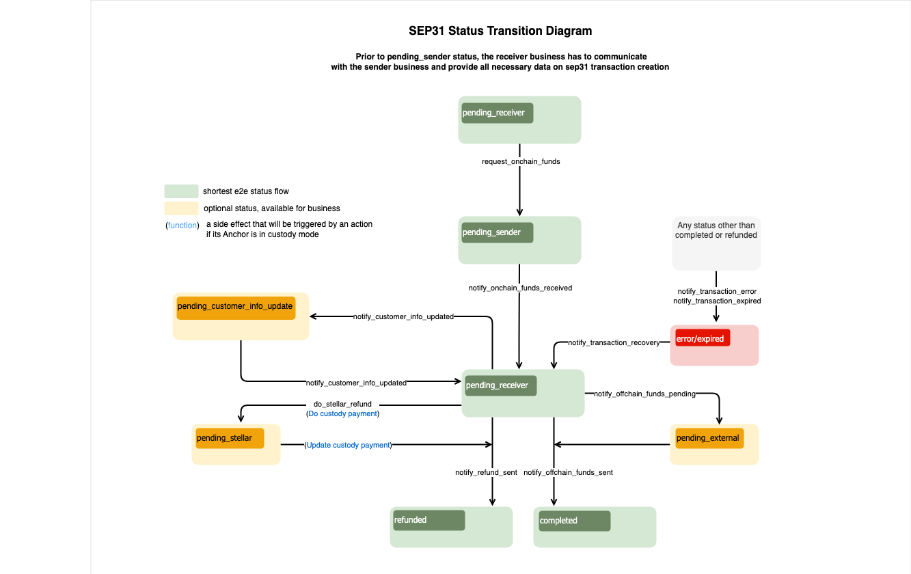

import { CodeExample } from "@site/src/components/CodeExample";

Integrar con la Anchor Platform para facilitar pagos transfronterizos implica implementar, como mínimo, lo siguiente:

- Puntos finales API KYC [`GET /customer`](../../api-reference/callbacks/get-customer.api.mdx) y [`PUT /customer`](../../api-reference/callbacks/put-customer.api.mdx) para solicitar y recopilar datos KYC de los clientes
- Punto final API RFQ [`GET /rate`](../../api-reference/callbacks/get-rates.api.mdx) para proveer tasas FX entre los activos on-chain y off-chain admitidos
- Solicitudes `GET /transactions` para obtener actualizaciones sobre los estados de transacciones en la Anchor Platform (documentación próximamente)
- Solicitudes [`JSON-RPC`](../../api-reference/platform/rpc/methods/README.mdx) para actualizar los estados de transacciones en la Anchor Platform

Lo siguiente también puede ser requerido dependiendo de tu caso de uso:

- [`DELETE /customer`](../../api-reference/callbacks/del-customer.api.mdx) si tu negocio desea o debe permitir que los remitentes soliciten la eliminación de datos de clientes

## Crear un Servidor Empresarial

Primero, crea un servidor empresarial y agrégalo a nuestro archivo docker compose.

<CodeExample>

```yaml
version: "3.8"

services:
  sep-server:
    image: stellar/anchor-platform:latest
    command: --sep-server
    env_file:
      - ./dev.env
    volumes:
      - ./config:/home
    ports:
      - "8080:8080"
    depends_on:
      - db
  platform-server:
    image: stellar/anchor-platform:latest
    command: --platform-server
    env_file:
      - ./dev.env
    volumes:
      - ./config:/home
    ports:
      - "8085:8085"
    depends_on:
      - db

  server:
    build: .
    ports:
      - "8081:8081"
    env_file:
      - ./dev.env
  db:
    image: postgres:14
    ports:
      - "5432:5432"
    env_file:
      - ./dev.env
```

</CodeExample>

Luego, crea un servidor web simple usando tu lenguaje de programación preferido y un `Dockerfile` que inicie el servidor. `docker compose up` debe iniciar correctamente los tres servicios.

Esta guía no proporciona una implementación de ejemplo para los puntos finales, pero puedes encontrar más información sobre los esquemas de solicitud y respuesta en la [Referencia API Anchor Platform](../../README.mdx), y las secciones siguientes ampliarán conceptos importantes para implementarlos.

## Puntos finales de Callback de Cliente

La Anchor Platform nunca almacena la información personal identificable (PII) de tus clientes, actuando en cambio como un servidor proxy entre las aplicaciones cliente y tu negocio, reenviando solicitudes y respuestas a la otra parte. Actualmente, las solicitudes y respuestas son casi idénticas a las definidas en la [especificación API KYC SEP-12](https://github.com/stellar/stellar-protocol/blob/master/ecosystem/sep-0012.md).

### Identificando Clientes

Se pueden identificar los clientes usando dos enfoques.

El primer enfoque utiliza una cuenta Stellar y memo. Al usar la Anchor Platform para facilitar pagos transfronterizos, la organización remitente usa su propia cuenta Stellar, la cual se usa para autenticarse vía [SEP-10 Stellar Authentication](../sep10/README.mdx), al registrar clientes con tu negocio. Los memos se utilizan para distinguir clientes únicos provenientes de la misma organización remitente.

El segundo enfoque usa IDs de cliente generados por tu servicio. Por ejemplo, si una organización remitente registra un cliente, tu negocio recibirá una solicitud `PUT /customer` como la siguiente:

<CodeExample>

```json
{
  "account": "GDJUOFZGW5WYBK4GIETCSSM6MTTIJ4SUMCQITPTLUWMQ6B4UIX2IEX47",
  "memo": "780284017",
  "type": "sep31-sender",
  "first_name": "John",
  "last_name": "Doe",
  "email": "johndoe@example.com"
}
```

</CodeExample>

En este ejemplo, la clave pública `GDJ...X47` identifica a la organización remitente, y el memo `780284017` identifica al cliente. Los memos suelen ser enteros de 64 bits, pero pueden ser otros tipos de datos, por lo que deben guardarse como cadenas. En respuesta, tu negocio debe devolver un ID de cliente.

<CodeExample>

```json
{
  "id": "fb5ddc93-1d5d-490d-ba5f-2c361cea41f7"
}
```

</CodeExample>

Tu servidor empresarial puede usar cualquier identificador para clientes mientras sea una cadena.

Tras registrar un cliente, la organización remitente puede usar cualquiera de los enfoques para consultar el estado del cliente. Por ejemplo, podrías recibir una solicitud `GET /customer` como la siguiente:

<CodeExample>

```
/customer?account=GDJUOFZGW5WYBK4GIETCSSM6MTTIJ4SUMCQITPTLUWMQ6B4UIX2IEX47&memo=780284017&type=sep31-sender
```

</CodeExample>

O, la organización remitente podría usar el identificador que devolviste cuando registró originalmente al cliente.

<CodeExample>

```
/customer?id=fb5ddc93-1d5d-490d-ba5f-2c361cea41f7&type=sep31-sender
```

</CodeExample>

Tu negocio necesitará mantener una correspondencia entre la cuenta y memo usados para registrar originalmente al cliente y el ID que devuelves en la respuesta, además de los datos KYC proporcionados. En futuras iteraciones de la Anchor Platform, podríamos mantener esta correspondencia para tu negocio, de modo que solo tengas que trabajar con los IDs que generas.

### Tipos de Cliente

Tu negocio probablemente requiera diferentes conjuntos de información KYC según el tipo de cliente. Puedes definir las etiquetas para cada tipo de cliente en tu archivo `dev.assets.yaml`, y las organizaciones remitentes deben saber qué etiqueta usar al registrar o consultar el estado de clientes.

En las solicitudes `PUT /customer`, debes usar el tipo enviado para evaluar si el remitente ha proporcionado todos los campos necesarios. En las solicitudes `GET /customer`, debes usar el tipo para determinar el estado del cliente.

### Prueba con la Demo Wallet

Puedes probar tu implementación con la [Stellar Demo Wallet](https://demo-wallet.stellar.org) siguiendo los pasos a continuación.

1. Selecciona "Generar par de claves para cuenta nueva"
2. Selecciona "Crear cuenta"
3. Selecciona "Agregar Activo" e ingresa el código de activo y el dominio principal de la Anchor Platform, `localhost:8080`
4. Selecciona "Agregar trustline"
5. Fondea tu cuenta con un saldo del activo
6. Selecciona "SEP-31 Enviar" en el menú desplegable

Deberías ver que la demo wallet encuentra las URL de tu servicio, se autentica y verifica qué campos KYC debe recopilar. Luego presentará un formulario para que ingreses los datos KYC del remitente y receptor.

[](../../assets/sep31-demo-wallet-widget.png)

Una vez que ingreses la información solicitada, la enviará a la Anchor Platform, que a su vez la enviará a tu servidor empresarial. Cuando la demo wallet tenga los IDs de clientes que generaste, iniciará una transacción que debería fallar.

## Punto final de callback de tasa

Una vez que la organización remitente haya registrado a los clientes involucrados en la transacción, necesitará solicitar una cotización, o tasa FX, a tu negocio. La Anchor Platform solicita esta información a tu servidor empresarial usando el punto final [`GET /rate`](../../api-reference/callbacks/get-rates.api.mdx).

### Cotizaciones Firmes vs. Indicativas

Las solicitudes de cotización tendrán un parámetro `type` que será [`indicativo`](https://www.investopedia.com/terms/i/indicativequote.asp) o [`firme`](https://www.investopedia.com/terms/f/firmquote.asp). Si `type=firm`, tu respuesta debe incluir el campo `id` y la fecha-hora `expires_at`, y reservar la liquidez necesaria para cumplir esta cotización hasta que expire. Si `type=indicative`, no regreses los campos `id` o `expires_at` porque la tasa proporcionada no será usada en una transacción.

Ten en cuenta que el cliente puede solicitar que la cotización expire tras una fecha-hora específica usando el parámetro `expires_after`. Tu negocio debe respetar esta solicitud devolviendo un valor `expires_at` que sea en o después de la fecha-hora solicitada, o rechazar la petición con un error 400 Bad Request, que será reenviado al cliente.

### Uso del ID de Cliente

Las solicitudes pueden incluir un parámetro `client_id` que identifica a la organización remitente que solicita la tasa. Puedes usar este parámetro para aplicar los términos comerciales acordados con esa organización remitente, como ofrecer tasas con descuento. `client_id` podría no estar presente en solicitudes indicativas, en cuyo caso debes devolver tu precio de mercado. Actualmente, `client_id` será siempre la clave pública Stellar que la organización remitente usó para autenticarse con la Anchor Platform.

### Métodos de Entrega

Es común que las tasas y tarifas de los negocios difieran según las vías de pago usadas para enviar fondos al destinatario. Si tus métodos de entrega están configurados en tu archivo `asset.yaml`, los clientes siempre proporcionarán la vía de pago que desean que tu negocio use para solicitudes de cotización firme.

Como este punto final solo se usa actualmente para pagos de remesas en activos off-chain, se utilizará `buy_delivery_method`. Si este punto final alguna vez se usa en otros flujos de transacción como depósitos SEP-24, también se podrá pasar `sell_delivery_method` para negocios que admitan esos tipos de transacciones.

## Obteniendo Actualizaciones de Estado de Transacciones

Para facilitar pagos transfronterizos, necesitarás poder detectar cuándo una organización remitente ha enviado a tu negocio un pago on-chain y determinar a qué transacción pertenecía ese pago.

La forma más fácil de hacerlo es ejecutar el Stellar Observer, que detectará estos pagos y actualizará el registro de transacciones correspondiente con información sobre el pago. Tu negocio puede detectar estas actualizaciones consultando periódicamente el punto final `GET /transactions` de la API Platform.

### Ejecutando el Stellar Observer

El Stellar Observer monitorea el libro mayor de Stellar en busca de pagos hechos a tus cuentas y actualiza los registros de transacciones correspondientes con información del pago on-chain. Para ejecutar el observador, agrega lo siguiente a tu archivo docker compose.

<CodeExample>

```yaml
services:
  ...
  observer:
    image: stellar/anchor-platform:latest
    command: --stellar-observer
    env_file:
      - ./dev.env
    volumes:
      - ./config:/home
```

</CodeExample>

### Consultando por Pagos Recibidos

El Stellar Observer realiza solicitudes JSON-RPC a la API Platform cada vez que detecta pagos recibidos para transacciones iniciadas por organizaciones remitentes, actualizando así la fecha-hora `transfer_received_at` de la transacción.

Tu negocio debe consultar periódicamente el punto final `GET /transactions` de la API Platform para detectar estas actualizaciones. Puedes referirte al siguiente ejemplo:

<CodeExample>

```bash
curl http://localhost:8080/transactions?sep=31&order_by=transfer_received_at&order=desc
```

</CodeExample>

La respuesta incluirá una lista de transacciones de pagos transfronterizos iniciadas por organizaciones remitentes. Esta lista estará ordenada según el momento en que se recibió un pago para esa transacción. Por cada transacción devuelta, tu negocio debe verificar si ya ha detectado el pago correspondiente. Si lo ha hecho, has detectado todos los pagos realizados a tus cuentas.

## Actualizando la Transacción vía JSON-RPC

El diagrama de flujo SEP-31 define la secuencia/reglas de la transición del estado de la transacción y un conjunto de métodos JSON-RPC que deben llamarse para cambiar ese estado. No puedes definir el estado que deseas establecer para una transacción específica en tus solicitudes. Cada método JSON-RPC define las estructuras de datos que espera en la solicitud. Si la solicitud no contiene los atributos requeridos, la Anchor Platform devolverá un error y no cambiará el estado de la transacción.

[](../../assets/sep31-transition-diagram.png)

:::tip

Los estados en <span style={{color: "green"}}>verde</span> son obligatorios y definen el flujo más corto.

Los estados en <span style={{color: "#B0BF1A"}}>amarillo</span> son opcionales y pueden omitirse.

Los estados en <span style={{color: "red"}}>rojo</span> indican que la transacción está en estado de error o ha expirado.

:::

Puedes crear una [plantilla](../sep24/integration.mdx#making-json-rpc-requests) para hacer solicitudes JSON-RPC a la Anchor Platform.

Este capítulo también contiene información sobre el formato de [solicitud](../sep24/integration.mdx#json-rpc-request)/[respuesta](../sep24/integration.mdx#json-rpc-response) y [códigos de error](../sep24/integration.mdx#error-codes) que podría devolver la Anchor Platform.

### Listo para Recibir Fondos

Las transacciones SEP-31 deberían estar inicialmente en estado `pending_receiver`. Para solicitar fondos del Anchor Remitente, el Anchor Receptor debería cambiar el estado de la transacción a `pending_sender` haciendo la siguiente solicitud RPC:

<CodeExample>

```json
// request-onchain-funds.json
[
  {
    "id": 1,
    "jsonrpc": "2.0",
    "method": "request_onchain_funds",
    "params": {
      "transaction_id": "<transaction_id>",
      "message": "Request onchain funds",
      "destination_account": "GD...G",
      "memo": "12345",
      "memo_type": "id"
    }
  }
]
```

</CodeExample>

Para ejecutar esto, necesitas correr:

<CodeExample>

```bash
./call-json-rpc.sh request-onchain-funds.json
```

</CodeExample>

El estado de la transacción cambiará a `pending_sender`.

### Fondos Recibidos

Si el Anchor Remitente ha enviado los fondos, el Anchor Receptor debería cambiar el estado de la transacción a `pending_receiver` haciendo la siguiente solicitud JSON-RPC:

<CodeExample>

```json
// onchain-funds-received.json
[
  {
    "id": 1,
    "jsonrpc": "2.0",
    "method": "notify_onchain_funds_received",
    "params": {
      "transaction_id": "<transaction_id>",
      "message": "Onchain funds received",
      "stellar_transaction_id": "7...9",
      "amount_in": {
        "amount": 10
      },
      "amount_out": {
        "amount": 9
      },
      "fee_details": {
        "total": 1
      }
    }
  }
]
```

</CodeExample>

Para ejecutar esto, necesitas correr:

<CodeExample>

```bash
./call-json-rpc.sh onchain-funds-received.json
```

</CodeExample>

El estado de la transacción cambiará a `pending_receiver`.

### Fondos Offchain Enviados

Para completar la transacción y cambiar su estado a `completed`, necesitas hacer una solicitud JSON-RPC `notify_offchain_funds_sent`.

<CodeExample>

```json
// offchain-funds-sent.json
[
  {
    "id": 1,
    "jsonrpc": "2.0",
    "method": "notify_offchain_funds_sent",
    "params": {
      "transaction_id": "<transaction_id>",
      "message": "Offchain funds sent",
      "funds_sent_at": "2023-07-04T12:34:56Z",
      "external_transaction_id": "a...c"
    }
  }
]
```

</CodeExample>

Para ejecutar esto, necesitas correr:

<CodeExample>

```bash
./call-json-rpc.sh offchain-funds-sent.json
```

</CodeExample>

### Fondos Offchain Pendientes

Otra opción es mover el estado de la transacción a `pending_external`. Este estado significa que el pago ha sido enviado a una red externa, pero aún no está confirmado.

<CodeExample>

```json
// offchain-funds-pending.json
[
  {
    "id": 1,
    "jsonrpc": "2.0",
    "method": "notify_offchain_funds_pending",
    "params": {
      "transaction_id": "<transaction_id>",
      "message": "Offchain funds pending",
      "external_transaction_id": "a...c"
    }
  }
]
```

</CodeExample>

Para ejecutar esto, necesitas correr:

<CodeExample>

```bash
./call-json-rpc.sh offchain-funds-pending.json
```

</CodeExample>

### Verificando Información del Cliente

En algunos casos, el Anchor Receptor podría necesitar solicitar información actualizada al Anchor Remitente. Por ejemplo, el banco informa al Anchor Receptor que el nombre del cliente receptor proporcionado es incorrecto o le falta una inicial intermedia. Dado que esta información fue enviada vía SEP-12, la transacción debería pasar al estado `pending_customer_info_update` hasta que el Anchor Remitente haga otra solicitud SEP-12 `PUT /customer` para actualizarla. El Anchor Remitente puede verificar qué campos necesitan actualizarse haciendo una solicitud SEP-12 `GET /customer` incluyendo los parámetros de id o cuenta y memo. El Anchor Receptor debe responder con un estado `NEEDS_INFO` y el campo `last_name` incluido en los campos descritos.

Después de que el Anchor Remitente haga una solicitud SEP-12 `PUT /customer`, llama al método JSON-RPC `notify_customer_info_updated` para actualizar el estado de la transacción. Además, llama a este método cada vez que el estado SEP-12 de un cliente cambie, por ejemplo cuando la información del cliente se esté validando y el estado cambie de `NEEDS_INFO` a `PROCESSING`. Esto asegura que cualquier cliente configurado con una URL de callback sea notificado del estado más reciente del cliente, permitiendo que el cliente solicite al usuario que actualice su información.

<CodeExample>

```json
// notify-customer-info-updated.json
[
  {
    "id": 1,
    "jsonrpc": "2.0",
    "method": "notify_customer_info_updated",
    "params": {
      "transaction_id": "<transaction_id>",
      "message": "Customer info updated",
      "customer_id": "45f8884d-d6e1-477f-a680-503179263359",
      "customer_type": "sep31-receiver" // or sep31-sender
    }
  }
]
```

</CodeExample>

Para ejecutar esto, necesitas correr:

<CodeExample>

```bash
./call-json-rpc.sh notify-customer-info-updated.json
```

</CodeExample>

### Reembolso Enviado

Existe la posibilidad de enviar todos los fondos de regreso al `Sending Anchor` (reembolso). Debes reembolsar la suma total (reembolso completo).

<CodeExample>

```json
// refund-sent.json
[
  {
    "id": 1,
    "jsonrpc": "2.0",
    "method": "notify_refund_sent",
    "params": {
      "transaction_id": "<transaction_id>",
      "message": "Refund sent",
      "refund": {
        "id": "1c186184-09ee-486c-82a6-aa7a0ab1119c",
        "amount": {
          "amount": 10,
          "asset": "iso4217:USD"
        },
        "amount_fee": {
          "amount": 1,
          "asset": "iso4217:USD"
        }
      }
    }
  }
]
```

</CodeExample>

Para ejecutar esto, necesitas correr:

<CodeExample>

```bash
./call-json-rpc.sh refund-sent.json
```

</CodeExample>

:::note

No puedes hacer múltiples reembolsos en el flujo SEP-31. Por esta razón, el monto a reembolsar más la tarifa deben sumar `amount_in`. De lo contrario, obtendrás un error.

:::

### Error de Transacción

Si encuentras un error irrecuperable al procesar la transacción, es obligatorio establecer el estado de la transacción en `error`. Puedes usar el campo message para describir los detalles del error.

<CodeExample>

```json
// transaction-error.json
[
  {
    "id": 1,
    "jsonrpc": "2.0",
    "method": "notify_transaction_error",
    "params": {
      "transaction_id": "<transaction_id>",
      "message": "Error occurred"
    }
  }
]
```

</CodeExample>

Para ejecutar esto, necesitas correr:

<CodeExample>

```bash
./call-json-rpc.sh transaction-error.json
```

</CodeExample>

:::tip

Si un usuario ha hecho una transferencia, deberías hacer una recuperación de transacción, y luego puedes reintentar procesar la transacción o iniciar un reembolso.

:::

### Transacción Expirada

Tu negocio puede querer expirar aquellas transacciones que el usuario haya abandonado tras cierto tiempo. Es una buena práctica limpiar transacciones inactivas en estado `incomplete`. Para ello, simplemente cambia el estado de la transacción a `expired`.

<CodeExample>

```json
// transaction-expired.json
[
  {
    "id": 1,
    "jsonrpc": "2.0",
    "method": "notify_transaction_expired",
    "params": {
      "transaction_id": "<transaction_id>",
      "message": "Transaction expired"
    }
  }
]
```

</CodeExample>

Para ejecutar esto, necesitas correr:

<CodeExample>

```bash
./call-json-rpc.sh transaction-expired.json
```

</CodeExample>

:::tip

Este método JSON-RPC no puede usarse después de que el usuario haya hecho la transferencia.

:::

### Recuperación de Transacción

El estado de la transacción puede cambiarse de `error/expired` a `pending-anchor`. Después de la recuperación, puedes reembolsar los activos recibidos o continuar con el procesamiento de la transacción. Para recuperar la transacción, es necesario hacer la siguiente solicitud JSON-RPC:

<CodeExample>

```json
// transaction-recovery.json
[
  {
    "id": 1,
    "jsonrpc": "2.0",
    "method": "notify_transaction_recovery",
    "params": {
      "transaction_id": "<transaction_id>",
      "message": "Transaction recovered"
    }
  }
]
```

</CodeExample>

Para ejecutar esto, necesitas correr:

<CodeExample>

```bash
./call-json-rpc.sh transaction-recovery.json
```

</CodeExample>

### Configuración

Puedes habilitar estos tipos de transacciones actualizando la configuración de tu archivo `assets.yaml`:

<CodeExample>

```yaml
items:
  - ...
    sep31:
      quotes_required: false
```

</CodeExample>
