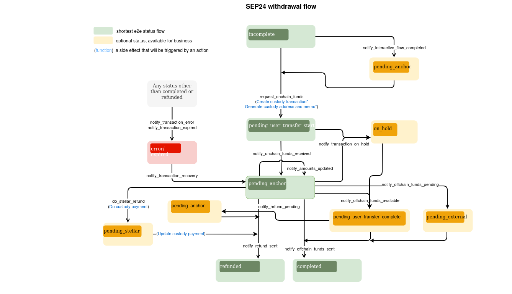

import { CodeExample } from "@site/src/components/CodeExample";
import { AttributeTable } from "@site/src/components/AttributeTable";
import Security from "../component/security/security.mdx";
import UsingApiKey from "../component/security/api_key.mdx";
import UsingJwt from "../component/security/jwt.mdx";
import Rpc from "../component/rpc/rpc.mdx";
import RpcRequest from "../component/rpc/request.mdx";
import RpcResponse from "../component/rpc/response.mdx";
import RpcError from "../component/rpc/error.mdx";
import Observer from "../component/observer/observer.mdx";

Uno de los principales puntos de interacción con Anchor Platform es notificar a Anchor Platform sobre eventos relacionados con la transacción.

Generalmente, querrás proporcionar actualizaciones para los siguientes eventos:

- Tu negocio está procesando la información KYC proporcionada por el usuario
- Tu negocio está listo para recibir fondos del usuario
- Tu negocio ha recibido fondos del usuario
- Tu negocio ha enviado fondos al usuario
- Tu negocio ha procesado un reembolso para la transacción del usuario
- Tu negocio experimentó un error inesperado

Esto se realiza haciendo solicitudes JSON-RPC al punto final de la API de la Plataforma. Las solicitudes JSON-RPC te permiten actualizar el estado de la transacción. Para mover la transacción a un estado específico, es necesario hacer una solicitud JSON-RPC correspondiente y pasar los datos que requiere este método RPC.

La API JSON-RPC de Anchor Platform está diseñada para notificar a la plataforma sobre cambios en el estado de la transacción. Por lo tanto, la API será llamada cada vez que un usuario o el anchor realice cualquier acción que haga progresar el estado de la transacción en el flujo.

La comunicación desde Anchor Platform sobre actualizaciones de transacciones, actualizaciones de clientes y creación de cotizaciones se maneja a través del servicio de eventos. Esta es una función opcional que debe configurarse por separado de la integración SEP-6. Para más información, consulta [Manejo de Eventos][event-handling].

Puedes encontrar más sobre el flujo y estados de la transacción en el [documento del protocolo SEP-24][sep-24].

## Callbacks

Anchor Platform depende del servidor del negocio para proporcionar y almacenar información sobre las cotizaciones.

### Cotizaciones y Tarifas

Para admitir el intercambio de activos no equivalentes, Anchor Platform expone una API compatible con SEP-38 para proporcionar cotizaciones para el exchange. La API de cotizaciones se usa para proporcionar al usuario la cantidad esperada del activo que recibirá a cambio del activo que está enviando. La API de cotizaciones también se usa para proporcionar al usuario las tarifas esperadas para la transacción. Por lo tanto, tu servidor de negocio debe implementar la [API de cotización][rate-callback] para proporcionar cotizaciones a Anchor Platform.

## Asegurar la API de la Plataforma

<Security />

### Uso de clave API

<UsingApiKey />

### Uso de JWT

<UsingJwt />

## Realizar solicitudes JSON-RPC

<Rpc />

### Solicitud JSON-RPC

<RpcRequest />

### Respuesta JSON-RPC

<RpcResponse />

### Códigos de error

<RpcError />

## Actualizando la transacción de depósito vía JSON-RPC

El diagrama del flujo de depósito SEP-24 define la secuencia/reglas de transición del estado de la transacción y un conjunto de métodos JSON-RPC que deben llamarse para cambiar ese estado. No puedes definir el estado que deseas establecer para una transacción específica en tus solicitudes. Cada método JSON-RPC define las estructuras de datos que espera en la solicitud. Si la solicitud no contiene atributos requeridos, Anchor Platform devolverá un error y no cambiará el estado de la transacción.

[](../../assets/sep24-deposit-flow-diagram.png)

:::tip

Los estados en <span style={{color: "green"}}>verde</span> son obligatorios y definen el camino más corto.

Los estados en <span style={{color: "#B0BF1A"}}>amarillo</span> son opcionales y pueden omitirse.

Los estados en <span style={{color: "red"}}>rojo</span> indican que la transacción está en un estado de error o ha caducado.

:::

### Listo para recibir fondos

El primer paso del flujo de depósito después de iniciar el propio depósito es recopilar el KYC. Generalmente se realiza en la aplicación web, pero también puede ser proporcionado opcionalmente por la aplicación billetera, usando [SEP-9]. Una vez que se recopila el KYC necesario, se debe hacer una solicitud JSON-RPC `request_offchain_funds`.

<CodeExample>

```json
// request-offchain-funds.json
[
  {
    "id": 1,
    "jsonrpc": "2.0",
    "method": "request_offchain_funds",
    "params": {
      "transaction_id": "<transaction_id>",
      "message": "Request offchain funds",
      "amount_in": {
        "amount": 10,
        "asset": "iso4217:USD"
      },
      "amount_out": {
        "amount": 9,
        "asset": "stellar:USDC:GBBD47IF6LWK7P7MDEVSCWR7DPUWV3NY3DTQEVFL4NAT4AQH3ZLLFLA5"
      },
      "amount_fee": {
        "amount": 1,
        "asset": "iso4217:USD"
      },
      "amount_expected": {
        "amount": 10
      }
    }
  }
]
```

</CodeExample>

- `amount_in` es la cantidad que el usuario debe enviar al negocio.
- `amount_out` es la cantidad que el usuario recibirá.
- `amount_fee` es el total de tarifas recolectadas por el negocio.
- `asset` es parte del campo `amount_x` y está en formato SEP-38. En este ejemplo, está establecido en USD, suponiendo que el usuario hizo una transferencia bancaria al sistema usando USD.

La información sobre las cantidades (entrada/salida/tarifa) es requerida si quieres mover la transacción del estado `incomplete` a `pending_user_transfer_start`. Si el estado de la transacción cambia de `pending_anchor` a `pending_user_transfer_start`, puedes omitir la definición de las cantidades.

Para procesar esto, necesitas ejecutar:

<CodeExample>

```bash
./call-json-rpc.sh request-offchain-funds.json
```

</CodeExample>

:::tip

Cuando el proceso KYC es largo (por ejemplo, verificación de identificación), se recomienda primero establecer el estado de la transacción a `pending_anchor` usando la solicitud JSON-RPC `notify_interactive_flow_completed`. Esto indicará al usuario que el KYC está siendo procesado.

:::

### Procesando información KYC

:::tip

Este paso es opcional. La mayoría de los negocios no lo usan. Puedes omitirlo e ir al [siguiente paso](#funds-received).

Se recomienda usar este estado cuando la verificación KYC debe realizarse de forma asincrónica.

:::

**Debes** especificar los campos `amount_x`.

<CodeExample>

```json
// kyc-in-process.json
[
  {
    "id": 1,
    "jsonrpc": "2.0",
    "method": "notify_interactive_flow_completed",
    "params": {
      "transaction_id": "<transaction_id>",
      "message": "Interactive flow completed.",
      "amount_in": {
        "amount": 10,
        "asset": "iso4217:USD"
      },
      "amount_out": {
        "amount": 9,
        "asset": "stellar:USDC:GBBD47IF6LWK7P7MDEVSCWR7DPUWV3NY3DTQEVFL4NAT4AQH3ZLLFLA5"
      },
      "amount_fee": {
        "amount": 1,
        "asset": "iso4217:USD"
      },
      "amount_expected": {
        "amount": 10
      }
    }
  }
]
```

</CodeExample>

Para procesar esto, necesitas ejecutar:

<CodeExample>

```bash
./call-json-rpc.sh kyc-in-process.json
```

</CodeExample>

### Fondos recibidos

Si se recibieron fondos offchain, querrás proporcionar información actualizada de la transacción.

<CodeExample>

```json
// offchain-funds-received.json
[
  {
    "id": 1,
    "jsonrpc": "2.0",
    "method": "notify_offchain_funds_received",
    "params": {
      "transaction_id": "<transaction_id>",
      "message": "Offchain funds received",
      "funds_received_at": "2023-07-04T12:34:56Z",
      "external_transaction_id": "7...9",
      "amount_in": {
        "amount": 10
      },
      "amount_out": {
        "amount": 9
      },
      "amount_fee": {
        "amount": 1
      },
      "amount_expected": {
        "amount": 10
      }
    }
  }
]
```

</CodeExample>

- `funds_received_at` es la fecha y hora de recepción de fondos
- `external_transaction_id` es el ID de la transacción en la red externa

Los campos de monto son opcionales. Si se omiten, se tomarán los valores de solicitudes JSON-RPC previas.

Para procesar esto, necesitas ejecutar:

<CodeExample>

```bash
./call-json-rpc.sh offchain-funds-received.json
```

</CodeExample>

### Esperando fondos del usuario

En el mundo real, el proceso de confirmación de la transferencia puede tomar tiempo. En tales casos, las transacciones deben establecerse en un nuevo estado que indique que se ha recibido la confirmación de la transferencia pero aún no se han recibido los fondos.

<CodeExample>

```json
// offchain-funds-sent.json
[
  {
    "id": 1,
    "jsonrpc": "2.0",
    "method": "notify_offchain_funds_sent",
    "params": {
      "transaction_id": "<transaction_id>",
      "message": "Offchain funds sent",
      "funds_received_at": "2023-07-04T12:34:56Z",
      "external_transaction_id": "7...9"
    }
  }
]
```

</CodeExample>

Para procesar esto, necesitas ejecutar:

<CodeExample>

```bash
./call-json-rpc.sh offchain-funds-sent.json
```

</CodeExample>

### Envío de fondos Onchain

Luego, envía una transacción en la red Stellar para cumplir la solicitud del usuario. Después de completar la transacción, es necesario enviar la solicitud JSON-RPC `notify_onchain_funds_sent` para notificar al usuario que los fondos se enviaron con éxito.

<CodeExample>

```json
// onchain-funds-sent.json
[
  {
    "id": 1,
    "jsonrpc": "2.0",
    "method": "notify_onchain_funds_sent",
    "params": {
      "transaction_id": "<transaction_id>",
      "message": "Onchain funds sent",
      "stellar_transaction_id": "7...9"
    }
  }
]
```

</CodeExample>

- `stellar_transaction_id` es el ID de la transacción en la red Stellar de la transferencia

Para procesar esto, necesitas ejecutar:

<CodeExample>

```bash
./call-json-rpc.sh onchain-funds-sent.json
```

</CodeExample>

Después de esta solicitud JSON-RPC, la transacción pasará al estado `completed`.

### Envío de pagos vía servicio de custodia

Anchor Platform ofrece la posibilidad de enviar un pago a través de servicios de custodia, como Fireblocks. Para realizar un pago mediante un servicio de custodia, es necesario hacer la siguiente solicitud JSON-RPC:

<CodeExample>

```json
// do-stellar-payment.json
[
  {
    "id": 1,
    "jsonrpc": "2.0",
    "method": "do_stellar_payment",
    "params": {
      "transaction_id": "<transaction_id>",
      "message": "Custody payment started"
    }
  }
]
```

</CodeExample>

Para procesar esto, necesitas ejecutar:

<CodeExample>

```bash
./call-json-rpc.sh do-stellar-payment.json
```

</CodeExample>

Después del procesamiento exitoso del pago en un servicio de custodia, Anchor Platform hará automáticamente la solicitud JSON-RPC `notify_onchain_funds_sent` y el estado de la transacción cambiará a `completed`.

:::caution

Una cuenta de usuario puede no estar lista para recibir fondos. Puedes verificar que la cuenta ha establecido una [trustline](/docs/learn/glossary#trustline). De lo contrario, puedes establecer el estado de la transacción a `pending_trust` para indicar que el anchor está esperando que el usuario establezca la trustline.

Si la integración de custodia está habilitada, Anchor Platform realizará esta validación automáticamente por ti.

:::

### En Espera de Trust

Este estado debe establecerse si un pago requiere una trustline de activo que no fue configurada por el usuario. Hay dos formas en las que la transacción puede pasar al estado `pending_trust`. La primera es el procesamiento de un pago vía servicio de custodia en caso de que detecte que la trustline no está configurada. La segunda es cuando el negocio detecta que falta la trustline y quiere notificar al usuario que debe configurarla. Para mover la transacción al estado `pending_trust`, es necesario hacer la siguiente solicitud JSON-RPC:

<CodeExample>

```json
// request-trust.json
[
  {
    "id": 1,
    "jsonrpc": "2.0",
    "method": "request_trust",
    "params": {
      "transaction_id": "<transaction_id>",
      "message": "Asset trustine not configured"
    }
  }
]
```

</CodeExample>

Para procesar esto, necesitas ejecutar:

<CodeExample>

```bash
./call-json-rpc.sh request-trust.json
```

</CodeExample>

:::info

El pago a través del servicio de custodia verifica periódicamente si la trustline fue configurada. Si lo fue, enviará automáticamente un pago al servicio de custodia y cambiará el estado de la transacción a `pending_stellar`.

:::

### Trust Set

Este estado debe establecerse si el negocio ha detectado si la trustline fue o no configurada por el usuario.

<CodeExample>

```json
// trust-set.json
[
  {
    "id": 1,
    "jsonrpc": "2.0",
    "method": "notify_trust_set",
    "params": {
      "transaction_id": "<transaction_id>",
      "message": "Asset trustine set",
      "success": "true"
    }
  }
]
```

</CodeExample>

- El flag `success` define si la trustline fue configurada o no por el usuario

Para procesar esto, necesitas ejecutar:

<CodeExample>

```bash
./call-json-rpc.sh trust-set.json
```

</CodeExample>

:::info

Dependiendo del flag `success`, el estado de la transacción cambiará a `pending_stellar` si la trustline se configuró, o a `pending_anchor` si no lo fue.

:::

### Envío de reembolso vía servicio de custodia

Existe la posibilidad de devolver fondos al usuario (reembolso). Puedes reembolsar la suma completa (reembolso total) o hacer un conjunto de reembolsos parciales. Además, si el usuario envió más dinero del esperado, puedes reembolsar una parte de la suma al usuario y enviar el resto como fondos onchain.

<CodeExample>

```json
// refund-sent.json
[
  {
    "id": 1,
    "jsonrpc": "2.0",
    "method": "notify_refund_sent",
    "params": {
      "transaction_id": "<transaction_id>",
      "message": "Refund sent",
      "refund": {
        "id": "1c186184-09ee-486c-82a6-aa7a0ab1119c",
        "amount": {
          "amount": 10,
          "asset": "iso4217:USD"
        },
        "amount_fee": {
          "amount": 1,
          "asset": "iso4217:USD"
        }
      }
    }
  }
]
```

</CodeExample>

Para procesar esto, necesitas ejecutar:

<CodeExample>

```bash
./call-json-rpc.sh refund-sent.json
```

</CodeExample>

:::info

Si la suma de los reembolsos es menor que `amount_in`, el estado de la transacción se establecerá en `pending_anchor`. Solo si la suma de los reembolsos es igual a `amount_in`, el estado de la transacción se establecerá en `refunded`.

:::

### Reembolso pendiente

Es similar a [Reembolso enviado](#refund-sent), pero maneja el caso cuando un reembolso ha sido enviado a la red externa pero aún no está confirmado. El estado de la transacción se establece en `pending_external`. Este es el estado que se establecerá al esperar que Bitcoin u otra red de criptomonedas externa complete una transacción, o al esperar una transferencia bancaria.

### Error de transacción

Si encuentras un error irrecuperable al procesar la transacción, es necesario establecer el estado de la transacción a `error`. Puedes usar el campo mensaje para describir los detalles del error.

<CodeExample>

```json
// transaction-error.json
[
  {
    "id": 1,
    "jsonrpc": "2.0",
    "method": "notify_transaction_error",
    "params": {
      "transaction_id": "<transaction_id>",
      "message": "Error occurred"
    }
  }
]
```

</CodeExample>

Para procesar esto, necesitas ejecutar:

<CodeExample>

```bash
./call-json-rpc.sh transaction-error.json
```

</CodeExample>

:::tip

Si un usuario ha hecho una transferencia, deberías hacer una recuperación de transacción, y luego puedes reintentar procesar la transacción o iniciar un reembolso.

:::

### Transacción caducada

Tu negocio puede querer expirar las transacciones que el usuario ha abandonado después de un tiempo. Es una buena práctica limpiar las transacciones inactivas en el estado `incomplete`. Para hacerlo, simplemente cambia el estado de la transacción a `expired`.

<CodeExample>

```json
// transaction-expired.json
[
  {
    "id": 1,
    "jsonrpc": "2.0",
    "method": "notify_transaction_expired",
    "params": {
      "transaction_id": "<transaction_id>",
      "message": "Transaction expired"
    }
  }
]
```

</CodeExample>

Para procesar esto, necesitas ejecutar:

<CodeExample>

```bash
./call-json-rpc.sh transaction-expired.json
```

</CodeExample>

:::tip

Este método JSON-RPC no puede usarse después de que el usuario haya hecho una transferencia.

:::

### Transacción en espera

En casos raros, puedes querer pausar la transacción actual y solicitar más información al usuario (después de haber recibido la transferencia). Esto podría usarse para casos de cumplimiento.

<CodeExample>

```json
// transaction-hold.json
[
  {
    "id": 1,
    "jsonrpc": "2.0",
    "method": "notify_transaction_on_hold",
    "params": {
      "transaction_id": "<transaction_id>",
      "message": "Transaction is on hold. Please contact customer support to resolve the hold."
    }
  }
]
```

</CodeExample>

Para procesar esto, necesitas ejecutar:

<CodeExample>

```bash
./call-json-rpc.sh transaction-hold.json
```

</CodeExample>

### Recuperación de transacción

El estado de la transacción puede cambiar de `error/expired` a `pending_anchor`. Después de la recuperación, puedes reembolsar los activos recibidos o proceder con el procesamiento de la transacción. Para recuperar una transacción, es necesario hacer la siguiente solicitud JSON-RPC:

<CodeExample>

```json
// transaction-recovery.json
[
  {
    "id": 1,
    "jsonrpc": "2.0",
    "method": "notify_transaction_recovery",
    "params": {
      "transaction_id": "<transaction_id>",
      "message": "Transaction recovered"
    }
  }
]
```

</CodeExample>

Para procesar esto, necesitas ejecutar:

<CodeExample>

```bash
./call-json-rpc.sh transaction-recovery.json
```

</CodeExample>

## Actualizando la transacción de retirada vía JSON-RPC

Este diagrama define una secuencia/reglas de transición del estado de la transacción para el flujo de retirada SEP-24.

[](../../assets/sep24-withdrawal-flow-diagram.png)

:::tip

Los estados en <span style={{color: "green"}}>verde</span> son obligatorios y definen el camino más corto.

Los estados en <span style={{color: "#B0BF1A"}}>amarillo</span> son opcionales y pueden omitirse.

Los estados en <span style={{color: "red"}}>rojo</span> indican que la transacción está en un estado de error o ha caducado.

:::

Una vez que finaliza el flujo de depósito, implementar la retirada es sencillo. Algunas partes del flujo son similares y pueden reutilizarse.

El punto de inicio tanto para la retirada como para el depósito es el mismo.

### Listo para recibir fondos

Similar al depósito, el siguiente paso es notificar al usuario que el anchor está listo para recibir fondos. Sin embargo, como tu servicio recibirá transacciones a través de la red Stellar, la actualización será diferente.

<CodeExample>

```json
// request-onchain-funds.json
[
  {
    "id": 1,
    "jsonrpc": "2.0",
    "method": "request_onchain_funds",
    "params": {
      "transaction_id": "<transaction_id>",
      "message": "Request onchain funds",
      "amount_in": {
        "amount": 10,
        "asset": "stellar:USDC:GBBD47IF6LWK7P7MDEVSCWR7DPUWV3NY3DTQEVFL4NAT4AQH3ZLLFLA5"
      },
      "amount_out": {
        "amount": 9,
        "asset": "iso4217:USD"
      },
      "amount_fee": {
        "amount": 1,
        "asset": "stellar:USDC:GBBD47IF6LWK7P7MDEVSCWR7DPUWV3NY3DTQEVFL4NAT4AQH3ZLLFLA5"
      },
      "amount_expected": {
        "amount": 10
      },
      "destination_account": "GD...G",
      "memo": "12345",
      "memo_type": "id"
    }
  }
]
```

</CodeExample>

- `memo`: Valor del memo para adjuntar a la transacción
- `memo_type`: Tipo de memo que el anchor debe adjuntar a la transacción
- `destination_account`: Cuenta destino

Para procesar esto, necesitas ejecutar:

<CodeExample>

```bash
./call-json-rpc.sh request-onchain-funds.json
```

</CodeExample>

:::tip

Establecer `memo`, `memo_type` y `destination_account` es opcional.

Si la integración con un custodio tercero está habilitada, Anchor Platform puede generar `memo`, `memo_type` y `destination_address` si se eligió un `deposit_info_generator_type` correspondiente. También puedes proporcionar `memo` y `memo_type` a la solicitud como se muestra arriba. Ten en cuenta que el memo debe ser único, esto ayuda a asociar transacciones Stellar con transacciones SEP.

Si tu negocio administra los activos, Anchor Platform puede generar memos por ti. Cuando el estado cambia a `pending_user_transfer_start`, Anchor Platform establece automáticamente el `memo` y `memo_type` (solo si no están incluidos en la solicitud).

:::

:::note

La cuenta Stellar que se usará para recibir fondos debe estar configurada.

:::

### Procesando información KYC

Este paso es opcional, y es similar a [Procesando información KYC](#processing-kyc-information) del flujo de depósito.

### Fondos recibidos

Si se recibieron fondos onchain, necesitas proporcionar las cantidades y cambiar el estado de la transacción a `pending_anchor`.

<CodeExample>

```json
// onchain-funds-received.json
[
  {
    "id": 1,
    "jsonrpc": "2.0",
    "method": "notify_onchain_funds_received",
    "params": {
      "transaction_id": "<transaction_id>",
      "message": "Onchain funds received",
      "stellar_transaction_id": "7...9",
      "amount_in": {
        "amount": 10
      },
      "amount_out": {
        "amount": 9
      },
      "amount_fee": {
        "amount": 1
      }
    }
  }
]
```

</CodeExample>

Para procesar esto, necesitas ejecutar:

<CodeExample>

```bash
./call-json-rpc.sh onchain-funds-received.json
```

</CodeExample>

:::tip

Este método será llamado automáticamente por el servidor de custodia si la integración de custodia está habilitada.

:::

### Cantidad actualizada

Si se recibieron fondos onchain, pero por alguna razón el `amount_in` difiere del especificado en el flujo interactivo (`amount_expected`), puedes actualizar `amount_out` y `amount_fee` para que correspondan al `amount_in` real. El estado de la transacción en este caso no cambiará y será igual a `pending_anchor`.

<CodeExample>

```json
// amounts-updated.json
[
  {
    "id": 1,
    "jsonrpc": "2.0",
    "method": "notify_amounts_updated",
    "params": {
      "transaction_id": "<transaction_id>",
      "message": "Amounts updated",
      "amount_out": {
        "amount": 9
      },
      "amount_fee": {
        "amount": 1
      }
    }
  }
]
```

</CodeExample>

Para procesar esto, necesitas ejecutar:

<CodeExample>

```bash
./call-json-rpc.sh amounts-updated.json
```

</CodeExample>

:::note

Solo `amount_out` y `amount_fee` pueden actualizarse usando esta solicitud JSON-RPC, y no necesitas especificar los activos de las cantidades.

:::

### Fondos offchain enviados

Para completar la transacción y cambiar su estado a `completed`, necesitas hacer la solicitud JSON-RPC `notify_offchain_funds_sent`.

<CodeExample>

```json
// offchain-funds-sent.json
[
  {
    "id": 1,
    "jsonrpc": "2.0",
    "method": "notify_offchain_funds_sent",
    "params": {
      "transaction_id": "<transaction_id>",
      "message": "Offchain funds sent",
      "funds_sent_at": "2023-07-04T12:34:56Z",
      "external_transaction_id": "a...c"
    }
  }
]
```

</CodeExample>

Para procesar esto, necesitas ejecutar:

<CodeExample>

```bash
./call-json-rpc.sh offchain-funds-sent.json
```

</CodeExample>

### Fondos offchain disponibles

Puedes mover el estado de la transacción a `pending_user_transfer_complete` si se enviaron fondos offchain y está listo para que el usuario o destinatario los recoja.

<CodeExample>

```json
// offchain-funds-available.json
[
  {
    "id": 1,
    "jsonrpc": "2.0",
    "method": "notify_offchain_funds_available",
    "params": {
      "transaction_id": "<transaction_id>",
      "message": "Offchain funds available",
      "external_transaction_id": "a...c"
    }
  }
]
```

</CodeExample>

Para procesar esto, necesitas ejecutar:

<CodeExample>

```bash
./call-json-rpc.sh offchain-funds-available.json
```

</CodeExample>

### Fondos offchain pendientes

Otra opción es mover el estado de la transacción a `pending_external`. Este estado significa que el pago ha sido enviado a una red externa, pero aún no está confirmado.

<CodeExample>

```json
// offchain-funds-pending.json
[
  {
    "id": 1,
    "jsonrpc": "2.0",
    "method": "notify_offchain_funds_pending",
    "params": {
      "transaction_id": "<transaction_id>",
      "message": "Offchain funds pending",
      "external_transaction_id": "a...c"
    }
  }
]
```

</CodeExample>

Para procesar esto, necesitas ejecutar:

<CodeExample>

```bash
./call-json-rpc.sh offchain-funds-pending.json
```

</CodeExample>

### Reembolso enviado

La lógica de reembolso funciona de la misma manera que para el flujo de depósito. Para más detalles, consulta [Reembolso enviado](#refund-sent) del flujo de depósito.

### Envío de reembolso vía servicio de custodia

La integración con un servicio de custodia te permite hacer un reembolso a través de un servicio de custodia, como Fireblocks.

<CodeExample>

```json
// do-stellar-refund.json
[
  {
    "id": 1,
    "jsonrpc": "2.0",
    "method": "do_stellar_refund",
    "params": {
      "transaction_id": "<transaction_id>",
      "message": "Do stellar refund",
      "refund": {
        "amount": {
          "amount": 9,
          "asset": "stellar:USDC:GBBD47IF6LWK7P7MDEVSCWR7DPUWV3NY3DTQEVFL4NAT4AQH3ZLLFLA5"
        },
        "amount_fee": {
          "amount": 1,
          "asset": "stellar:USDC:GBBD47IF6LWK7P7MDEVSCWR7DPUWV3NY3DTQEVFL4NAT4AQH3ZLLFLA5"
        }
      }
    }
  }
]
```

</CodeExample>

Para procesar esto, necesitas ejecutar:

<CodeExample>

```bash
./call-json-rpc.sh do-stellar-refund.json
```

</CodeExample>

:::note

De manera similar al flujo de depósito, puedes hacer un reembolso completo o un conjunto de reembolsos parciales. La transacción permanecerá en estado `pending_anchor` hasta que la suma de los reembolsos sea menor que `amount_in`. Si la suma de los reembolsos es igual a `amount_in`, Anchor Platform cambiará automáticamente el estado de la transacción a `refunded`.

:::

### Error de transacción

Funciona de la misma manera que para el flujo de depósito. Para más detalles, consulta [Error de transacción](#transaction-error) del flujo de depósito.

### Transacción caducada

Funciona de la misma manera que para el flujo de depósito. Para más detalles, consulta [Transacción caducada](#expired-transaction) del flujo de depósito.

### Transacción en espera

Funciona de la misma manera que para el flujo de depósito. Para más detalles, consulta [Transacción en espera](#on-hold-transaction) del flujo de depósito.

### Recuperación de transacción

Funciona de la misma manera que para el flujo de depósito. Para más detalles, consulta [Recuperación de transacción](#transaction-recovery) del flujo de depósito.

## Rastreo de transacciones Stellar

<Observer />

[sep-9]: https://github.com/stellar/stellar-protocol/blob/master/ecosystem/sep-0009.md
[sep-24]: https://github.com/stellar/stellar-protocol/blob/master/ecosystem/sep-0024.md
[event-handling]: ../events/README.mdx
[rate-callback]: ../../api-reference/callbacks/README.mdx
[json-rpc-methods]: ../../api-reference/platform/rpc/methods/README.mdx
