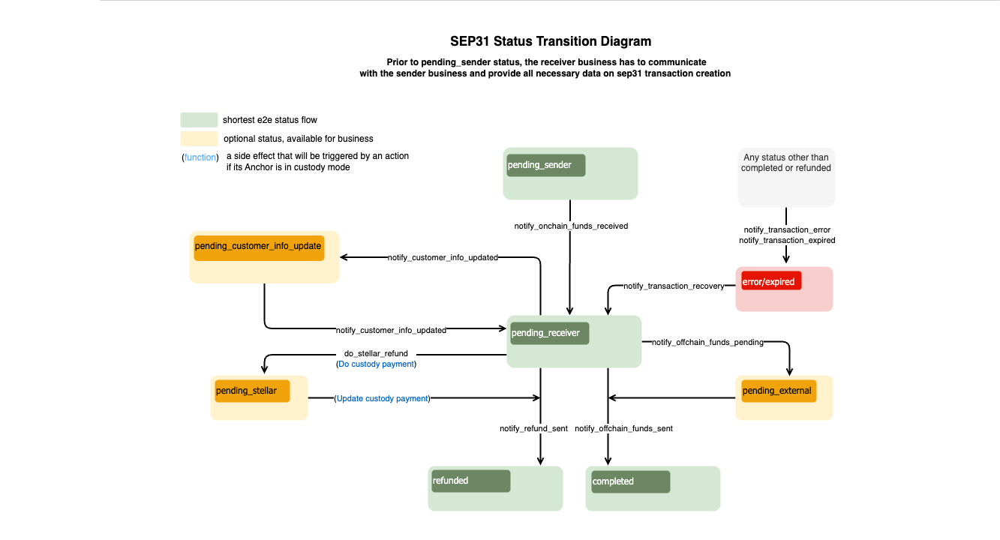

import { CodeExample } from "@site/src/components/CodeExample";

Integrar con la Anchor Platform para facilitar pagos transnacionales implica implementar lo siguiente, como mínimo:

- [`GET /customer`][get-customer] & [`PUT /customer`][put-customer] puntos finales de la API KYC para solicitar y recolectar datos KYC de los clientes
- [`GET /rate`][get-rate] punto final de la API RFQ para proporcionar tasas de FX entre los activos on-chain y off-chain admitidos
- `GET /transactions` solicitudes para obtener actualizaciones sobre los estados de las transacciones de la Anchor Platform (documentación próximamente)
- [`JSON-RPC`][json-rpc-methods] solicitudes para actualizar los estados de las transacciones de la Anchor Platform

Lo siguiente también puede ser requerido dependiendo de tu caso de uso:

- [`GET /fee`][get-fee] si tu negocio quiere proporcionar a los remitentes la opción de omitir el paso de creación de cotización
- [`GET /unique_address`][get-unique-address] si tu negocio utiliza un servicio de custodia para activos on-chain
- [`DELETE /customer`][delete-customer] si tu negocio desea o está obligado a permitir que los remitentes soliciten la eliminación de los datos del cliente

## Crear un servidor empresarial

Primero, vamos a crear un servidor empresarial y añadirlo a nuestro archivo docker compose.

<CodeExample>

```yaml
version: "3.8"

services:
  sep-server:
    image: stellar/anchor-platform:2.10.0
    command: --sep-server
    env_file:
      - ./dev.env
    volumes:
      - ./config:/home
    ports:
      - "8080:8080"
    depends_on:
      - db
  platform-server:
    image: stellar/anchor-platform:2.10.0
    command: --platform-server
    env_file:
      - ./dev.env
    volumes:
      - ./config:/home
    ports:
      - "8085:8085"
    depends_on:
      - db

  server:
    build: .
    ports:
      - "8081:8081"
    env_file:
      - ./dev.env
  db:
    image: postgres:14
    ports:
      - "5432:5432"
    env_file:
      - ./dev.env
```

</CodeExample>

A continuación, crea un servidor web simple utilizando tu lenguaje de programación preferido y un `Dockerfile` que inicie el servidor. `docker compose up` debería iniciar con éxito los tres servicios.

Esta guía no proporciona una implementación de ejemplo de los puntos finales, pero puedes encontrar más información sobre los esquemas de solicitud y respuesta en la [Referencia de la API de la Anchor Platform][ap-api], y las secciones a continuación ampliarán conceptos importantes a entender al implementar los puntos finales.

## Puntos finales de devolución de llamada del cliente

La Anchor Platform nunca almacena la PII de tus clientes, y en su lugar actúa como un servidor proxy entre las aplicaciones cliente y tu negocio, reenviando solicitudes y respuestas a la otra parte. Actualmente, las solicitudes y respuestas son casi idénticas a las definidas en la [especificación de la API KYC SEP-12][sep12].

### Identificar clientes

Los clientes pueden ser identificados utilizando dos enfoques.

El primer enfoque utiliza una cuenta Stellar y un memo. Al utilizar la Anchor Platform para facilitar pagos transnacionales, la organización remitente utiliza su propia cuenta Stellar, la que se utilizó para autenticar a través de [SEP-10 Autenticación Stellar][ap-sep10], al registrar clientes en tu negocio. Los memos se utilizan para distinguir clientes únicos que provienen de la misma organización remitente.

El segundo enfoque utiliza identificadores de clientes generados por tu servicio. Por ejemplo, si una organización remitente está registrando un cliente, tu negocio recibirá una solicitud `PUT /customer` como la siguiente:

<CodeExample>

```json
{
  "account": "GDJUOFZGW5WYBK4GIETCSSM6MTTIJ4SUMCQITPTLUWMQ6B4UIX2IEX47",
  "memo": "780284017",
  "type": "sep31-sender",
  "first_name": "John",
  "last_name": "Doe",
  "email": "johndoe@example.com"
}
```

</CodeExample>

En este ejemplo, la clave pública `GDJ...X47` identifica a la organización remitente, y el memo `780284017` identifica al cliente. Los memos generalmente son enteros de 64 bits, pero también pueden ser otros tipos de datos, por lo que deben guardarse como cadenas. En respuesta, tu negocio debe devolver un identificador de cliente.

<CodeExample>

```json
{
  "id": "fb5ddc93-1d5d-490d-ba5f-2c361cea41f7"
}
```

</CodeExample>

Tu servidor empresarial puede usar cualquier identificador para clientes siempre que sea una cadena.

Luego del registro de un cliente, la organización remitente puede usar cualquiera de los enfoques al verificar el estado del cliente. Por ejemplo, puedes recibir una solicitud `GET /customer` como la siguiente:

<CodeExample>

```
/customer?account=GDJUOFZGW5WYBK4GIETCSSM6MTTIJ4SUMCQITPTLUWMQ6B4UIX2IEX47&memo=780284017&type=sep31-sender
```

</CodeExample>

O, la organización remitente podría usar el identificador que devolviste cuando originalmente registraron al cliente.

<CodeExample>

```
/customer?id=fb5ddc93-1d5d-490d-ba5f-2c361cea41f7&type=sep31-sender
```

</CodeExample>

Tu negocio deberá mantener un mapeo entre la cuenta y el memo usados para registrar originalmente al cliente y el ID que devuelves en la respuesta, así como los datos KYC proporcionados. En futuras iteraciones de la Anchor Platform, podemos mantener este mapeo para tu negocio, de manera que solo tengas que trabajar con los IDs que generas.

### Tipos de clientes

Tu negocio probablemente requiere diferentes conjuntos de información KYC dependiendo del tipo de cliente. Puedes definir las etiquetas para cada uno de estos tipos de clientes en tu archivo `dev.assets.yaml`, y tus organizaciones remitentes necesitarán entender qué etiqueta usar al registrar o consultar el estado de los clientes.

En las solicitudes `PUT /customer`, debes usar el tipo pasado para evaluar si el remitente ha proporcionado todos los campos requeridos. En las solicitudes `GET /customer`, debes usar el tipo para determinar el estado del cliente.

### Probar con la billetera demo

Puedes probar tu implementación con la [Billetera Demo Stellar][demo-wallet] siguiendo los pasos a continuación.

1. Selecciona "Generar keypair para nueva cuenta"
2. Selecciona "Crear cuenta"
3. Selecciona "Agregar activo" e introduce el código del activo y el dominio principal de la Anchor Platform, `localhost:8080`
4. Selecciona "Agregar línea de confianza"
5. Financia tu cuenta con un saldo del activo
6. Selecciona "SEP-31 Enviar" en el menú desplegable

Deberías ver cómo la billetera demo encuentra tus URLs de servicio, se autentica, y verifica qué campos KYC necesita recolectar. Entonces debería presentar un formulario para que ingreses los detalles KYC del remitente y del receptor.

[](../../assets/anchor-platform-sep31-demo-wallet-widget.png)

Una vez que hayas ingresado la información solicitada, enviará esa información a la Anchor Platform, que la enviará a tu servidor empresarial. Una vez que la billetera demo tenga los IDs de clientes que generaste, iniciará una transacción que debería fallar.

## Punto final de devolución de llamada de tasas

Una vez que la organización remitente haya registrado a los clientes involucrados en la transacción, necesitará solicitar una cotización, o tasa de FX, a tu negocio. La Anchor Platform solicita esta información a tu servidor empresarial utilizando el [`GET /rate` endpoint][get-rate].

### Cotizaciones firmes vs. indicativas

Las solicitudes de cotizaciones tendrán un parámetro `type` que es [`indicativa`][indicative] o [`firme`][firm]. Si `type=firm`, tu respuesta debe incluir el campo `id` y el `expires_at` de fecha y hora y reservar la liquidez necesaria para cumplir esta cotización hasta que la cotización expire. Si `type=indicative`, no devuelvas los campos `id` o `expires_at` porque la tasa proporcionada no será utilizada en una transacción.

Ten en cuenta que el cliente puede solicitar que la cotización expire después de una fecha y hora específicas usando el parámetro `expires_after`. Tu negocio debe honrar esta solicitud devolviendo un valor `expires_at` que esté en o después de la fecha y hora solicitadas o rechazar la solicitud con una respuesta 400 Bad Request, que será enviada al cliente.

### Usando el ID del cliente

Las solicitudes pueden incluir un parámetro `client_id` que identifica a la organización remitente que solicita la tasa. Puedes usar este parámetro para adherirte a los términos comerciales acordados con esa organización remitente, como ofrecer tasas con descuento. `client_id` puede no estar presente para solicitudes indicativas, en cuyo caso se debe devolver el precio de mercado. Actualmente, `client_id` siempre será la clave pública Stellar que la organización remitente utilizó para autenticar con la Anchor Platform.

### Métodos de entrega

Es común que las tasas y tarifas de las empresas difieran dependiendo de los canales de pago utilizados para enviar fondos al destinatario. Si tus métodos de entrega están configurados en tu archivo `asset.yaml`, los clientes siempre proporcionarán el canal de pago que quieren que utilice tu negocio para solicitudes de cotización firmes.

Debido a que este punto final actualmente solo se utiliza para pagar remesas en activos off-chain, se usará el `buy_delivery_method`. Si este punto final se utiliza alguna vez en otros flujos de transacciones, como depósitos SEP-24, entonces `sell_delivery_method` también puede pasarse para los negocios que admitan estos tipos de transacciones.

## Obteniendo actualizaciones del estado de la transacción

Para facilitar pagos transnacionales, necesitarás poder detectar cuándo una organización remitente ha enviado a tu negocio un pago on-chain y determinar qué transacción estaba destinado a cumplir ese pago.

La forma más sencilla de hacerlo es ejecutar el Stellar Observer, que detectará estos pagos y actualizará el registro de transacción correspondiente con información sobre el pago. Tu negocio puede entonces detectar estas actualizaciones haciendo polling al punto final de la API Platform `GET /transactions`.

### Ejecutando el Stellar Observer

The Stellar Observer monitors the Stellar ledger for payments made to your account(s) and updates the corresponding transaction records with on-chain payment information. Para ejecutar el observador, añade lo siguiente a tu archivo docker compose.

<CodeExample>

```yaml
services:
  ...
  observer:
    image: stellar/anchor-platform:2.10.0
    command: --stellar-observer
    env_file:
      - ./dev.env
    volumes:
      - ./config:/home
```

</CodeExample>

### Polling por pagos recibidos

El Stellar Observer hace solicitudes JSON-RPC a la API Platform cada vez que detecta pagos recibidos para transacciones iniciadas por organizaciones remitentes, actualizando así el campo `transfer_received_at` de la transacción.

Tu negocio debe hacer polling periódicamente al punto final de la API Platform `GET /transactions` para detectar estas actualizaciones. Puedes referirte al siguiente ejemplo:

<CodeExample>

```bash
curl http://localhost:8080/transactions?sep=31&order_by=transfer_received_at&order=desc
```

</CodeExample>

La respuesta incluirá una lista de transacciones de pagos transnacionales iniciadas por organizaciones remitentes. Esta lista estará ordenada según el momento en que se recibió un pago por esa transacción. Para cada transacción devuelta, tu negocio debe verificar si ya ha detectado el pago por esa transacción. If it has, you have detected all payments made to your account(s).

## Actualizar transacción a través de JSON-RPC

El diagrama de flujo SEP-31 define la secuencia/reglas de la transición del estado de la transacción y un conjunto de métodos JSON-RPC que deben ser llamados para cambiar ese estado. No puedes definir el estado que quieres establecer para una transacción específica en tus solicitudes. Cada método JSON-RPC define las estructuras de datos que espera en la solicitud. Si la solicitud no contiene los atributos requeridos, la Anchor Platform devolverá un error y no cambiará el estado de la transacción.

[](../../assets/sep31-transition-diagram.png)

:::tip

Los estados en <span style={{color: "green"}}>verde</span> son obligatorios y definen el flujo más corto.

Los estados en <span style={{color: "#B0BF1A"}}>amarillo</span> son opcionales y pueden ser omitidos.

Los estados en <span style={{color: "red"}}>rojo</span> significan que la transacción está en un estado de error o ha expirado.

:::

Puedes crear una [plantilla][sep24-integration-make-json-rpc-request] para hacer solicitudes JSON-RPC a la Anchor Platform.

Este capítulo también contiene información sobre el formato de [solicitud][sep24-integration-rpc-request]/[respuesta][sep24-integration-rpc-response] y [códigos de error][sep24-integration-error-codes] que podrían ser devueltos por la Anchor Platform.

### Listo para recibir fondos

Las transacciones SEP-31 deberían estar inicialmente en el estado `pending_sender`. El Anchor receptor espera recibir el pago identificado por el stellar_memo incluido en la respuesta de POST /transactions.

Una vez que tu negocio detecte que ha recibido un pago on-chain para una transacción específica, debe actualizar el estado de la transacción.

<CodeExample>

```json
// onchain-funds-received.json
[
  {
    "id": 1,
    "jsonrpc": "2.0",
    "method": "notify_onchain_funds_received",
    "params": {
      "transaction_id": "<transaction_id>",
      "message": "Onchain funds received",
      "stellar_transaction_id": "7...9",
      "amount_in": {
        "amount": 10
      },
      "amount_out": {
        "amount": 9
      },
      "amount_fee": {
        "amount": 1
      }
    }
  }
]
```

</CodeExample>

Para procesar esto, necesitas ejecutar:

<CodeExample>

```bash
./call-json-rpc.sh onchain-funds-received.json
```

</CodeExample>

El estado de la transacción se cambiará a `pending_receiver`.

### Fondos offchain enviados

Para completar la transacción y cambiar su estado a `completed`, necesitas hacer una solicitud JSON-RPC `notify_offchain_funds_sent`.

<CodeExample>

```json
// offchain-funds-sent.json
[
  {
    "id": 1,
    "jsonrpc": "2.0",
    "method": "notify_offchain_funds_sent",
    "params": {
      "transaction_id": "<transaction_id>",
      "message": "Offchain funds sent",
      "funds_sent_at": "2023-07-04T12:34:56Z",
      "external_transaction_id": "a...c"
    }
  }
]
```

</CodeExample>

Para procesar esto, necesitas ejecutar:

<CodeExample>

```bash
./call-json-rpc.sh offchain-funds-sent.json
```

</CodeExample>

### Fondos offchain pendientes

Otra opción es mover el estado de la transacción a `pending_external`. Este estado significa que el pago ha sido enviado a la red externa, pero aún no está confirmado.

<CodeExample>

```json
// offchain-funds-pending.json
[
  {
    "id": 1,
    "jsonrpc": "2.0",
    "method": "notify_offchain_funds_pending",
    "params": {
      "transaction_id": "<transaction_id>",
      "message": "Offchain funds pending",
      "external_transaction_id": "a...c"
    }
  }
]
```

</CodeExample>

Para procesar esto, necesitas ejecutar:

<CodeExample>

```bash
./call-json-rpc.sh offchain-funds-pending.json
```

</CodeExample>

### Verificando información del cliente

En algunos casos, el Anchor receptor podría necesitar solicitar una información actualizada del Anchor remitente. Por ejemplo, el banco le dice al Anchor receptor que el nombre del cliente receptor proporcionado es incorrecto o falta una inicial del segundo nombre. Dado que esta información fue enviada a través de SEP-12, la transacción debería pasar al estado `pending_customer_info_update` hasta que el Anchor remitente haga otra solicitud SEP-12 `PUT /customer` para actualizar. El Anchor remitente puede verificar qué campos necesitan ser actualizados haciendo una solicitud SEP-12 `GET /customer` que incluya el ID o los parámetros de cuenta y memo. El Anchor receptor debería responder con un estado `NEEDS_INFO` y `last_name` incluido en los campos descritos.

Después de que el Anchor remitente haga una solicitud SEP-12 `PUT /customer`, llama al método JSON-RPC `notify_customer_info_updated` nuevamente para actualizar el estado de la transacción. Además, llama a este método siempre que el estado SEP-12 de un cliente cambie, como cuando la información del cliente está siendo validada y el estado cambia de `NEEDS_INFO` a `PROCESSING`. Esto asegura que cualquier cliente configurado con una URL de devolución de llamada sea notificado del último estado del cliente, permitiendo al cliente solicitar al usuario que actualice su información.

<CodeExample>

```json
// notify-customer-info-updated.json
[
  {
    "id": 1,
    "jsonrpc": "2.0",
    "method": "notify_customer_info_updated",
    "params": {
      "transaction_id": "<transaction_id>",
      "message": "Customer info updated",
      "customer_id": "45f8884d-d6e1-477f-a680-503179263359",
      "customer_type": "sep31-receiver" // or sep31-sender
    }
  }
]
```

</CodeExample>

Para procesar esto, necesitas ejecutar:

<CodeExample>

```bash
./call-json-rpc.sh notify-customer-info-updated.json
```

</CodeExample>

### Hacer un reembolso Stellar

La integración con el servicio de custodia te permite hacer reembolsos a través del servicio de custodia, como Fireblocks.

<CodeExample>

```json
// do-stellar-refund.json
[
  {
    "id": 1,
    "jsonrpc": "2.0",
    "method": "do_stellar_refund",
    "params": {
      "transaction_id": "<transaction_id>",
      "message": "Do stellar refund",
      "refund": {
        "amount": {
          "amount": 9,
          "asset": "stellar:USDC:GBBD47IF6LWK7P7MDEVSCWR7DPUWV3NY3DTQEVFL4NAT4AQH3ZLLFLA5"
        },
        "amount_fee": {
          "amount": 1,
          "asset": "stellar:USDC:GBBD47IF6LWK7P7MDEVSCWR7DPUWV3NY3DTQEVFL4NAT4AQH3ZLLFLA5"
        }
      }
    }
  }
]
```

</CodeExample>

Para procesar esto, necesitas ejecutar:

<CodeExample>

```bash
./call-json-rpc.sh do-stellar-refund.json
```

</CodeExample>

:::note

No puedes hacer múltiples reembolsos en el flujo SEP-31. Por esta razón, el monto total de reembolso más la tarifa debería ser igual a `amount_in`. De lo contrario, recibirás un error.

:::

### Reembolso enviado

Hay posibilidad de enviar todos los fondos de vuelta al `Anchor Remitente` (reembolso). Necesitas reembolsar la suma total (reembolso completo).

<CodeExample>

```json
// refund-sent.json
[
  {
    "id": 1,
    "jsonrpc": "2.0",
    "method": "notify_refund_sent",
    "params": {
      "transaction_id": "<transaction_id>",
      "message": "Refund sent",
      "refund": {
        "id": "1c186184-09ee-486c-82a6-aa7a0ab1119c",
        "amount": {
          "amount": 10,
          "asset": "iso4217:USD"
        },
        "amount_fee": {
          "amount": 1,
          "asset": "iso4217:USD"
        }
      }
    }
  }
]
```

</CodeExample>

Para procesar esto, necesitas ejecutar:

<CodeExample>

```bash
./call-json-rpc.sh refund-sent.json
```

</CodeExample>

:::note

No puedes hacer múltiples reembolsos en el flujo SEP-31. Por esta razón, el monto a reembolsar más la tarifa debería ser igual a `amount_in`. De lo contrario, recibirás un error.

:::

### Error de transacción

Si encuentras un error irrecuperable al procesar la transacción, es necesario establecer el estado de la transacción en `error`. Puedes usar el campo de mensaje para describir los detalles del error.

<CodeExample>

```json
// transaction-error.json
[
  {
    "id": 1,
    "jsonrpc": "2.0",
    "method": "notify_transaction_error",
    "params": {
      "transaction_id": "<transaction_id>",
      "message": "Error occurred"
    }
  }
]
```

</CodeExample>

Para procesar esto, necesitas ejecutar:

<CodeExample>

```bash
./call-json-rpc.sh transaction-error.json
```

</CodeExample>

:::tip

Si un usuario ha realizado una transferencia, debes hacer una recuperación de transacción, y luego puedes volver a intentar procesar la transacción o iniciar un reembolso.

:::

### Transacción Caducada

Tu negocio puede querer caducar aquellas transacciones que han sido abandonadas por el usuario después de un tiempo. Es una buena práctica limpiar las transacciones inactivas en estado `incomplete`. Para hacerlo, simplemente cambia el estado de la transacción a `expired`.

<CodeExample>

```json
// transaction-expired.json
[
  {
    "id": 1,
    "jsonrpc": "2.0",
    "method": "notify_transaction_expired",
    "params": {
      "transaction_id": "<transaction_id>",
      "message": "Transaction expired"
    }
  }
]
```

</CodeExample>

Para procesar esto, necesitas ejecutar:

<CodeExample>

```bash
./call-json-rpc.sh transaction-expired.json
```

</CodeExample>

:::tip

Este método JSON-RPC no puede ser utilizado después de que el usuario haya realizado una transferencia.

:::

### Recuperación de Transacción

El estado de la transacción puede cambiarse de `error/expired` a `pending-anchor`. Después de la recuperación, puedes reembolsar los activos recibidos o proceder con el procesamiento de la transacción. Para recuperar la transacción, es necesario hacer la siguiente solicitud JSON-RPC:

<CodeExample>

```json
// transaction-recovery.json
[
  {
    "id": 1,
    "jsonrpc": "2.0",
    "method": "notify_transaction_recovery",
    "params": {
      "transaction_id": "<transaction_id>",
      "message": "Transaction recovered"
    }
  }
]
```

</CodeExample>

Para procesar esto, necesitas ejecutar:

<CodeExample>

```bash
./call-json-rpc.sh transaction-recovery.json
```

</CodeExample>

## Punto Final de Callback de Tarifas

Tu negocio puede querer ofrecer a las organizaciones que envían la opción de omitir el proceso de creación de cotizaciones, permitiendo a tu negocio usar una tarifa determinada en el momento en que se paguen los fondos al destinatario. En este caso, la Anchor Platform no realizará una solicitud `GET /rate`, pero aún necesitarás proporcionar la tarifa que tu negocio cobrará por estos tipos de transacciones utilizando el punto final [`GET /fee`][get-fee].

### Configuración

Puedes habilitar estos tipos de transacciones actualizando la configuración de tu archivo `assets.yaml`:

<CodeExample>

```yaml
assets:
  - ...
    sep31:
      quotes_required: false
```

</CodeExample>

## Punto Final de Callback de Dirección Única

Las empresas deben proporcionar un par único de cuenta Stellar y memo para cada transacción solicitada por las organizaciones que envían, de manera que la Anchor Platform pueda identificar y mapear el pago on-chain enviado para la transacción específica. La Anchor Platform puede generar estos pares de cuenta y memo por sí misma, pero la mayoría de las empresas utilizan un servicio de custodia para recibir pagos on-chain. En este caso, el negocio debe solicitar al custodio que genere la cuenta y memo de Stellar. Esto se hace utilizando el punto final [`GET /unique_address`][get-unique-address].

### Configuración

Para configurar la Anchor Platform para hacer estas solicitudes, agrega lo siguiente a tu configuración:

<CodeExample>

```bash
# dev.env
SEP31_DEPOSIT_INFO_GENERATOR_TYPE=api
```

</CodeExample>

:::caution

Este punto final puede ser eliminado durante futuras actualizaciones importantes de la Anchor Platform, cuando añada soporte para conectarse a servicios de custodia y generar estas direcciones automáticamente.

:::

[ap-api]: ../../README.mdx
[ap-sep10]: ../sep10/README.mdx
[sep12]: https://github.com/stellar/stellar-protocol/blob/master/ecosystem/sep-0012.md
[demo-wallet]: https://demo-wallet.stellar.org
[indicative]: https://www.investopedia.com/terms/i/indicativequote.asp
[firm]: https://www.investopedia.com/terms/f/firmquote.asp
[get-unique-address]: ../../api-reference/callbacks/gen-address.api.mdx
[get-customer]: ../../api-reference/callbacks/get-customer.api.mdx
[put-customer]: ../../api-reference/callbacks/put-customer.api.mdx
[get-rate]: ../../api-reference/callbacks/get-rates.api.mdx
[get-fee]: ../../api-reference/callbacks/get-fee.api.mdx
[put-customer-callback]: ../../api-reference/callbacks/put-customer.api.mdx
[delete-customer]: ../../api-reference/callbacks/del-customer.api.mdx
[json-rpc-methods]: ../../api-reference/platform/rpc/methods/README.mdx
[sep24-integration-make-json-rpc-request]: ../sep24/integration.mdx#making-json-rpc-requests
[sep24-integration-rpc-request]: ../sep24/integration.mdx#json-rpc-request
[sep24-integration-rpc-response]: ../sep24/integration.mdx#json-rpc-response
[sep24-integration-error-codes]: ../sep24/integration.mdx#error-codes
