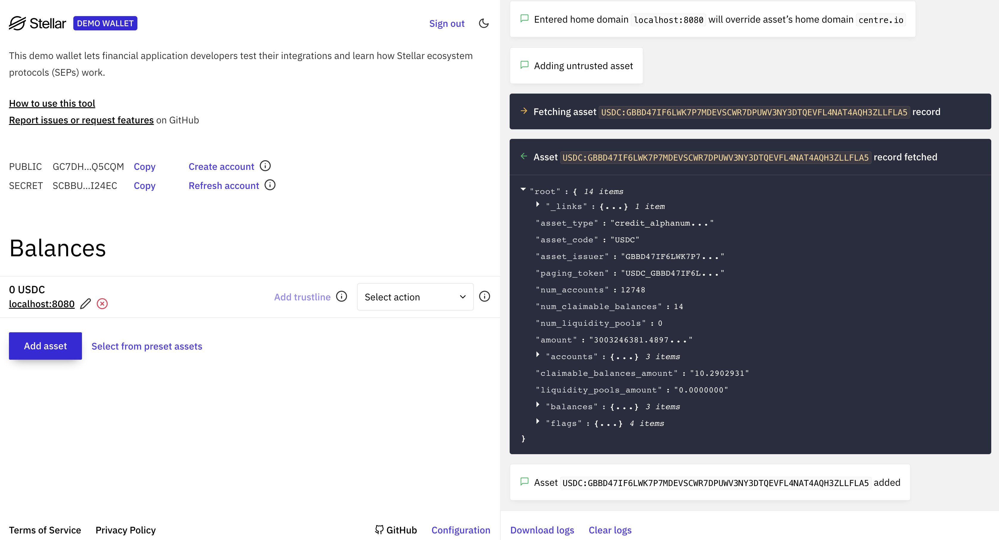

import { CodeExample } from "@site/src/components/CodeExample";

## Modificar un Archivo de Información de Stellar

A continuación, modifiquemos el archivo `stellar.toml` creado [anteriormente][sep1-ap]. Las billeteras necesitan saber que la funcionalidad SEP-24 es admitida por tu negocio, y también necesitan conocer todas las monedas que admites.

<CodeExample>

```toml
# dev.stellar.toml
ACCOUNTS = ["add your public keys for your distribution accounts here"]
SIGNING_KEY = "add your signing key here"
NETWORK_PASSPHRASE = "Test SDF Network ; September 2015"

TRANSFER_SERVER_SEP0024 = "http://localhost:8080/sep24"
WEB_AUTH_ENDPOINT = "http://localhost:8080/auth"

# Add support for USDC
[[CURRENCIES]]
code = "USDC"
issuer = "GBBD47IF6LWK7P7MDEVSCWR7DPUWV3NY3DTQEVFL4NAT4AQH3ZLLFLA5"
status = "test"
is_asset_anchored = false
desc = "USD Coin issued by Circle"

# Optionally, add support for XLM
[[CURRENCIES]]
code = "native"
status = "test"
is_asset_anchored = false
anchor_asset_type = "crypto"
desc = "XLM, the native token of the Stellar network."

[DOCUMENTATION]
ORG_NAME = "Your organization"
ORG_URL = "Your website"
ORG_DESCRIPTION = "A description of your organization"
```

</CodeExample>

Ten en cuenta que necesitarás crear otro archivo para tu despliegue en producción que utilice la frase de paso de la red pública, tus URLs de servicio de producción, tus cuentas de distribución de Mainnet y tu clave de firma, así como las cuentas emisoras de Mainnet de los activos que utiliza tu servicio.

## Habilitar Depósitos y Retiros Alojados

Ahora estás listo para habilitar depósitos y retiros alojados a través de la API SEP-24. Especifica lo siguiente en tu archivo `dev.assets.yaml`, y cambia los valores según tus preferencias. Este archivo de activo de ejemplo habilitará el soporte para USDC de Circle y un USD en fiat.

<CodeExample>

```yaml
# dev.assets.yaml
assets:
  - schema: stellar
    code: USDC
    issuer: GBBD47IF6LWK7P7MDEVSCWR7DPUWV3NY3DTQEVFL4NAT4AQH3ZLLFLA5
    distribution_account: GBLSAHONJRODSFTLOV225NZR4LHICH63RIFQTQN37L5CRTR2IMQ5UEK7
    significant_decimals: 2
    sep24_enabled: true
    deposit:
      enabled: true
    withdraw:
      enabled: true
  - schema: iso4217
    code: USD
    significant_decimals: 2
    deposit:
      enabled: true
    withdraw:
      enabled: true
  # Optional support for XLM
  - schema: stellar
    code: native
    distribution_account: GBLSAHONJRODSFTLOV225NZR4LHICH63RIFQTQN37L5CRTR2IMQ5UEK7
    significant_decimals: 7
    sep24_enabled: true
    deposit:
      enabled: true
    withdraw:
      enabled: true
```

</CodeExample>

La información proporcionada para el valor `assets` se corresponde estrechamente con la información que se expondrá a la aplicación de billetera utilizando el endpoint SEP-24 [`GET /info`][sep24-get-info]. La Anchor Platform también utiliza esta información para validar las solicitudes realizadas a tu servicio.

Agrega las siguientes variables a tu archivo de entorno.

<CodeExample>

```bash
# dev.env
SEP24_ENABLED=true
SEP24_INTERACTIVE_URL_BASE_URL=http://example.com
SEP24_MORE_INFO_URL_BASE_URL=http://example.com
SECRET_SEP24_INTERACTIVE_URL_JWT_SECRET="your encryption key shared with your business server"
SECRET_SEP24_MORE_INFO_URL_JWT_SECRET="your encryption key shared with your business server"
```

</CodeExample>

`SEP24_INTERACTIVE_URL_BASE_URL` es la URL que la Anchor Platform proporcionará a las aplicaciones de billetera cuando inicien transacciones. Las aplicaciones de billetera abrirán esta URL en una vista web dentro de su aplicación, entregando el control de la experiencia del usuario desde la billetera a tu negocio. Esta URL apunta al widget web que implementa tu negocio. Contiene toda la lógica definida por el negocio. Profundizaremos más en esta experiencia en secciones posteriores.

`SEP24_MORE_INFO_URL_BASE_URL` es la URL que la Anchor Platform proporcionará a las aplicaciones de billetera cuando quieran mostrar información sobre una transacción iniciada previamente. Esta URL es utilizada con mayor frecuencia por las billeteras en sus vistas de historial de transacciones, y tu negocio puede definir qué información mostrar sobre la transacción.

`SECRET_SEP24_INTERACTIVE_URL_JWT_SECRET` y `SECRET_SEP24_MORE_INFO_URL_JWT_SECRET` son claves de encriptación que la Anchor Platform utilizará para generar tokens de corta duración que se añadirán a las URLs proporcionadas a la billetera. El servidor de tu negocio también debe tener estas claves en su entorno para que pueda verificar la firma del token.

## Probar con la Billetera de Demostración

¡Las billeteras ahora deberían poder descubrir, autenticar e iniciar transacciones con tu servicio! Tu proyecto y los archivos fuente ahora deberían verse algo así.

<CodeExample>

```
├── dev.env
├── docker-compose.yaml
├── config
│   ├── dev.assets.yaml
│   ├── dev.stellar.toml
```

</CodeExample>

Tu entorno ahora debería verse como lo siguiente.

<CodeExample>

```bash
# dev.env
ASSETS_TYPE=file
ASSETS_VALUE=/home/dev.assets.yaml

SEP1_ENABLED=true
SEP1_TOML_TYPE=file
SEP1_TOML_VALUE=/home/dev.stellar.toml

SEP10_ENABLED=true
SEP10_HOME_DOMAIN=localhost:8080
SECRET_SEP10_SIGNING_SEED="a Stellar private key"
SECRET_SEP10_JWT_SECRET="a secret encryption key"

SEP24_ENABLED=true
SEP24_INTERACTIVE_URL_BASE_URL=http://localhost:8081
SECRET_SEP24_INTERACTIVE_URL_JWT_SECRET="your encryption key shared with your business server"
SECRET_SEP24_MORE_INFO_URL_JWT_SECRET="your encryption key shared with your business server"
```

</CodeExample>

Para probar esto, ve a la [Billetera de Demostración de Stellar][stellar-demo-wallet].

[](../../assets/anchor-platform-sep24-demo-wallet.png)

Inicia una transacción haciendo lo siguiente:

- Crear un nuevo keypair
- Haz clic en el botón "Agregar Activo" e introduce
  - el código del activo de Stellar en tu archivo `stellar.toml`
  - tu dominio de origen, `localhost:8080`
- Selecciona el desplegable y haz clic en "Depósito SEP-24", luego haz clic en "Iniciar"

La billetera de demostración debería poder encontrar tu archivo `stellar.toml`, autenticar utilizando el keypair de Stellar que acabas de crear e iniciar una transacción. Sin embargo, cuando la billetera de demostración intenta abrir la URL proporcionada por la Anchor Platform, recibirás una página no encontrada.

[](../../assets/anchor-platform-sep24-demo-wallet-widget.png)

[sep-1]: https://github.com/stellar/stellar-protocol/blob/master/ecosystem/sep-0001.md
[sep-9]: https://github.com/stellar/stellar-protocol/blob/master/ecosystem/sep-0009.md
[sep-24]: https://github.com/stellar/stellar-protocol/blob/master/ecosystem/sep-0024.md
[sep-38]: https://github.com/stellar/stellar-protocol/blob/master/ecosystem/sep-0038.md
[sep24-get-info]: https://github.com/stellar/stellar-protocol/blob/master/ecosystem/sep-0024.md#info
[anchor-platform-image]: https://hub.docker.com/r/stellar/anchor-platform
[docker-compose]: https://docs.docker.com/compose/
[minikube]: https://minikube.sigs.k8s.io/docs/
[kubernetes]: https://kubernetes.io/
[nginx]: https://www.nginx.com/
[ap-default-values]: https://github.com/stellar/java-stellar-anchor-sdk/blob/develop/platform/src/main/resources/config/anchor-config-default-values.yaml
[stellar-demo-wallet]: https://demo-wallet.stellar.org
[stellar-lab]: https://lab.stellar.org/
[postgresql]: https://www.postgresql.org/
[aurora-postgresql]: https://docs.aws.amazon.com/AmazonRDS/latest/AuroraUserGuide/Aurora.AuroraPostgreSQL.html
[h2]: https://www.h2database.com/html/main.html
[sqlite]: https://www.sqlite.org/index.html
[flyway]: https://documentation.red-gate.com/fd/welcome-to-flyway-184127914.html
[sep-24-ref-ui]: https://github.com/stellar/sep24-reference-ui
[sep-24-ref]: https://github.com/stellar/java-stellar-anchor-sdk/tree/develop/kotlin-reference-server
[sep1-ap]: ../sep1/README.mdx
