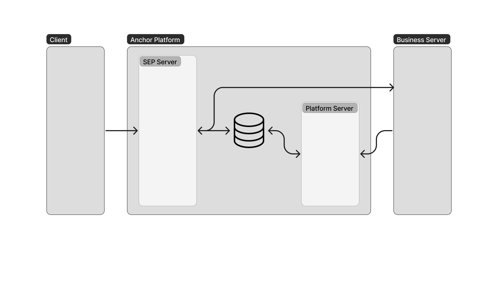

## Arquitectura

Antes de comenzar con la Anchor Platform, familiaricémonos con la arquitectura. Esta sección describirá los componentes involucrados y cómo interactúan.

### Arquitectura Fundamental

Los siguientes componentes arquitectónicos son necesarios para todas las implementaciones de la Anchor Platform.

#### Cliente

El cliente es una aplicación, como una billetera o un remitente de remesas, que actúa en nombre de un usuario y realiza solicitudes al sistema. Los clientes hacen solicitudes al componente servidor SEP de la Anchor Platform utilizando conjuntos de estándares llamados [SEPs][seps] (Propuestas del Ecosistema Stellar).

#### Servidor SEP

El servidor SEP es un servidor orientado al cliente y, por lo tanto, debe ser accesible desde una red externa. El servidor SEP procesa las solicitudes de los usuarios y gestiona el estado de las transacciones que inician. Cuando el servidor SEP necesita proporcionar información que no tiene al cliente, como la tasa de exchange para un par de activos o el estado KYC de un cliente, realiza solicitudes [callback][callback-api] sincrónicas al servidor de negocio y devuelve la información en un formato compatible con SEP.

:::note

El servidor SEP nunca almacenará información sensible, como KYC (PII), en la base de datos.

:::

#### Servidor de Negocios

El servidor de negocios es un servicio que tú (el negocio) debes implementar para conectar la Anchor Platform con tus sistemas internos. El servidor de negocios responde a las solicitudes de callback enviadas por el servidor SEP, tales como solicitudes de cotización, recibe eventos enviados por el servicio de eventos, como la notificación de un pago recibido en tu cuenta Stellar, y proporciona actualizaciones al servidor de plataforma cuando ocurren eventos fuera de la cadena, como la iniciación de una transferencia bancaria a un cliente.

#### Servidor de Plataforma

El servidor de plataforma es un componente interno. Debería estar alojado en una red privada y no debería ser accesible desde Internet. Este servidor permite al negocio obtener y actualizar el estado de las transacciones utilizando su [API][platform-api].

#### Base de Datos

La Anchor Platform utiliza una base de datos PostgreSQL para almacenar eventos y entidades de Stellar. Se usa principalmente para almacenar transacciones.

### Arquitectura Completa

Además de los componentes descritos anteriormente, la Anchor Platform incluye varios otros componentes que ofrecen funcionalidad adicional. Tu negocio puede elegir cuáles de los componentes adicionales usar, pero el diagrama a continuación visualiza la arquitectura del sistema si se utilizan todos los componentes.

#### Servicio de Eventos

El servicio de eventos permite a la Anchor Platform enviar webhooks HTTP a los clientes registrados y a tu servidor de negocios cuando el estado de las transacciones cambia, eliminando la necesidad de que los clientes y/o tu servidor de negocios consulten las APIs de la Anchor Platform. Funciona leyendo eventos publicados en un tema de Kafka por los otros componentes de la Anchor Platform. [Lee más][events] sobre el uso del servicio de eventos.

#### Servidor de Custodia

El servidor de custodia se conecta a proveedores de billeteras empresariales, como Fireblocks, para enviar y recibir pagos por transacciones iniciadas a través de la Anchor Platform. Este servicio es una alternativa al Stellar Observer para empresas que utilizan uno de los proveedores admitidos. Además de la funcionalidad ofrecida por el Stellar Observer, el Servidor de Custodia también puede facilitar pagos salientes a las cuentas Stellar del cliente. Si también utilizas el servicio de [eventos], los pagos a tus cuentas activarán un callback HTTP realizado a tu servidor de negocios.

Si ya tienes una integración con tu proveedor de billetera, entonces este componente no es necesario, aunque tu servidor de negocios tendrá que notificar a la Anchor Platform cuando un pago asociado a una transacción de la Anchor Platform haya sido enviado a o desde tus cuentas Stellar a través de la [Platform API][platform-api].

Actualmente, el único proveedor admitido es Fireblocks.

#### Observador Stellar

El observer de Stellar, una alternativa al servidor de custodia mencionado arriba, monitorea la cadena de bloques de Stellar utilizando Horizon, detecta automáticamente los pagos de usuarios enviados al negocio y actualiza las transacciones correspondientes en la base de datos de la Anchor Platform. Si también utilizas el servicio de [eventos], los pagos a tus cuentas activarán un callback HTTP realizado a tu servidor de negocios.

Si ya tienes una solución para monitorear pagos a tus cuentas Stellar, como una integración con tu exchange, Horizon, o RPC, entonces este componente no es necesario, aunque tu servidor de negocios tendrá que notificar a la Anchor Platform cuando un pago asociado a una transacción de la Anchor Platform haya sido realizado a una de tus cuentas Stellar a través de la [Platform API][platform-api].

[seps]: https://github.com/stellar/stellar-protocol/blob/master/ecosystem/README.md
[platform-api]: ../api-reference/platform/transactions/README.mdx
[callback-api]: ../api-reference/callbacks/README.mdx
[eventos]: ./events/README.mdx
