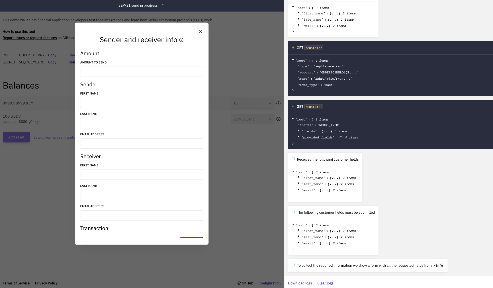
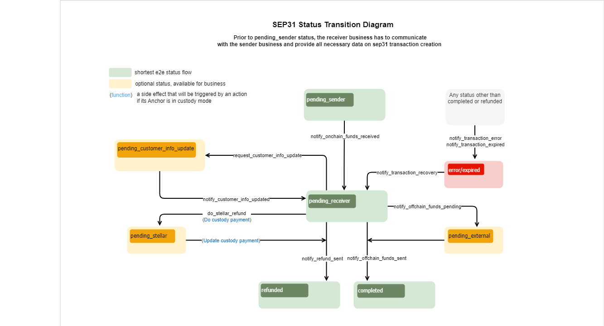

import { CodeExample } from "@site/src/components/CodeExample";

Integrar con la Anchor Platform para facilitar pagos transnacionales implica implementar lo siguiente, como mínimo:

- [`GET /customer`][get-customer] & [`PUT /customer`][put-customer] puntos finales de la API KYC para solicitar y recopilar los datos KYC de los clientes
- [`GET /rate`][get-rate] punto final de la API RFQ para proporcionar tasas de cambio entre los activos on-chain y off-chain admitidos
- `GET /transactions` solicitudes para obtener actualizaciones sobre el estado de las transacciones de la Anchor Platform (documentación próximamente)
- [`JSON-RPC`][json-rpc-methods] solicitudes para actualizar el estado de las transacciones de la Anchor Platform

Lo siguiente también puede ser requerido dependiendo de tu caso de uso:

- [`GET /fee`][get-fee] si tu negocio quiere proporcionar a los remitentes la opción de omitir el paso de creación de la cotización
- [`GET /unique_address`][get-unique-address] si tu negocio utiliza un servicio de custodia para activos on-chain
- [`DELETE /customer`][delete-customer] si tu negocio quiere o está obligado a permitir que los remitentes soliciten la eliminación de datos de clientes

## Crear un Servidor Empresarial

Primero, vamos a crear un servidor empresarial y agregarlo a nuestro archivo docker compose.

<CodeExample>

```yaml
version: "3.8"

services:
  sep-server:
    image: stellar/anchor-platform:2.8.4
    command: --sep-server
    env_file:
      - ./dev.env
    volumes:
      - ./config:/home
    ports:
      - "8080:8080"
    depends_on:
      - db
  platform-server:
    image: stellar/anchor-platform:2.8.4
    command: --platform-server
    env_file:
      - ./dev.env
    volumes:
      - ./config:/home
    ports:
      - "8085:8085"
    depends_on:
      - db

  server:
    build: .
    ports:
      - "8081:8081"
    env_file:
      - ./dev.env
  db:
    image: postgres:14
    ports:
      - "5432:5432"
    env_file:
      - ./dev.env
```

</CodeExample>

A continuación, crea un servidor web sencillo usando tu lenguaje de programación preferido y un `Dockerfile` que inicie el servidor. `docker compose up` debería iniciar con éxito todos los tres servicios.

Esta guía no proporciona una implementación de ejemplo de los puntos finales, pero puedes encontrar más información sobre los esquemas de solicitud y respuesta en la [Referencia API de Anchor Platform][ap-api], y las secciones a continuación expandirán sobre conceptos importantes para entender al implementar los puntos finales.

## Puntos finales de Callback del Cliente

La Anchor Platform nunca almacena la información PII de tus clientes, y en cambio actúa como un servidor proxy entre las aplicaciones de cliente y tu negocio, reenviando solicitudes y respuestas a la otra parte. Actualmente, las solicitudes y respuestas son casi idénticas a las definidas en la [especificación API KYC SEP-12][sep12].

### Identificando Clientes

Los clientes pueden ser identificados usando dos enfoques.

El primer enfoque usa una cuenta Stellar y un memo. Al usar la Anchor Platform para facilitar pagos transnacionales, la organización remitente usa su propia cuenta Stellar, la que se usó para autenticarse a través de [Autenticación Stellar SEP-10][ap-sep10], al registrar clientes con tu negocio. Los memos se utilizan para distinguir a clientes únicos que provienen de la misma organización remitente.

El segundo enfoque utiliza identificadores de cliente generados por tu servicio. Por ejemplo, si una organización remitente está registrando un cliente, tu negocio recibirá un request `PUT /customer` como el siguiente:

<CodeExample>

```json
{
  "account": "GDJUOFZGW5WYBK4GIETCSSM6MTTIJ4SUMCQITPTLUWMQ6B4UIX2IEX47",
  "memo": "780284017",
  "type": "sep31-sender",
  "first_name": "John",
  "last_name": "Doe",
  "email": "johndoe@example.com"
}
```

</CodeExample>

En este ejemplo, la clave pública `GDJ...X47` identifica a la organización remitente, y el memo `780284017` identifica al cliente. Los memos son generalmente enteros de 64 bits, pero también pueden ser otros tipos de datos, por lo que deben ser guardados como cadenas. En respuesta, tu negocio deberá devolver un identificador de cliente.

<CodeExample>

```json
{
  "id": "fb5ddc93-1d5d-490d-ba5f-2c361cea41f7"
}
```

</CodeExample>

Tu servidor empresarial puede usar cualquier identificador para los clientes siempre que sea una cadena.

Tras el registro de un cliente, la organización remitente puede usar cualquiera de los enfoques al verificar el estado del cliente. Por ejemplo, puedes recibir un request `GET /customer` como el siguiente:

<CodeExample>

```
/customer?account=GDJUOFZGW5WYBK4GIETCSSM6MTTIJ4SUMCQITPTLUWMQ6B4UIX2IEX47&memo=780284017&type=sep31-sender
```

</CodeExample>

O, la organización remitente podría usar el identificador que devolviste cuando originalmente registraron al cliente.

<CodeExample>

```
/customer?id=fb5ddc93-1d5d-490d-ba5f-2c361cea41f7&type=sep31-sender
```

</CodeExample>

Tu negocio necesitará mantener un mapeo entre la cuenta y el memo usados para registrar originalmente al cliente y el ID que devuelves en la respuesta, así como los datos KYC proporcionados. En futuras iteraciones de la Anchor Platform, puede que mantengamos este mapeo para tu negocio para que solo tengas que trabajar con los ID que generas.

### Tipos de Clientes

Tu negocio probablemente requiera diferentes conjuntos de información KYC dependiendo del tipo de cliente. Puedes definir las etiquetas para cada uno de estos tipos de clientes en tu archivo `dev.assets.yaml`, y tus organizaciones remitentes deberán entender qué etiqueta usar al registrar o consultar el estado de los clientes.

En las solicitudes `PUT /customer`, deberías usar el tipo pasado para evaluar si el remitente ha proporcionado todos los campos requeridos. En las solicitudes `GET /customer`, deberías usar el tipo para determinar el estado del cliente.

### Prueba con la Billetera Demo

Puedes probar tu implementación con la [Billetera Demo Stellar][demo-wallet] siguiendo los pasos a continuación.

1. Selecciona "Generar keypair para nueva cuenta"
2. Selecciona "Crear cuenta"
3. Selecciona "Agregar Activo" y introduce el código del activo y el dominio principal de la Anchor Platform, `localhost:8080`
4. Selecciona "Agregar línea de confianza"
5. Financia tu cuenta con un saldo del activo
6. Selecciona "SEP-31 Enviar" en el menú desplegable

Deberías ver la billetera demo encontrar tus URLs de servicio, autenticarse y verificar qué campos KYC necesita recopilar. Luego debería presentarte un formulario para que ingreses los detalles KYC para el remitente y el receptor.

[](../../assets/anchor-platform-sep31-demo-wallet-widget.png)

Una vez que hayas ingresado la información solicitada, se enviará esa información a la Anchor Platform, que la enviará a tu servidor empresarial. Una vez que la billetera demo tenga los IDs de los clientes que generaste, iniciará una transacción que debería fallar.

## Punto final de Callback de Tarifas

Una vez que la organización remitente ha registrado a los clientes involucrados en la transacción, necesitará solicitar una cotización, o tasa de cambio, de tu negocio. La Anchor Platform solicita esta información a tu servidor empresarial usando el [`GET /rate` endpoint][get-rate].

### Cotizaciones Firmes vs. Indicativas

Las solicitudes de cotizaciones tendrán un parámetro `type` que es [`indicativa`][indicative] o [`firme`][firm]. Si `type=firme`, tu respuesta debe incluir el campo `id` y la fecha-hora de `expires_at` y reservar la liquidez necesaria para cumplir esta cotización hasta que esta expire. Si `type=indicativa`, no devuelvas los campos `id` o `expires_at` porque la tasa proporcionada no se usará en una transacción.

Ten en cuenta que el cliente puede solicitar que la cotización expire después de una fecha-hora específica usando el parámetro `expires_after`. Tu negocio debe honrar esta solicitud devolviendo un valor de `expires_at` que esté antes o en la fecha-hora solicitada o rechazar la solicitud con una respuesta 400 Bad Request, que será reenviada al cliente.

### Métodos de Entrega

Es común que las tarifas y comisiones de los negocios difieran dependiendo de los rails de pago utilizados para enviar fondos al destinatario. Puedes usar este parámetro para adherirte a los términos comerciales acordados con esa organización emisora, como ofrecer tarifas con descuento. Debido a que este punto final actualmente solo se usa para pagar remesas en activos off-chain, se utilizará `buy_delivery_method`. Actualmente, `client_id` será siempre la clave pública Stellar que la organización emisora usó para autenticar con la Anchor Platform.

### Métodos de entrega

Es común que las tarifas y comisiones de las empresas varíen según los métodos de pago utilizados para enviar fondos al destinatario. Si tus métodos de entrega están configurados en tu archivo `asset.yaml`, los clientes siempre proporcionarán el método de pago que desean que tu empresa utilice para solicitudes de cotización firme.

Debido a que este endpoint se utiliza actualmente solo para pagar remesas en activos off-chain, se utilizará el `buy_delivery_method`. Si este endpoint se utiliza alguna vez en otros flujos de transacciones, como depósitos SEP-24, también se puede pasar `sell_delivery_method` para empresas que admiten estos tipos de transacciones.

## Obteniendo Actualizaciones del Estado de las Transacciones

Para facilitar pagos transnacionales, necesitarás poder detectar cuándo una organización remitente ha enviado a tu negocio un pago on-chain y determinar qué transacción se pretendía cumplir con ese pago.

La forma más fácil de hacerlo es ejecutar el Stellar Observer, que detectará estos pagos y actualizará el registro de transacción correspondiente con información sobre el pago. Tu negocio puede luego detectar estas actualizaciones consultando el punto final de la API `GET /transactions` de la plataforma.

### Ejecutando el Stellar Observer

El Stellar Observer monitorea el ledger Stellar para pagos realizados a tu(s) cuenta(s) y actualiza los registros de transacción correspondientes con información de pago on-chain. Para ejecutar el observer, agrega lo siguiente a tu archivo docker compose.

<CodeExample>

```yaml
services:
  ...
  observer:
    image: stellar/anchor-platform:2.8.4
    command: --stellar-observer
    env_file:
      - ./dev.env
    volumes:
      - ./config:/home
```

</CodeExample>

### Consultando Pagos Recibidos

El Stellar Observer realiza solicitudes JSON-RPC a la API de la plataforma cada vez que detecta pagos recibidos para transacciones iniciadas por organizaciones remitentes, actualizando así la fecha-hora `transfer_received_at` de la transacción.

Tu negocio debe consultar periódicamente el punto final de la API `GET /transactions` de la plataforma para detectar estas actualizaciones. Puedes referirte al siguiente ejemplo:

<CodeExample>

```bash
curl http://localhost:8080/transactions?sep=31&order_by=transfer_received_at&order=desc
```

</CodeExample>

La respuesta incluirá una lista de transacciones de pagos transnacionales iniciadas por organizaciones remitentes. Esta lista se ordenará según el momento en que se recibió un pago para esa transacción. Para cada transacción devuelta, tu negocio debe verificar si ya ha detectado el pago para esa transacción. Si es así, has detectado todos los pagos realizados a tu(s) cuenta(s).

## Actualizando Transacciones a Través de JSON-RPC

El diagrama de flujo SEP-31 define la secuencia/reglas de la transición de estado de la transacción y un conjunto de métodos JSON-RPC que deben ser llamados para cambiar ese estado. No puedes definir el estado que deseas establecer para una transacción específica en tus solicitudes. Cada método JSON-RPC define estructuras de datos que espera en la solicitud. Si la solicitud no contiene los atributos requeridos, la Anchor Platform devolverá un error y no cambiará el estado de la transacción.

[](../../assets/sep31-transition-diagram.png)

:::tip

Los estados en <span style={{color: "green"}}>verde</span> son obligatorios y definen el flujo más corto.

Los estados en <span style={{color: "#B0BF1A"}}>amarillo</span> son opcionales y se pueden omitir.

Los estados en <span style={{color: "red"}}>rojo</span> significan que la transacción está en estado de error o ha caducado.

:::

Puedes crear una [plantilla][sep24-integration-make-json-rpc-request] para hacer solicitudes JSON-RPC a la Anchor Platform.

Este capítulo también contiene información sobre el formato de [solicitud][sep24-integration-rpc-request]/[respuesta][sep24-integration-rpc-response] y [códigos de error][sep24-integration-error-codes] que podrían ser devueltos por la Anchor Platform.

### Listo para Recibir Fondos

Las transacciones SEP-31 deberían estar inicialmente en estado `pending_sender`. El Anchor Receptor espera recibir el pago identificado por el stellar_memo incluido en la respuesta POST /transactions.

Una vez que tu negocio detecta que ha recibido un pago on-chain para una transacción específica, debe actualizar el estado de la transacción.

<CodeExample>

```json
// onchain-funds-received.json
[
  {
    "id": 1,
    "jsonrpc": "2.0",
    "method": "notify_onchain_funds_received",
    "params": {
      "transaction_id": "<transaction_id>",
      "message": "Onchain funds received",
      "stellar_transaction_id": "7...9",
      "amount_in": {
        "amount": 10
      },
      "amount_out": {
        "amount": 9
      },
      "amount_fee": {
        "amount": 1
      }
    }
  }
]
```

</CodeExample>

Para procesar esto, necesitas ejecutar:

<CodeExample>

```bash
./call-json-rpc.sh onchain-funds-received.json
```

</CodeExample>

El estado de la transacción cambiará a `pending_receiver`.

### Fondos Offchain Enviados

Para completar la transacción y cambiar su estado a `completed`, necesitas hacer una solicitud JSON-RPC `notify_offchain_funds_sent`.

<CodeExample>

```json
// offchain-funds-sent.json
[
  {
    "id": 1,
    "jsonrpc": "2.0",
    "method": "notify_offchain_funds_sent",
    "params": {
      "transaction_id": "<transaction_id>",
      "message": "Offchain funds sent",
      "funds_sent_at": "2023-07-04T12:34:56Z",
      "external_transaction_id": "a...c"
    }
  }
]
```

</CodeExample>

Para procesar esto, necesitas ejecutar:

<CodeExample>

```bash
./call-json-rpc.sh offchain-funds-sent.json
```

</CodeExample>

### Fondos Offchain Pendientes

Otra opción es mover el estado de la transacción a `pending_external`. Este estado significa que el pago ha sido enviado a la red externa, pero aún no está confirmado.

<CodeExample>

```json
// offchain-funds-pending.json
[
  {
    "id": 1,
    "jsonrpc": "2.0",
    "method": "notify_offchain_funds_pending",
    "params": {
      "transaction_id": "<transaction_id>",
      "message": "Offchain funds pending",
      "external_transaction_id": "a...c"
    }
  }
]
```

</CodeExample>

Para procesar esto, necesitas ejecutar:

<CodeExample>

```bash
./call-json-rpc.sh offchain-funds-pending.json
```

</CodeExample>

### Información del Cliente Necesaria

En algunos casos, el Anchor Receptor podría necesitar solicitar información actualizada del Anchor Remitente. Por ejemplo, el banco le dice al Anchor Receptor que el nombre del Cliente Receptor proporcionado es incorrecto o le falta una inicial del segundo nombre. Dado que esta información fue enviada a través de SEP-12, la transacción debe entrar en estado `pending_customer_info_update` hasta que el Anchor Remitente realice otra solicitud `PUT /customer` de SEP-12 para actualizar. El Anchor Remitente puede verificar qué campos necesitan actualizarse realizando una solicitud `GET /customer` de SEP-12 incluyendo el id o los parámetros de cuenta y memo. El Anchor Receptor debería responder con un estado `NEEDS_INFO` y `last_name` incluido en los campos descritos.

<CodeExample>

```json
// pending-customer-info-update.json
[
  {
    "id": 1,
    "jsonrpc": "2.0",
    "method": "pending_customer_info_update",
    "params": {
      "transaction_id": "<transaction_id>",
      "message": "Customer info needed"
    }
  }
]
```

</CodeExample>

Para procesar esto, necesitas ejecutar:

<CodeExample>

```bash
./call-json-rpc.sh pending-customer-info-update.json
```

</CodeExample>

### Información del Cliente Actualizada

Después de que el Anchor Remitente haya realizado otra solicitud `PUT /customer` de SEP-12 para actualizar la información del cliente, el Anchor Receptor debería cambiar el estado de la transacción a `pending_receiver`.

<CodeExample>

```json
// notify-customer-info-updated.json
[
  {
    "id": 1,
    "jsonrpc": "2.0",
    "method": "notify_customer_info_updated",
    "params": {
      "transaction_id": "<transaction_id>",
      "message": "Customer info updated"
    }
  }
]
```

</CodeExample>

Para procesar esto, necesitas ejecutar:

<CodeExample>

```bash
./call-json-rpc.sh notify-customer-info-updated.json
```

</CodeExample>

### Hacer un Reembolso Stellar

La integración con el servicio de custodia te permite realizar reembolsos a través del servicio de custodia, como Fireblocks.

<CodeExample>

```json
// do-stellar-refund.json
[
  {
    "id": 1,
    "jsonrpc": "2.0",
    "method": "do_stellar_refund",
    "params": {
      "transaction_id": "<transaction_id>",
      "message": "Do stellar refund",
      "refund": {
        "amount": {
          "amount": 9,
          "asset": "stellar:USDC:GBBD47IF6LWK7P7MDEVSCWR7DPUWV3NY3DTQEVFL4NAT4AQH3ZLLFLA5"
        },
        "amount_fee": {
          "amount": 1,
          "asset": "stellar:USDC:GBBD47IF6LWK7P7MDEVSCWR7DPUWV3NY3DTQEVFL4NAT4AQH3ZLLFLA5"
        }
      }
    }
  }
]
```

</CodeExample>

Para procesar esto, necesitas ejecutar:

<CodeExample>

```bash
./call-json-rpc.sh do-stellar-refund.json
```

</CodeExample>

:::note

No puedes hacer múltiples reembolsos en el flujo SEP-31. Por esta razón, el monto total del reembolso más la tarifa de monto debería ser igual a `amount_in`. De lo contrario, recibirás un error.

:::

### Reembolso Enviado

Hay una posibilidad de enviar todos los fondos de vuelta al `Anchor Remitente` (reembolso). Necesitas reembolsar la suma total (reembolso completo).

<CodeExample>

```json
// refund-sent.json
[
  {
    "id": 1,
    "jsonrpc": "2.0",
    "method": "notify_refund_sent",
    "params": {
      "transaction_id": "<transaction_id>",
      "message": "Refund sent",
      "refund": {
        "id": "1c186184-09ee-486c-82a6-aa7a0ab1119c",
        "amount": {
          "amount": 10,
          "asset": "iso4217:USD"
        },
        "amount_fee": {
          "amount": 1,
          "asset": "iso4217:USD"
        }
      }
    }
  }
]
```

</CodeExample>

Para procesar esto, necesitas ejecutar:

<CodeExample>

```bash
./call-json-rpc.sh refund-sent.json
```

</CodeExample>

:::note

No puedes hacer múltiples reembolsos en el flujo SEP-31. Por esta razón, el monto a reembolsar más la tarifa de monto debería ser igual a `amount_in`. De lo contrario, recibirás un error.

:::

### Error de Transacción

Si encuentras un error irrecuperable al procesar la transacción, es necesario establecer el estado de la transacción a `error`. Puedes usar el campo de mensaje para describir los detalles del error.

<CodeExample>

```json
// transaction-error.json
[
  {
    "id": 1,
    "jsonrpc": "2.0",
    "method": "notify_transaction_error",
    "params": {
      "transaction_id": "<transaction_id>",
      "message": "Error occurred"
    }
  }
]
```

</CodeExample>

Para procesar esto, necesitas ejecutar:

<CodeExample>

```bash
./call-json-rpc.sh transaction-error.json
```

</CodeExample>

:::tip

Si un usuario ha realizado una transferencia, debes hacer una recuperación de transacción, y luego puedes volver a intentar procesar la transacción o iniciar un reembolso.

:::

### Transacción caducada

Tu empresa puede querer caducar aquellas transacciones que han sido abandonadas por el usuario después de algún tiempo. Es una buena práctica limpiar las transacciones inactivas en estado `incomplete`. Para hacerlo, simplemente cambia el estado de la transacción a `expired`.

<CodeExample>

```json
// transaction-expired.json
[
  {
    "id": 1,
    "jsonrpc": "2.0",
    "method": "notify_transaction_expired",
    "params": {
      "transaction_id": "<transaction_id>",
      "message": "Transaction expired"
    }
  }
]
```

</CodeExample>

Para procesar esto, necesitas ejecutar:

<CodeExample>

```bash
./call-json-rpc.sh transaction-expired.json
```

</CodeExample>

:::tip

Este método JSON-RPC no se puede utilizar después de que el usuario haya realizado una transferencia.

:::

### Recuperación de transacciones

El estado de la transacción se puede cambiar de `error/expired` a `pending-anchor`. Después de la recuperación, puedes reembolsar los activos recibidos o proceder con el procesamiento de la transacción. Para recuperar la transacción, es necesario hacer la siguiente solicitud JSON-RPC:

<CodeExample>

```json
// transaction-recovery.json
[
  {
    "id": 1,
    "jsonrpc": "2.0",
    "method": "notify_transaction_recovery",
    "params": {
      "transaction_id": "<transaction_id>",
      "message": "Transaction recovered"
    }
  }
]
```

</CodeExample>

Para procesar esto, necesitas ejecutar:

<CodeExample>

```bash
./call-json-rpc.sh transaction-recovery.json
```

</CodeExample>

## Endpoint de devolución de tarifas

Tu empresa puede querer ofrecer a las organizaciones enviadoras la opción de omitir el proceso de creación de cotizaciones, lo que permite a tu empresa utilizar una tarifa determinada en el momento en que se pagan los fondos al destinatario. En este caso, la Anchor Platform no hará una solicitud `GET /rate`, pero aún necesitarás proporcionar la tarifa que tu empresa cobrará por estos tipos de transacciones utilizando el endpoint [`GET /fee`][get-fee].

### Configuración

Puedes habilitar estos tipos de transacciones actualizando la configuración de tu archivo `assets.yaml`:

<CodeExample>

```yaml
assets:
  - ...
    sep31:
      quotes_required: false
```

</CodeExample>

## Endpoint de devolución de dirección única

Las empresas deben proporcionar un par de cuenta y memo Stellar único para cada transacción solicitada por las organizaciones enviadoras para que la Anchor Platform pueda identificar y mapear el pago on-chain enviado para la transacción específica. La Anchor Platform puede generar estos pares de cuentas y memos ella misma, pero la mayoría de las empresas utilizan un servicio custodial para recibir pagos on-chain. En este caso, la empresa debe solicitar al custodio que genere la cuenta y memo Stellar. Esto se hace utilizando el endpoint [`GET /unique_address`][get-unique-address].

### Configuración

Para configurar la Anchor Platform para hacer estas solicitudes, agrega lo siguiente a tu configuración:

<CodeExample>

```bash
# dev.env
SEP31_DEPOSIT_INFO_GENERATOR_TYPE=api
```

</CodeExample>

:::caution

Este endpoint puede ser eliminado durante futuras actualizaciones de versiones principales de la Anchor Platform, cuando se añada soporte para conectarse a servicios custodiales y generar estas direcciones automáticamente.

:::

[ap-api]: ../../README.mdx
[ap-sep10]: ../sep10/README.mdx
[sep12]: https://github.com/stellar/stellar-protocol/blob/master/ecosystem/sep-0012.md
[demo-wallet]: https://demo-wallet.stellar.org
[indicative]: https://www.investopedia.com/terms/i/indicativequote.asp
[firm]: https://www.investopedia.com/terms/f/firmquote.asp
[get-unique-address]: ../../api-reference/callbacks/gen-address.api.mdx
[get-customer]: ../../api-reference/callbacks/get-customer.api.mdx
[put-customer]: ../../api-reference/callbacks/put-customer.api.mdx
[get-rate]: ../../api-reference/callbacks/get-rates.api.mdx
[get-fee]: ../../api-reference/callbacks/get-fee.api.mdx
[put-customer-callback]: ../../api-reference/callbacks/put-customer.api.mdx
[delete-customer]: ../../api-reference/callbacks/del-customer.api.mdx
[json-rpc-methods]: ../../api-reference/platform/rpc/methods/README.mdx
[sep24-integration-make-json-rpc-request]: ../sep24/integration.mdx#making-json-rpc-requests
[sep24-integration-rpc-request]: ../sep24/integration.mdx#json-rpc-request
[sep24-integration-rpc-response]: ../sep24/integration.mdx#json-rpc-response
[sep24-integration-error-codes]: ../sep24/integration.mdx#error-codes
