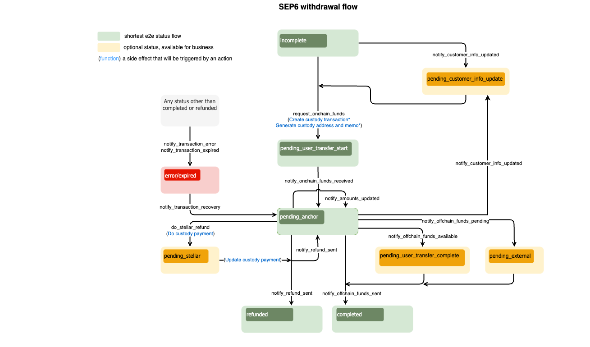

import { CodeExample } from "@site/src/components/CodeExample";
import { AttributeTable } from "@site/src/components/AttributeTable";
import Security from "../component/security/security.mdx";
import UsingApiKey from "../component/security/api_key.mdx";
import UsingJwt from "../component/security/jwt.mdx";
import Rpc from "../component/rpc/rpc.mdx";
import RpcRequest from "../component/rpc/request.mdx";
import RpcResponse from "../component/rpc/response.mdx";
import RpcError from "../component/rpc/error.mdx";
import Observer from "../component/observer/observer.mdx";

Uno de los principales puntos de interacción con la Anchor Platform es notificar a la Plataforma sobre eventos relacionados con las transacciones.

En general, querrás proporcionar actualizaciones para los siguientes eventos.

- Tu negocio requiere que el usuario envíe información KYC para procesar una transacción
- Tu negocio actualizó los montos de entrada/salida/tarifa para una transacción
- Tu negocio está listo para recibir fondos del usuario
- Tu negocio ha recibido fondos del usuario
- Tu negocio ha enviado fondos al usuario
- Tu negocio ha procesado un reembolso para la transacción del usuario
- Tu negocio experimentó un error inesperado

Esto se realiza haciendo solicitudes JSON-RPC al endpoint de la API de la Plataforma. Las solicitudes JSON-RPC te permiten actualizar el estado de la transacción. Para mover la transacción a un estado específico, es necesario hacer una solicitud JSON-RPC correspondiente y pasar los datos requeridos por el método RPC.

La API JSON-RPC de Anchor Platform está diseñada para notificar a la plataforma sobre cambios en el estado de la transacción. Dado esto, la API será llamada cada vez que un usuario o el anchor tome alguna acción que progrese el estado de la transacción en el flujo.

La comunicación de Anchor Platform sobre actualizaciones de transacciones, actualizaciones de clientes y creación de cotizaciones se maneja a través del servicio de eventos. Esta es una característica opcional que necesita ser configurada separadamente de la integración SEP-6. Para más información, consulta [Manejo de Eventos][event-handling].

Puedes encontrar más información sobre el flujo de transacciones y estados en el [documento de protocolo SEP-6][sep-6].

## Callbacks

La Anchor Platform depende del servidor empresarial para proporcionar y almacenar información sobre clientes y cotizaciones.

### Información del Cliente

La Anchor Platform no almacena información del cliente. En su lugar, reenvía todas las solicitudes de clientes SEP-12 al servidor empresarial. El servidor empresarial es responsable de almacenar y gestionar esta información. Por lo tanto, tu servidor empresarial debe implementar las [APIs de clientes][customer-callback] para manejar las actualizaciones KYC.

### Cotizaciones y Tarifas

Para admitir el exchange de activos no equivalentes, la Anchor Platform expone una API compatible con SEP-38 para proporcionar cotizaciones para el exchange. La API de cotizaciones se usa para proporcionar al usuario el monto esperado del activo que recibirá a cambio del activo que está enviando. La API de cotizaciones también se usa para proporcionar al usuario las tarifas esperadas para la transacción. Por lo tanto, tu servidor empresarial debe implementar la [API de tarifas][rate-callback] para proporcionar cotizaciones a la Anchor Platform.

## Asegurando la API de la Plataforma

<Security />

### Usando la Clave API

<UsingApiKey />

### Usando JWT

<UsingJwt />

## Haciendo Solicitudes JSON-RPC

<Rpc />

### Solicitud JSON-RPC

<RpcRequest />

### Respuesta JSON-RPC

<RpcResponse />

### Códigos de Error

<RpcError />

## Actualizando la Transacción de Depósito (Exchange) a Través de JSON-RPC

El diagrama de flujo de depósito SEP-6 define las secuencias/reglas de la transición del estado de la transacción y un conjunto de métodos JSON-RPC que deben ser llamados para cambiar ese estado. No puedes definir el estado que deseas establecer para una transacción específica en tus solicitudes. Cada método JSON-RPC define estructuras de datos que espera en la solicitud. Si la solicitud no contiene los atributos requeridos, la Anchor Platform devolverá un error y no cambiará el estado de la transacción.

El flujo de depósito exchange es el mismo que el flujo de depósito, excepto que los montos no necesitan ser recalculados al solicitar fondos offchain, si el usuario ha proporcionado una cotización firme del anchor.

[](../../assets/sep6-deposit-flow-diagram.png)

:::tip

Los estados en <span style={{color: "green"}}>verde</span> son obligatorios y definen el camino más corto.

Los estados en <span style={{color: "#B0BF1A"}}>amarillo</span> son opcionales y pueden ser omitidos.

Los estados en <span style={{color: "red"}}>rojo</span> significan que la transacción está en un estado de error o ha caducado.

:::

### Verificando la Información KYC

Aunque la Anchor Platform no requiere que un cliente tenga su información KYC recopilada antes de iniciar un depósito, tu negocio puede querer recopilar esta información antes de que el cliente realice una transferencia. Al escuchar eventos de transacciones creadas, o al consultar el [`GET /transactions`][get-transactions] endpoint, puedes determinar si una transacción requiere que el cliente actualice su información. Los campos requeridos de SEP-9 pueden ser comunicados al usuario devolviendo un estado `NEEDS_INFO` con los campos requeridos en el atributo `fields`.

Después de que el usuario haya enviado su información KYC, llama al método JSON-RPC `notify_customer_info_updated` nuevamente para actualizar el estado de la transacción. Además, llama a este método siempre que el estado SEP-12 de un cliente cambie, como cuando la información del cliente está siendo validada y el estado cambia de `NEEDS_INFO` a `PROCESSING`. Esto asegura que cualquier cliente configurado con una URL de callback sea notificado del último estado del cliente, permitiendo que el cliente le pida al usuario que actualice su información.

<CodeExample>

```json
// notify-customer-info-updated.json
[
  {
    "id": 1,
    "jsonrpc": "2.0",
    "method": "notify_customer_info_updated",
    "params": {
      "transaction_id": "<transaction_id>",
      "message": "Customer info updated",
      "customer_id": "45f8884d-d6e1-477f-a680-503179263359",
      "customer_type": "sep6-deposit" // or sep6-withdrawal
    }
  }
]
```

</CodeExample>

Para procesar esto, necesitas ejecutar:

<CodeExample>

```bash
./call-json-rpc.sh notify-customer-info-updated.json
```

</CodeExample>

### Listo para Recibir Fondos

Después de que el usuario haya enviado su información KYC, el anchor puede notificar a la Plataforma que está listo para recibir fondos. El anchor debe usar el RPC `request_offchain_funds` para proporcionar los montos finales al usuario. Para hacerlo, realiza la siguiente solicitud JSON-RPC.

<CodeExample>

```json
// request-offchain-funds.json
[
  {
    "id": 1,
    "jsonrpc": "2.0",
    "method": "request_offchain_funds",
    "params": {
      "transaction_id": "<transaction_id>",
      "message": "Request offchain funds",
      "amount_in": {
        "amount": 10,
        "asset": "iso4217:USD"
      },
      "amount_out": {
        "amount": 9,
        "asset": "stellar:USDC:GBBD47IF6LWK7P7MDEVSCWR7DPUWV3NY3DTQEVFL4NAT4AQH3ZLLFLA5"
      },
      "amount_fee": {
        "amount": 1,
        "asset": "iso4217:USD"
      },
      "amount_expected": {
        "amount": 10
      },
      "instructions": {
        "organization.bank_number": {
          "value": "123456789",
          "description": "US Bank routing number"
        },
        "organization.bank_account_number": {
          "value": "123456789",
          "description": "US Bank account number"
        }
      }
    }
  }
]
```

</CodeExample>

- `amount_in` es la cantidad que el usuario debe enviar al negocio.
- `amount_out` es la cantidad que el usuario recibirá.
- `amount_fee` es el monto total de tarifas cobradas por el negocio.
- `asset` es parte del campo `amount_x` y está en un formato SEP-38. En este ejemplo, está establecido a USD, asumiendo que el usuario realizó una transferencia bancaria al sistema utilizando USD.
- `instructions` es el conjunto de campos estándar SEP-9 que el usuario debe usar para enviar fondos al negocio. En este ejemplo, el usuario debe enviar fondos a la cuenta bancaria con el número de ruta `123456789` y el número de cuenta `123456789`.

La información sobre los montos (entrada/salida/tarifa) es requerida si quieres mover la transacción al estado `pending_user_transfer_start`.

Para procesar esto, necesitas ejecutar:

<CodeExample>

```bash
./call-json-rpc.sh request-offchain-funds.json
```

</CodeExample>

:::caution

Para depósitos de exchange con una cotización firme (la solicitud está asociada con un `quote_id`), no se deben proporcionar montos.

:::

### Fondos Recibidos

Si se recibieron fondos offchain, querrás proporcionar información actualizada sobre la transacción.

<CodeExample>

```json
// offchain-funds-received.json
[
  {
    "id": 1,
    "jsonrpc": "2.0",
    "method": "notify_offchain_funds_received",
    "params": {
      "transaction_id": "<transaction_id>",
      "message": "Offchain funds received",
      "funds_received_at": "2023-07-04T12:34:56Z",
      "external_transaction_id": "7...9",
      "amount_in": {
        "amount": 10
      },
      "amount_out": {
        "amount": 9
      },
      "amount_fee": {
        "amount": 1
      },
      "amount_expected": {
        "amount": 10
      }
    }
  }
]
```

</CodeExample>

- `funds_received_at` es la fecha y hora de recepción de los fondos.
- `external_transaction_id` es el ID de la transacción en la red externa.

Los campos de montos son opcionales. Si se omiten, se utilizarán los valores previos a esta solicitud.

Para procesar esto, necesitas ejecutar:

<CodeExample>

```bash
./call-json-rpc.sh offchain-funds-received.json
```

</CodeExample>

### Esperando Fondos del Usuario

En el mundo real, el proceso de confirmación de la transferencia puede llevar tiempo. En tales casos, las transacciones deben establecerse en un nuevo estado que indique que se ha recibido la confirmación de la transferencia pero que los fondos en sí aún no han sido recibidos.

<CodeExample>

```json
// offchain-funds-sent.json
[
  {
    "id": 1,
    "jsonrpc": "2.0",
    "method": "notify_offchain_funds_sent",
    "params": {
      "transaction_id": "<transaction_id>",
      "message": "Offchain funds sent",
      "funds_received_at": "2023-07-04T12:34:56Z",
      "external_transaction_id": "7...9"
    }
  }
]
```

</CodeExample>

Para procesar esto, necesitas ejecutar:

<CodeExample>

```bash
./call-json-rpc.sh offchain-funds-sent.json
```

</CodeExample>

### Enviando Fondos Onchain

A continuación, envía una transacción en la red Stellar para cumplir con el depósito del usuario. Después de que la transacción Stellar haya sido presentada, es necesario enviar la solicitud JSON-RPC `notify_onchain_funds_sent` para notificar al usuario que los fondos han sido enviados con éxito.

<CodeExample>

```json
// onchain-funds-sent.json
[
  {
    "id": 1,
    "jsonrpc": "2.0",
    "method": "notify_onchain_funds_sent",
    "params": {
      "transaction_id": "<transaction_id>",
      "message": "Onchain funds sent",
      "stellar_transaction_id": "7...9"
    }
  }
]
```

</CodeExample>

- `stellar_transaction_id` es el ID de la transacción en la red Stellar de la transferencia.

Para procesar esto, necesitas ejecutar:

<CodeExample>

```bash
./call-json-rpc.sh onchain-funds-sent.json
```

</CodeExample>

Después de esta solicitud JSON-RPC, la transacción será transferida al estado `completada`.

### Enviando Pago a Través del Servicio de Custodia

La Anchor Platform ofrece la posibilidad de enviar un pago a través de servicios de custodia, como [Fireblocks](../custody-services/fireblocks/README.mdx). Para hacer un pago a través de un servicio de custodia, realiza la siguiente solicitud JSON-RPC.

<CodeExample>

```json
// do-stellar-payment.json
[
  {
    "id": 1,
    "jsonrpc": "2.0",
    "method": "do_stellar_payment",
    "params": {
      "transaction_id": "<transaction_id>",
      "message": "Custody payment started"
    }
  }
]
```

</CodeExample>

Para procesar esto, necesitas ejecutar:

<CodeExample>

```bash
./call-json-rpc.sh do-stellar-payment.json
```

</CodeExample>

Después del procesamiento exitoso del pago en un servicio de custodia, la Anchor Platform automáticamente hará la solicitud JSON-RPC `notify_onchain_funds_sent` y el estado de la transacción cambiará a `completado`.

:::caution

Una cuenta de usuario puede no estar lista para recibir fondos. Puedes verificar que la cuenta ha establecido una [línea de confianza](/docs/learn/glossary#trustline). De lo contrario, puedes establecer el estado de la transacción a `pending_trust` para indicar que el anchor está esperando que el usuario establezca la línea de confianza.

Si la integración de custodia está habilitada, la Anchor Platform hará esta validación automáticamente por ti.

:::

### Confianza Pendiente

Este estado debe establecerse si un pago requiere una línea de confianza de un activo que no fue configurada por el usuario. Hay dos maneras en que la transacción puede moverse al estado `pending_trust`. La primera es el procesamiento de un pago a través de un servicio de custodia en caso de que se detecte que la línea de confianza no está configurada. La segunda es cuando el negocio mismo detecta que falta la línea de confianza y quiere notificar al usuario que debe ser configurada. Para mover la transacción al estado `pending_trust`, realiza la siguiente solicitud JSON-RPC.

<CodeExample>

```json
// request-trust.json
[
  {
    "id": 1,
    "jsonrpc": "2.0",
    "method": "request_trust",
    "params": {
      "transaction_id": "<transaction_id>",
      "message": "Asset trustine not configured"
    }
  }
]
```

</CodeExample>

Para procesar esto, necesitas ejecutar:

<CodeExample>

```bash
./call-json-rpc.sh request-trust.json
```

</CodeExample>

:::info

El pago a través del servicio de custodia verifica periódicamente si la línea de confianza fue configurada. Si fue así, automáticamente enviará un pago a un servicio de custodia y cambiará el estado de la transacción a `pending_stellar`.

:::

### Configuración de Confianza

Este estado debe ser establecido si el negocio ha detectado que la línea de confianza fue o no configurada por el usuario.

<CodeExample>

```json
// trust-set.json
[
  {
    "id": 1,
    "jsonrpc": "2.0",
    "method": "notify_trust_set",
    "params": {
      "transaction_id": "<transaction_id>",
      "message": "Asset trustine set",
      "success": "true"
    }
  }
]
```

</CodeExample>

- `success` flag que define si la línea de confianza fue o no configurada por el usuario

Para procesar esto, necesitas ejecutar:

<CodeExample>

```bash
./call-json-rpc.sh trust-set.json
```

</CodeExample>

:::info

Dependiendo de la bandera `success`, el estado de la transacción se cambiará a `pending_stellar` si la línea de confianza fue configurada, o a `pending_anchor` si no lo fue.

:::

### Reembolso Enviado

A veces, es necesario enviar fondos de vuelta al usuario (reembolso). Puedes reembolsar la suma total (reembolso completo) o hacer un conjunto de reembolsos parciales de vuelta a la `source_account` usando el `refund_memo` y el `refund_memo_type` asociados con la transacción si están presentes. Además, si el usuario envía más dinero del esperado, puedes reembolsar una parte de la suma de vuelta al usuario y enviar el resto como fondos onchain.

<CodeExample>

```json
// refund-sent.json
[
  {
    "id": 1,
    "jsonrpc": "2.0",
    "method": "notify_refund_sent",
    "params": {
      "transaction_id": "<transaction_id>",
      "message": "Refund sent",
      "refund": {
        "id": "1c186184-09ee-486c-82a6-aa7a0ab1119c",
        "amount": {
          "amount": 10,
          "asset": "iso4217:USD"
        },
        "amount_fee": {
          "amount": 1,
          "asset": "iso4217:USD"
        }
      }
    }
  }
]
```

</CodeExample>

Para procesar esto, necesitas ejecutar:

<CodeExample>

```bash
./call-json-rpc.sh refund-sent.json
```

</CodeExample>

:::info

Si la suma de los reembolsos es menor que `amount_in`, el estado de la transacción se establecerá en `pending_anchor`. Solo si la suma de los reembolsos es igual a `amount_in`, el estado de la transacción se establecerá en `reembolsado`.

:::

### Reembolso Pendiente

Esto es similar a [Reembolso Enviado](#refund-sent), pero maneja el caso cuando un reembolso ha sido enviado a la red externa pero aún no está confirmado. El estado de la transacción se establece en `pending_external`. Este es el estado que se establecerá cuando se esté esperando a que Bitcoin o alguna otra red criptográfica externa complete una transacción, o cuando se esté esperando una transferencia bancaria.

### Error de Transacción

Si te encuentras con un error irrecuperable al procesar la transacción, es necesario establecer el estado de la transacción en `error`. Puedes usar el campo de mensaje para describir los detalles del error.

<CodeExample>

```json
// transaction-error.json
[
  {
    "id": 1,
    "jsonrpc": "2.0",
    "method": "notify_transaction_error",
    "params": {
      "transaction_id": "<transaction_id>",
      "message": "Error occurred"
    }
  }
]
```

</CodeExample>

Para procesar esto, necesitas ejecutar:

<CodeExample>

```bash
./call-json-rpc.sh transaction-error.json
```

</CodeExample>

:::tip

Si un usuario ha realizado una transferencia, debes hacer una recuperación de la transacción, y entonces puedes volver a intentar procesar la transacción o iniciar un reembolso.

:::

### Transacción Expirada

Tu negocio puede querer expirar transacciones que han sido abandonadas por el usuario después de algún tiempo. Es una buena práctica limpiar transacciones inactivas en estado `incomplete`. Para hacerlo, realiza la siguiente solicitud JSON-RPC para expirar una transacción.

<CodeExample>

```json
// transaction-expired.json
[
  {
    "id": 1,
    "jsonrpc": "2.0",
    "method": "notify_transaction_expired",
    "params": {
      "transaction_id": "<transaction_id>",
      "message": "Transaction expired"
    }
  }
]
```

</CodeExample>

Para procesar esto, necesitas ejecutar:

<CodeExample>

```bash
./call-json-rpc.sh transaction-expired.json
```

</CodeExample>

:::tip

Este método JSON-RPC no puede ser usado después de que el usuario ha realizado una transferencia.

:::

### Recuperación de Transacción

El estado de la transacción puede cambiarse de `error/expired` a `pending_anchor`. Después de la recuperación, puedes reembolsar los activos recibidos o proceder con el procesamiento de la transacción. Para recuperar una transacción, realiza la siguiente solicitud JSON-RPC.

<CodeExample>

```json
// transaction-recovery.json
[
  {
    "id": 1,
    "jsonrpc": "2.0",
    "method": "notify_transaction_recovery",
    "params": {
      "transaction_id": "<transaction_id>",
      "message": "Transaction recovered"
    }
  }
]
```

</CodeExample>

Para procesar esto, necesitas ejecutar:

<CodeExample>

```bash
./call-json-rpc.sh transaction-recovery.json
```

</CodeExample>

## Actualizar la transacción de retirada (exchange) a través de JSON-RPC

El diagrama de flujo de retirada SEP-6 define la secuencia/reglas de la transición del estado de la transacción. No puedes definir el estado que deseas establecer para una transacción específica en tus solicitudes. Cada método JSON-RPC define estructuras de datos que espera en la solicitud. Si la solicitud no contiene un atributo requerido, la Anchor Platform devolverá un error y no cambiará el estado de la transacción.

El flujo de exchange de retirada es el mismo que el flujo de retirada, excepto que las cantidades no necesitarán ser recalculadas al solicitar fondos on-chain, si el usuario ha proporcionado una cotización firme del anchor.

[](../../assets/sep6-withdrawal-flow-diagram.png)

:::tip

Los estados en <span style={{color: "green"}}>verde</span> son obligatorios y definen el camino más corto.

Los estados en <span style={{color: "#B0BF1A"}}>amarillo</span> son opcionales y pueden ser omitidos.

Los estados en <span style={{color: "red"}}>rojo</span> significan que la transacción está en un estado de error o que ha caducado.

:::

Una vez que el flujo de retirada ha terminado, implementar la retirada es sencillo. Algunas partes del flujo son similares y pueden ser reutilizadas.

El punto de partida tanto para la retirada como para el depósito es el mismo.

### Listo para recibir fondos

De manera similar al depósito, el paso después de haber recogido KYC es notificar al usuario que el anchor está listo para recibir fondos. Sin embargo, dado que tu servicio estará recibiendo transacciones a través de la red Stellar, la solicitud RPC será diferente. El anchor debe usar el RPC `request_onchain_funds` para proporcionar las cantidades finales al usuario. Para hacerlo, realiza la siguiente solicitud JSON-RPC.

<CodeExample>

```json
// request-onchain-funds.json
[
  {
    "id": 1,
    "jsonrpc": "2.0",
    "method": "request_onchain_funds",
    "params": {
      "transaction_id": "<transaction_id>",
      "message": "Request onchain funds",
      "amount_in": {
        "amount": 10,
        "asset": "stellar:USDC:GBBD47IF6LWK7P7MDEVSCWR7DPUWV3NY3DTQEVFL4NAT4AQH3ZLLFLA5"
      },
      "amount_out": {
        "amount": 9,
        "asset": "iso4217:USD"
      },
      "amount_fee": {
        "amount": 1,
        "asset": "stellar:USDC:GBBD47IF6LWK7P7MDEVSCWR7DPUWV3NY3DTQEVFL4NAT4AQH3ZLLFLA5"
      },
      "amount_expected": {
        "amount": 10
      },
      "destination_account": "GD...G",
      "memo": "12345",
      "memo_type": "id"
    }
  }
]
```

</CodeExample>

- `amount_in` es la cantidad que el usuario debe enviar al negocio.
- `amount_out` es la cantidad que el usuario recibirá.
- `amount_fee` es la cantidad total de tarifas recaudadas por el negocio.
- `asset` es parte del campo `amount_x` y está en formato SEP-38. En este ejemplo, se establece en USD, asumiendo que el usuario realizó una transferencia bancaria al sistema usando USD.
- `memo` es el memo que el usuario debe utilizar al enviar sus fondos on-chain al anchor.
- `memo_type` es el tipo de memo que el usuario debe utilizar al enviar sus fondos on-chain al anchor.
- `destination_account` es la cuenta a la que el usuario debe enviar los fondos.

Para procesar esto, necesitas ejecutar:

<CodeExample>

```bash
./call-json-rpc.sh request-onchain-funds.json
```

</CodeExample>

:::caution

Para retiros de exchange con una cotización firme (la solicitud está asociada con un `quote_id`), no se deben proporcionar cantidades.

:::

:::tip

Establecer `memo`, `memo_type` y `destination_account` es opcional.

Si la integración con un custodio de terceros está habilitada, la Anchor Platform puede generar `memo`, `memo_type` y `destination_address` si se elige un `deposit_info_generator_type` correspondiente. Además, puedes proporcionar `memo` y `memo_type` a la solicitud como se muestra arriba. Ten en cuenta que el memo debe ser único, esto es lo que ayuda a asociar las transacciones de Stellar con las transacciones SEP.

Si tu negocio gestiona los activos, la Anchor Platform puede generar memos para ti. Cuando el estado cambia a `pending_user_transfer_start`, la Anchor Platform establece el `memo` y `memo_type` automáticamente (solo si no se incluye en la solicitud).

:::

:::note

La cuenta Stellar que se utilizará para recibir fondos debe estar configurada.

:::

### Fondos recibidos

Si se recibieron fondos on-chain, necesitas proporcionar cantidades y cambiar el estado de la transacción a `pending_anchor`.

<CodeExample>

```json
// onchain-funds-received.json
[
  {
    "id": 1,
    "jsonrpc": "2.0",
    "method": "notify_onchain_funds_received",
    "params": {
      "transaction_id": "<transaction_id>",
      "message": "Onchain funds received",
      "stellar_transaction_id": "7...9",
      "amount_in": {
        "amount": 10
      },
      "amount_out": {
        "amount": 9
      },
      "amount_fee": {
        "amount": 1
      }
    }
  }
]
```

</CodeExample>

Para procesar esto, necesitas ejecutar:

<CodeExample>

```bash
./call-json-rpc.sh onchain-funds-received.json
```

</CodeExample>

:::tip

Este método será llamado automáticamente por el servidor de custodia si la integración de custodia está habilitada.

:::

### Cantidad actualizada

Si se recibieron fondos on-chain, pero por alguna razón `amount_in` difiere de lo especificado en el flujo interactivo (`amount_expected`), puedes actualizar `amount_out` y `amount_fee` para que correspondan a `amount_in` real. El estado de la transacción en este caso no cambiará y será igual a `pending_anchor`.

<CodeExample>

```json
// amounts-updated.json
[
  {
    "id": 1,
    "jsonrpc": "2.0",
    "method": "notify_amounts_updated",
    "params": {
      "transaction_id": "<transaction_id>",
      "message": "Amounts updated",
      "amount_out": {
        "amount": 9
      },
      "amount_fee": {
        "amount": 1
      }
    }
  }
]
```

</CodeExample>

Para procesar esto, necesitas ejecutar:

<CodeExample>

```bash
./call-json-rpc.sh amounts-updated.json
```

</CodeExample>

:::note

Solo `amount_out` y `amount_fee` pueden actualizarse utilizando esta solicitud JSON-RPC, y no necesitas especificar los activos de las cantidades.

:::

### Fondos offchain disponibles

Puedes mover el estado de la transacción a `pending_user_transfer_complete` si se enviaron fondos offchain, y si está listo para que el usuario/recipiente lo recoja.

<CodeExample>

```json
// offchain-funds-available.json
[
  {
    "id": 1,
    "jsonrpc": "2.0",
    "method": "notify_offchain_funds_available",
    "params": {
      "transaction_id": "<transaction_id>",
      "message": "Offchain funds available",
      "external_transaction_id": "a...c"
    }
  }
]
```

</CodeExample>

Para procesar esto, necesitas ejecutar:

<CodeExample>

```bash
./call-json-rpc.sh offchain-funds-available.json
```

</CodeExample>

### Fondos offchain pendientes

Otra opción es mover el estado de la transacción a `pending_external`. Este estado significa que el pago ha sido enviado a una red externa, pero aún no está confirmado.

<CodeExample>

```json
// offchain-funds-pending.json
[
  {
    "id": 1,
    "jsonrpc": "2.0",
    "method": "notify_offchain_funds_pending",
    "params": {
      "transaction_id": "<transaction_id>",
      "message": "Offchain funds pending",
      "external_transaction_id": "a...c"
    }
  }
]
```

</CodeExample>

Para procesar esto, necesitas ejecutar:

<CodeExample>

```bash
./call-json-rpc.sh offchain-funds-pending.json
```

</CodeExample>

### Fondos offchain enviados

Para completar la transacción y cambiar su estado a `completed`, necesitas realizar la solicitud JSON-RPC `notify_offchain_funds_sent`.

<CodeExample>

```json
// offchain-funds-sent.json
[
  {
    "id": 1,
    "jsonrpc": "2.0",
    "method": "notify_offchain_funds_sent",
    "params": {
      "transaction_id": "<transaction_id>",
      "message": "Offchain funds sent",
      "funds_sent_at": "2023-07-04T12:34:56Z",
      "external_transaction_id": "a...c"
    }
  }
]
```

</CodeExample>

Para procesar esto, necesitas ejecutar:

<CodeExample>

```bash
./call-json-rpc.sh offchain-funds-sent.json
```

</CodeExample>

### Reembolso enviado

La lógica de reembolso funciona de la misma manera que para el flujo de depósito. Para más detalles, consulta [Reembolso enviado](#refund-sent) del flujo de depósito.

### Enviar reembolso a través del servicio de custodia

La integración con un servicio de custodia te permite hacer un reembolso a través de un servicio de custodia, como Fireblocks.

<CodeExample>

```json
// do-stellar-refund.json
[
  {
    "id": 1,
    "jsonrpc": "2.0",
    "method": "do_stellar_refund",
    "params": {
      "transaction_id": "<transaction_id>",
      "message": "Do stellar refund",
      "refund": {
        "amount": {
          "amount": 9,
          "asset": "stellar:USDC:GBBD47IF6LWK7P7MDEVSCWR7DPUWV3NY3DTQEVFL4NAT4AQH3ZLLFLA5"
        },
        "amount_fee": {
          "amount": 1,
          "asset": "stellar:USDC:GBBD47IF6LWK7P7MDEVSCWR7DPUWV3NY3DTQEVFL4NAT4AQH3ZLLFLA5"
        }
      }
    }
  }
]
```

</CodeExample>

Para procesar esto, necesitas ejecutar:

<CodeExample>

```bash
./call-json-rpc.sh do-stellar-refund.json
```

</CodeExample>

:::note

De manera similar al flujo de depósito, puedes hacer un reembolso completo o un conjunto de reembolsos parciales. La transacción permanecerá en estado `pending_anchor` hasta que la suma de los reembolsos sea menor que `amount_in`. Si la suma de los reembolsos es igual a `amount_in`, la Anchor Platform cambiará automáticamente el estado de la transacción a `refunded`.

:::

### Error de transacción

Funciona de la misma manera que para el flujo de depósito. Para más detalles, consulta [Error de transacción](#transaction-error) del flujo de depósito.

### Transacción caducada

Funciona de la misma manera que para el flujo de depósito. Para más detalles, consulta [Transacción caducada](#expired-transaction) del flujo de depósito.

### Recuperación de transacción

Funciona de la misma manera que para el flujo de depósito. Para más detalles, consulta [Recuperación de transacción](#transaction-recovery) del flujo de depósito.

## Seguimiento de transacciones Stellar

<Observer />

[sep-6]: https://github.com/stellar/stellar-protocol/blob/master/ecosystem/sep-0006.md
[event-handling]: ../events/README.mdx
[customer-callback]: ../../api-reference/callbacks/README.mdx
[rate-callback]: ../../api-reference/callbacks/README.mdx
[get-transactions]: ../../api-reference/platform/transactions/get-transactions.api.mdx
