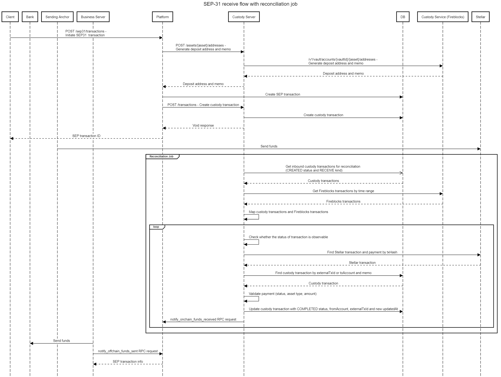

import { CodeExample } from "@site/src/components/CodeExample";

[comentario]: # "Las definiciones de diagrama de secuencia están ubicadas en la carpeta /static/definitions"
[comentario]: # "Para actualizarlos, usa https://sequencediagram.org"

### Flujo de depósito SEP-24 con webhook:

- solicitar_fondos_fuera_de_la_cadena
- notificar_fondos_fuera_de_la_cadena_recibidos
- realizar_pago_stellar
- notificar_fondos_en_la_cadena_enviados 
   

### Flujo de depósito SEP-24 con trabajo de conciliación:

- solicitar_fondos_fuera_de_la_cadena
- notificar_fondos_fuera_de_la_cadena_recibidos
- realizar_pago_stellar
- notificar_fondos_en_la_cadena_enviados 
   

### Flujo de retiro SEP-24 con webhook:

- realizar_pago_stellar
- notificar_fondos_en_la_cadena_recibidos
- notificar_fondos_fuera_de_la_cadena_enviados 
   

### Flujo de retiro SEP-24 con trabajo de conciliación:

- solicitar_fondos_en_la_cadena
- notificar_fondos_en_la_cadena_recibidos
- notificar_fondos_fuera_de_la_cadena_enviados 
   

### Flujo de recepción SEP-31 con webhook:

- notificar_fondos_en_la_cadena_recibidos
- notificar_fondos_fuera_de_la_cadena_enviados 
   

### Flujo de recepción SEP-31 con trabajo de conciliación:

- notificar_fondos_en_la_cadena_recibidos
- notificar_fondos_fuera_de_la_cadena_enviados 
