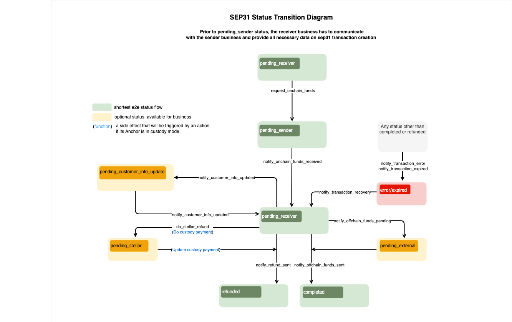

import { CodeExample } from "@site/src/components/CodeExample";

La integración con la Anchor Platform para facilitar pagos transnacionales implica implementar lo siguiente, como mínimo:

- [`GET /customer`][get-customer] & [`PUT /customer`][put-customer] puntos finales de la API KYC para solicitar y recoger los datos KYC de los clientes
- [`GET /rate`][get-rate] punto final de la API RFQ para proporcionar tasas de FX entre los activos on-chain y off-chain admitidos
- Las solicitudes `GET /transactions` para obtener actualizaciones sobre los estados de las transacciones de la Anchor Platform (la documentación llegará pronto)
- Solicitudes [`JSON-RPC`][json-rpc-methods] para actualizar los estados de las transacciones de la Anchor Platform

Lo siguiente también puede ser necesario dependiendo de tu caso de uso:

- [`DELETE /customer`][delete-customer] si tu negocio desea o necesita permitir que los remitentes soliciten la eliminación de los datos del cliente

## Crear un Servidor de Negocios

Primero, vamos a crear un servidor de negocios y agregarlo a nuestro archivo docker compose.

<CodeExample>

```yaml
version: "3.8"

services:
  sep-server:
    image: stellar/anchor-platform:latest
    command: --sep-server
    env_file:
      - ./dev.env
    volumes:
      - ./config:/home
    ports:
      - "8080:8080"
    depends_on:
      - db
  platform-server:
    image: stellar/anchor-platform:latest
    command: --platform-server
    env_file:
      - ./dev.env
    volumes:
      - ./config:/home
    ports:
      - "8085:8085"
    depends_on:
      - db

  server:
    build: .
    ports:
      - "8081:8081"
    env_file:
      - ./dev.env
  db:
    image: postgres:14
    ports:
      - "5432:5432"
    env_file:
      - ./dev.env
```

</CodeExample>

A continuación, crea un servidor web simple usando tu lenguaje de programación preferido y un `Dockerfile` que inicie el servidor. `docker compose up` deberías iniciar exitosamente los tres servicios.

Esta guía no proporciona un ejemplo de implementación de los puntos finales, pero puedes encontrar más información sobre los esquemas de solicitud y respuesta en la [Referencia de la API de Anchor Platform][ap-api], y las secciones a continuación ampliarán los conceptos importantes que debes entender al implementar los puntos finales.

## Puntos finales de Callback del Cliente

La Anchor Platform nunca almacena la PII de tus clientes, y en su lugar actúa como un servidor proxy entre las aplicaciones cliente y tu negocio, reenviando solicitudes y respuestas a la otra parte. Actualmente, las solicitudes y respuestas son casi idénticas a las definidas en la [especificación de la API KYC SEP-12][sep12].

### Identificando Clientes

Los clientes pueden ser identificados utilizando dos enfoques.

El primer enfoque utiliza una cuenta Stellar y un memo. Al utilizar la Anchor Platform para facilitar pagos transnacionales, la organización remitente utiliza su propia cuenta Stellar, la que se usa para autenticarse a través de [SEP-10 Stellar Authentication][ap-sep10], al registrar clientes con tu negocio. Los memos se utilizan para distinguir clientes únicos que provienen de la misma organización remitente.

El segundo enfoque utiliza identificadores de cliente generados por tu servicio. Por ejemplo, si una organización remitente está registrando un cliente, tu negocio recibirá una solicitud `PUT /customer` como la siguiente:

<CodeExample>

```json
{
  "account": "GDJUOFZGW5WYBK4GIETCSSM6MTTIJ4SUMCQITPTLUWMQ6B4UIX2IEX47",
  "memo": "780284017",
  "type": "sep31-sender",
  "first_name": "John",
  "last_name": "Doe",
  "email": "johndoe@example.com"
}
```

</CodeExample>

En este ejemplo, la clave pública `GDJ...X47` identifica a la organización remitente, y el memo `780284017` identifica al cliente. Los memos suelen ser enteros de 64 bits, pero también pueden ser otros tipos de datos, así que deben ser guardados como cadenas. En respuesta, tu negocio debería devolver un identificador de cliente.

<CodeExample>

```json
{
  "id": "fb5ddc93-1d5d-490d-ba5f-2c361cea41f7"
}
```

</CodeExample>

Tu servidor de negocios puede usar cualquier identificador para clientes siempre que sea una cadena.

Tras el registro de un cliente, la organización remitente puede usar cualquiera de los dos enfoques al verificar el estado del cliente. Por ejemplo, puedes recibir una solicitud `GET /customer` como la siguiente:

<CodeExample>

```
/customer?account=GDJUOFZGW5WYBK4GIETCSSM6MTTIJ4SUMCQITPTLUWMQ6B4UIX2IEX47&memo=780284017&type=sep31-sender
```

</CodeExample>

O, la organización remitente podría usar el identificador que devolviste cuando registraron originalmente al cliente.

<CodeExample>

```
/customer?id=fb5ddc93-1d5d-490d-ba5f-2c361cea41f7&type=sep31-sender
```

</CodeExample>

Tu negocio deberá mantener un mapeo entre la cuenta y el memo usados para registrar originalmente al cliente y el ID que devuelves en la respuesta, así como los datos KYC proporcionados. En futuras iteraciones de la Anchor Platform, podríamos mantener este mapeo para tu negocio para que solo tengas que trabajar con los IDs que generes.

### Tipos de Clientes

Es probable que tu negocio requiera diferentes conjuntos de información KYC dependiendo del tipo de cliente. Puedes definir las etiquetas para cada uno de estos tipos de clientes en tu archivo `dev.assets.yaml`, y tus organizaciones remitentes necesitarán entender qué etiqueta usar al registrar o consultar el estado de los clientes.

En las solicitudes `PUT /customer`, deberías usar el tipo que se pasa para evaluar si el remitente ha proporcionado todos los campos requeridos. En las solicitudes `GET /customer`, deberías usar el tipo para determinar el estado del cliente.

### Prueba con la Billetera de Demostración

Puedes probar tu implementación con la [Billetera de Demostración Stellar][demo-wallet] siguiendo los pasos a continuación.

1. Selecciona "Generar keypair para nueva cuenta"
2. Selecciona "Crear cuenta"
3. Selecciona "Agregar Activo" e introduce el código del activo y el dominio de la Anchor Platform, `localhost:8080`
4. Selecciona "Agregar línea de confianza"
5. Financia tu cuenta con un saldo del activo
6. Selecciona "SEP-31 Enviar" en el menú desplegable

Deberías ver cómo la billetera de demostración encuentra las URL de tu servicio, se autentica y verifica qué campos KYC necesita recoger. Luego debería presentar un formulario para que ingreses los detalles KYC del remitente y el receptor.

[](../../assets/anchor-platform-sep31-demo-wallet-widget.png)

Una vez que hayas ingresado la información solicitada, se enviará esa información a la Anchor Platform, que la enviará a tu servidor de negocios. Una vez que la billetera de demostración tenga los IDs de los clientes que generaste, iniciará una transacción que debería fallar.

## Punto Final de Callback de Tarifa

Una vez que la organización remitente ha registrado a los clientes involucrados en la transacción, necesitará solicitar un presupuesto, o tarifa de FX, a tu negocio. La Anchor Platform solicita esta información a tu servidor de negocios usando el [`GET /rate` endpoint][get-rate].

### Presupuestos Firmes vs. Indicativos

Las solicitudes de presupuestos tendrán un parámetro `type` que es [`indicativo`][indicative] o [`firme`][firm]. Si `type=firme`, tu respuesta debe incluir el `id` y el campo de fecha-hora `expires_at` y reservar la liquidez necesaria para cumplir con este presupuesto hasta que expire. Si `type=indicativo`, no devuelvas los campos `id` o `expires_at` porque la tarifa proporcionada no se utilizará en una transacción.

Ten en cuenta que el cliente puede solicitar que el presupuesto expire después de una fecha-hora específica usando el parámetro `expires_after`. Tu negocio debe honrar esta solicitud devolviendo un valor `expires_at` que esté en o después de la fecha-hora solicitada o rechazar la solicitud con una respuesta 400 Bad Request, que se reenviará al cliente.

### Usando el ID del Cliente

Las solicitudes pueden incluir un parámetro `client_id` que identifica a la organización remitente que solicita la tasa. Puedes usar este parámetro para cumplir con los términos comerciales acordados con esa organización remitente, como ofrecer tarifas con descuento. `client_id` puede no estar presente para solicitudes indicativas, en cuyo caso debería devolverse tu precio de mercado. Actualmente `client_id` siempre será la clave pública Stellar que la organización remitente utilizó para autenticarse con la Anchor Platform.

### Métodos de Entrega

Es común que las tarifas y los cargos de las empresas varíen según los rieles de pago utilizados para enviar fondos al destinatario. Si tus métodos de entrega están configurados en tu archivo `asset.yaml`, los clientes siempre proporcionarán el riel de pago que deseen que tu negocio use para solicitudes de presupuestos firmes.

Debido a que este punto final actualmente solo se utiliza para pagar remesas en activos off-chain, se usará el `buy_delivery_method`. Si este punto final se utiliza alguna vez en otros flujos de transacción, como depósitos SEP-24, entonces `sell_delivery_method` también podría ser pasado para negocios que soporten estos tipos de transacciones.

## Obteniendo Actualizaciones del Estado de la Transacción

Para facilitar pagos transnacionales, necesitarás ser capaz de detectar cuándo una organización remitente ha enviado a tu negocio un pago on-chain y determinar qué transacción se pretendía cumplir con ese pago.

La forma más fácil de hacerlo es ejecutar el Stellar Observer, que detectará estos pagos y actualizará el registro de transacción correspondiente con información sobre el pago. Tu negocio puede entonces detectar estas actualizaciones realizando sondeos al punto final de la API Platform `GET /transactions`.

### Ejecutando el Stellar Observer

El Stellar Observer monitorea el ledger de Stellar para los pagos realizados a tu(s) cuenta(s) y actualiza los registros de transacción correspondientes con información de pagos on-chain. Para ejecutar el observador, agrega lo siguiente a tu archivo docker compose.

<CodeExample>

```yaml
services:
  ...
  observer:
    image: stellar/anchor-platform:latest
    command: --stellar-observer
    env_file:
      - ./dev.env
    volumes:
      - ./config:/home
```

</CodeExample>

### Polling por Pagos Recibidos

El Stellar Observer realiza solicitudes JSON-RPC a la API Platform cada vez que detecta pagos recibidos por transacciones iniciadas por organizaciones remitentes, actualizando así la fecha-hora de `transfer_received_at` de la transacción.

Tu negocio debe hacer polling periódicamente al punto final de la API Platform `GET /transactions` para detectar estas actualizaciones. Puedes referirte al siguiente ejemplo:

<CodeExample>

```bash
curl http://localhost:8080/transactions?sep=31&order_by=transfer_received_at&order=desc
```

</CodeExample>

La respuesta incluirá una lista de transacciones de pagos transnacionales iniciadas por organizaciones remitentes. Esta lista estará ordenada según el momento en que se recibió un pago por esa transacción. Para cada transacción devuelta, tu negocio debería verificar si ya ha detectado el pago para esa transacción. Si lo ha hecho, has detectado todos los pagos realizados a tu(s) cuenta(s).

## Actualizando la Transacción Vía JSON-RPC

El diagrama de flujo SEP-31 define la secuencia/reglas de la transición del estado de la transacción y un conjunto de métodos JSON-RPC que se deben llamar para cambiar ese estado. No puedes definir el estado que deseas establecer para una transacción específica en tus solicitudes. Cada método JSON-RPC define estructuras de datos que espera en la solicitud. Si la solicitud no contiene los atributos requeridos, la Anchor Platform devolverá un error y no cambiará el estado de la transacción.

[](../../assets/sep31-transition-diagram.png)

:::tip

Los estados en <span style={{color: "green"}}>verde</span> son obligatorios y definen el flujo más corto.

Los estados en <span style={{color: "#B0BF1A"}}>amarillo</span> son opcionales y pueden ser omitidos.

Los estados en <span style={{color: "red"}}>rojo</span> significan que la transacción está en un estado de error o ha caducado.

:::

Puedes crear un [template][sep24-integration-make-json-rpc-request] para hacer solicitudes JSON-RPC a la Anchor Platform.

Este capítulo también contiene información sobre el formato de [solicitud][sep24-integration-rpc-request]/[respuesta][sep24-integration-rpc-response] y [códigos de error][sep24-integration-error-codes] que podrían ser devueltos por la Anchor Platform.

### Listo para Recibir Fondos

Las transacciones SEP-31 deben estar inicialmente en el estado `pending_receiver`. Para solicitar fondos del Sending Anchor, el Receiving Anchor debe cambiar el estado de la transacción a `pending_sender` haciendo la siguiente solicitud RPC:

<CodeExample>

```json
// request-onchain-funds.json
[
  {
    "id": 1,
    "jsonrpc": "2.0",
    "method": "request_onchain_funds",
    "params": {
      "transaction_id": "<transaction_id>",
      "message": "Request onchain funds",
      "destination_account": "GD...G",
      "memo": "12345",
      "memo_type": "id"
    }
  }
]
```

</CodeExample>

Para procesar esto, necesitas ejecutar:

<CodeExample>

```bash
./call-json-rpc.sh request-onchain-funds.json
```

</CodeExample>

El estado de la transacción se cambiará a `pending_sender`.

### Fondos Recibidos

Si el Sending Anchor ha enviado los fondos, el Receiving Anchor debe cambiar el estado de la transacción a `pending_receiver` haciendo la siguiente solicitud JSON-RPC:

<CodeExample>

```json
// onchain-funds-received.json
[
  {
    "id": 1,
    "jsonrpc": "2.0",
    "method": "notify_onchain_funds_received",
    "params": {
      "transaction_id": "<transaction_id>",
      "message": "Onchain funds received",
      "stellar_transaction_id": "7...9",
      "amount_in": {
        "amount": 10
      },
      "amount_out": {
        "amount": 9
      },
      "fee_details": {
        "total": 1
      }
    }
  }
]
```

</CodeExample>

Para procesar esto, necesitas ejecutar:

<CodeExample>

```bash
./call-json-rpc.sh onchain-funds-received.json
```

</CodeExample>

El estado de la transacción se cambiará a `pending_receiver`.

### Fondos Offchain Enviados

Para completar la transacción y cambiar su estado a `completed`, necesitas hacer una solicitud JSON-RPC `notify_offchain_funds_sent`.

<CodeExample>

```json
// offchain-funds-sent.json
[
  {
    "id": 1,
    "jsonrpc": "2.0",
    "method": "notify_offchain_funds_sent",
    "params": {
      "transaction_id": "<transaction_id>",
      "message": "Offchain funds sent",
      "funds_sent_at": "2023-07-04T12:34:56Z",
      "external_transaction_id": "a...c"
    }
  }
]
```

</CodeExample>

Para procesar esto, necesitas ejecutar:

<CodeExample>

```bash
./call-json-rpc.sh offchain-funds-sent.json
```

</CodeExample>

### Fondos Offchain Pendientes

Otra opción es mover el estado de la transacción a `pending_external`. Este estado significa que el pago ha sido enviado a la red externa, pero aún no está confirmado.

<CodeExample>

```json
// offchain-funds-pending.json
[
  {
    "id": 1,
    "jsonrpc": "2.0",
    "method": "notify_offchain_funds_pending",
    "params": {
      "transaction_id": "<transaction_id>",
      "message": "Offchain funds pending",
      "external_transaction_id": "a...c"
    }
  }
]
```

</CodeExample>

Para procesar esto, necesitas ejecutar:

<CodeExample>

```bash
./call-json-rpc.sh offchain-funds-pending.json
```

</CodeExample>

### Verificando la Información del Cliente

En algunos casos, el Receiving Anchor podría necesitar solicitar información actualizada del Sending Anchor. Por ejemplo, el banco le dice al Receiving Anchor que el nombre del Cliente Receptor proporcionado es incorrecto o le falta un segundo nombre. Dado que esta información fue enviada a través de SEP-12, la transacción debería entrar en el estado `pending_customer_info_update` hasta que el Sending Anchor haga otra solicitud `PUT /customer` de SEP-12 para actualizar. El Sending Anchor puede verificar qué campos necesitan ser actualizados haciendo una solicitud `GET /customer` de SEP-12 incluyendo los parámetros id o account & memo. El Receiving Anchor debe responder con un estado `NEEDS_INFO` y `last_name` incluido en los campos descritos.

Después de que el Sending Anchor haga una solicitud `PUT /customer` de SEP-12, llama al método JSON-RPC `notify_customer_info_updated` otra vez para actualizar el estado de la transacción. Adicionalmente, llama a este método cada vez que el estado SEP-12 de un cliente cambie, como cuando la información del cliente esté siendo validada y el estado cambie de `NEEDS_INFO` a `PROCESSING`. Esto garantiza que cualquier cliente configurado con una URL de callback sea notificado del estado más reciente del cliente, permitiendo al cliente solicitar al usuario que actualice su información.

<CodeExample>

```json
// notify-customer-info-updated.json
[
  {
    "id": 1,
    "jsonrpc": "2.0",
    "method": "notify_customer_info_updated",
    "params": {
      "transaction_id": "<transaction_id>",
      "message": "Customer info updated",
      "customer_id": "45f8884d-d6e1-477f-a680-503179263359",
      "customer_type": "sep31-receiver" // or sep31-sender
    }
  }
]
```

</CodeExample>

Para procesar esto, necesitas ejecutar:

<CodeExample>

```bash
./call-json-rpc.sh notify-customer-info-updated.json
```

</CodeExample>

### Realizar un Reembolso Stellar

La integración con el servicio de custodia te permite realizar reembolsos a través del servicio de custodia, como Fireblocks.

<CodeExample>

```json
// do-stellar-refund.json
[
  {
    "id": 1,
    "jsonrpc": "2.0",
    "method": "do_stellar_refund",
    "params": {
      "transaction_id": "<transaction_id>",
      "message": "Do stellar refund",
      "refund": {
        "amount": {
          "amount": 9,
          "asset": "stellar:USDC:GBBD47IF6LWK7P7MDEVSCWR7DPUWV3NY3DTQEVFL4NAT4AQH3ZLLFLA5"
        },
        "amount_fee": {
          "amount": 1,
          "asset": "stellar:USDC:GBBD47IF6LWK7P7MDEVSCWR7DPUWV3NY3DTQEVFL4NAT4AQH3ZLLFLA5"
        }
      }
    }
  }
]
```

</CodeExample>

Para procesar esto, necesitas ejecutar:

<CodeExample>

```bash
./call-json-rpc.sh do-stellar-refund.json
```

</CodeExample>

:::note

No puedes hacer múltiples reembolsos en el flujo SEP-31. Por esta razón, el monto total del reembolso más la tarifa debería ser igual a `amount_in`. De lo contrario, recibirás un error.

:::

### Reembolso Enviado

Hay una posibilidad de enviar todos los fondos de vuelta al `Sending Anchor` (reembolso). Necesitas reembolsar la suma total (reembolso completo).

<CodeExample>

```json
// refund-sent.json
[
  {
    "id": 1,
    "jsonrpc": "2.0",
    "method": "notify_refund_sent",
    "params": {
      "transaction_id": "<transaction_id>",
      "message": "Refund sent",
      "refund": {
        "id": "1c186184-09ee-486c-82a6-aa7a0ab1119c",
        "amount": {
          "amount": 10,
          "asset": "iso4217:USD"
        },
        "amount_fee": {
          "amount": 1,
          "asset": "iso4217:USD"
        }
      }
    }
  }
]
```

</CodeExample>

Para procesar esto, necesitas ejecutar:

<CodeExample>

```bash
./call-json-rpc.sh refund-sent.json
```

</CodeExample>

:::note

No puedes hacer múltiples reembolsos en el flujo SEP-31. Por esta razón, la cantidad a reembolsar más la tarifa debería ser igual a `amount_in`. De lo contrario, recibirás un error.

:::

### Error de Transacción

Si encuentras un error irrecuperable al procesar la transacción, es necesario establecer el estado de la transacción a `error`. Puedes usar el campo de mensaje para describir los detalles del error.

<CodeExample>

```json
// transaction-error.json
[
  {
    "id": 1,
    "jsonrpc": "2.0",
    "method": "notify_transaction_error",
    "params": {
      "transaction_id": "<transaction_id>",
      "message": "Error occurred"
    }
  }
]
```

</CodeExample>

Para procesar esto, necesitas ejecutar:

<CodeExample>

```bash
./call-json-rpc.sh transaction-error.json
```

</CodeExample>

:::tip

Si un usuario ha realizado una transferencia, debes hacer una recuperación de transacción y luego puedes intentar procesar la transacción nuevamente o iniciar un reembolso.

:::

### Transacción Caducada

Tu negocio puede querer caducar esas transacciones que han sido abandonadas por el usuario después de un tiempo. Es una buena práctica limpiar las transacciones inactivas en estado `incompleto`. Para hacerlo, simplemente cambia el estado de la transacción a `caducado`.

<CodeExample>

```json
// transaction-expired.json
[
  {
    "id": 1,
    "jsonrpc": "2.0",
    "method": "notify_transaction_expired",
    "params": {
      "transaction_id": "<transaction_id>",
      "message": "Transaction expired"
    }
  }
]
```

</CodeExample>

Para procesar esto, necesitas ejecutar:

<CodeExample>

```bash
./call-json-rpc.sh transaction-expired.json
```

</CodeExample>

:::tip

Este método JSON-RPC no se puede usar después de que el usuario haya realizado una transferencia.

:::

### Recuperación de Transacción

El estado de la transacción puede cambiarse de `error/expired` a `pending-anchor`. Después de la recuperación, puedes reembolsar los activos recibidos o proceder con el procesamiento de la transacción. Para recuperar la transacción, es necesario realizar la siguiente solicitud JSON-RPC:

<CodeExample>

```json
// transaction-recovery.json
[
  {
    "id": 1,
    "jsonrpc": "2.0",
    "method": "notify_transaction_recovery",
    "params": {
      "transaction_id": "<transaction_id>",
      "message": "Transaction recovered"
    }
  }
]
```

</CodeExample>

Para procesar esto, necesitas ejecutar:

<CodeExample>

```bash
./call-json-rpc.sh transaction-recovery.json
```

</CodeExample>

### Configuración

Puedes habilitar estos tipos de transacciones actualizando la configuración de tu archivo `assets.yaml`:

<CodeExample>

```yaml
items:
  - ...
    sep31:
      quotes_required: false
```

</CodeExample>

[ap-api]: ../../README.mdx
[ap-sep10]: ../sep10/README.mdx
[sep12]: https://github.com/stellar/stellar-protocol/blob/master/ecosystem/sep-0012.md
[demo-wallet]: https://demo-wallet.stellar.org
[indicative]: https://www.investopedia.com/terms/i/indicativequote.asp
[firm]: https://www.investopedia.com/terms/f/firmquote.asp
[get-customer]: ../../api-reference/callbacks/get-customer.api.mdx
[put-customer]: ../../api-reference/callbacks/put-customer.api.mdx
[get-rate]: ../../api-reference/callbacks/get-rates.api.mdx
[put-customer-callback]: ../../api-reference/callbacks/put-customer.api.mdx
[delete-customer]: ../../api-reference/callbacks/del-customer.api.mdx
[json-rpc-methods]: ../../api-reference/platform/rpc/methods/README.mdx
[sep24-integration-make-json-rpc-request]: ../sep24/integration.mdx#making-json-rpc-requests
[sep24-integration-rpc-request]: ../sep24/integration.mdx#json-rpc-request
[sep24-integration-rpc-response]: ../sep24/integration.mdx#json-rpc-response
[sep24-integration-error-codes]: ../sep24/integration.mdx#error-codes
