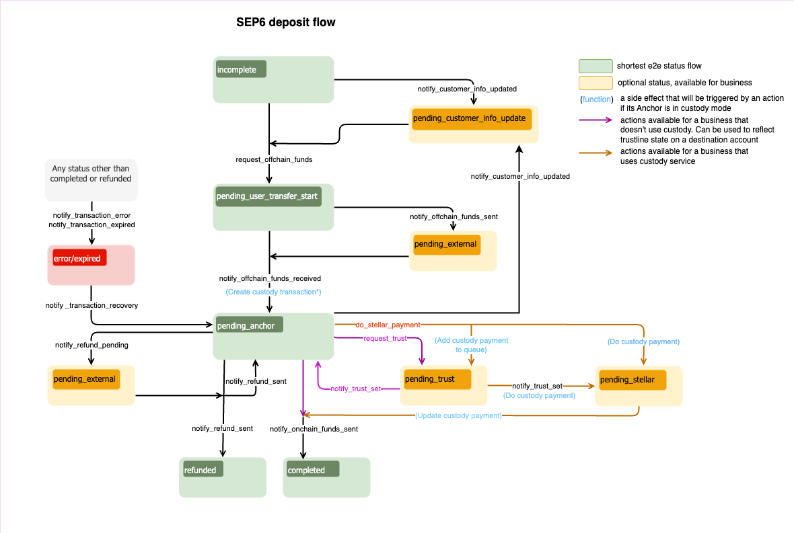

import { CodeExample } from "@site/src/components/CodeExample";
import { AttributeTable } from "@site/src/components/AttributeTable";
import Security from "../component/security/security.mdx";
import UsingApiKey from "../component/security/api_key.mdx";
import UsingJwt from "../component/security/jwt.mdx";
import Rpc from "../component/rpc/rpc.mdx";
import RpcRequest from "../component/rpc/request.mdx";
import RpcResponse from "../component/rpc/response.mdx";
import RpcError from "../component/rpc/error.mdx";
import Observer from "../component/observer/observer.mdx";

Uno de los puntos principales de interacción con la Anchor Platform es notificar a la Plataforma sobre eventos relacionados con las transacciones.

En general, querrás proporcionar actualizaciones para los siguientes eventos.

- Tu negocio requiere que el usuario envíe información KYC para procesar una transacción
- Tu negocio actualizó los montos de entrada/salida/tarifa para una transacción
- Tu negocio está listo para recibir fondos del usuario
- Tu negocio ha recibido fondos del usuario
- Tu negocio ha enviado fondos al usuario
- Tu negocio ha procesado un reembolso para la transacción del usuario
- Tu negocio experimentó un error inesperado

Esto se hace realizando solicitudes JSON-RPC al punto final de la API de la Plataforma. Las solicitudes JSON-RPC te permiten actualizar el estado de la transacción. Para mover la transacción a un estado específico, es necesario realizar una solicitud JSON-RPC correspondiente y pasar los datos requeridos por el método RPC.

La API JSON-RPC de Anchor Platform está diseñada para notificar a la plataforma sobre cambios en el estado de la transacción. Dado esto, la API será llamada cada vez que un usuario o el anchor tome alguna acción que avance el estado de la transacción en el flujo.

La comunicación desde la Anchor Platform sobre actualizaciones de transacciones, actualizaciones de clientes y creación de cotizaciones se maneja a través del servicio de eventos. Esta es una función opcional que debe configurarse por separado de la integración SEP-6. Para más información, consulta [Manejo de Eventos][event-handling].

Puedes descubrir más sobre el flujo y los estados de las transacciones en el [documento del protocolo SEP-6][sep-6].

## Devoluciones de llamada

La Anchor Platform se basa en el servidor de negocio para proporcionar y almacenar información sobre clientes y cotizaciones.

### Información del Cliente

La Anchor Platform no almacena información de clientes. En su lugar, reenvía todas las solicitudes de clientes SEP-12 al servidor de negocio. El servidor de negocio es responsable de almacenar y gestionar esta información. Por lo tanto, tu servidor de negocio debe implementar las [API de clientes][customer-callback] para manejar actualizaciones KYC.

### Cotizaciones y Tarifas

Para permitir el intercambio de activos no equivalentes, la Anchor Platform expone una API conforme a SEP-38 para proporcionar cotizaciones para el intercambio. La API de cotización se utiliza para proporcionar al usuario el monto esperado del activo que recibirá a cambio del activo que está enviando. La API de cotización también se utiliza para proporcionar al usuario las tarifas esperadas para la transacción. Por lo tanto, tu servidor de negocio debe implementar la [API de tarifas][rate-callback] para proporcionar cotizaciones a la Anchor Platform.

## Asegurando la API de la Plataforma

<Security />

### Usando la Clave de API

<UsingApiKey />

### Usando JWT

<UsingJwt />

## Realizando Solicitudes JSON-RPC

<Rpc />

### Solicitud JSON-RPC

<RpcRequest />

### Respuesta JSON-RPC

<RpcResponse />

### Códigos de Error

<RpcError />

## Actualizando Depósito (Intercambio) Transacción a Través de JSON-RPC

El diagrama de flujo de depósito SEP-6 define las secuencias/reglas de la transición del estado de la transacción y un conjunto de métodos JSON-RPC que deben ser llamados para cambiar ese estado. No puedes definir el estado que deseas establecer para una transacción específica en tus solicitudes. Cada método JSON-RPC define las estructuras de datos que espera en la solicitud. Si la solicitud no contiene atributos requeridos, la Anchor Platform devolverá un error y no cambiará el estado de la transacción.

El flujo de intercambio de depósito es el mismo que el flujo de depósito, excepto que los montos no necesitarán ser recalculados al solicitar fondos fuera de la cadena, si el usuario ha proporcionado una cotización firme del anchor.

[](../../assets/sep6-deposit-flow-diagram.png)

:::tip

Los estados en <span style={{color: "green"}}>verde</span> son obligatorios y definen el camino más corto.

Los estados en <span style={{color: "#B0BF1A"}}>amarillo</span> son opcionales y pueden ser omitidos.

Los estados en <span style={{color: "red"}}>rojo</span> significan que la transacción está en un estado de error o ha expirado.

:::

### Verificando Información KYC

Aunque la Anchor Platform no requiere que un cliente tenga su información KYC recopilada antes de iniciar un depósito, tu negocio puede querer recopilar esta información antes de que el cliente realice una transferencia. Al escuchar eventos de transacción creados, o al consultar el punto final [`GET /transactions`][get-transactions], puedes determinar si una transacción requiere que el cliente actualice su información. Los campos requeridos de SEP-9 pueden ser comunicados al usuario devolviendo un estado `NEEDS_INFO` con los campos requeridos en el atributo `fields`.

Después de que el usuario haya enviado su información KYC, llama al método JSON-RPC `notify_customer_info_updated` nuevamente para actualizar el estado de la transacción. Adicionalmente, llama a este método cada vez que el estado SEP-12 de un cliente cambie, como cuando la información del cliente está siendo validada y el estado cambia de `NEEDS_INFO` a `PROCESSING`. Esto asegura que cualquier cliente configurado con una URL de callback sea notificado del último estado del cliente, permitiendo que el cliente solicite al usuario que actualice su información.

<CodeExample>

```json
// notify-customer-info-updated.json
[
  {
    "id": 1,
    "jsonrpc": "2.0",
    "method": "notify_customer_info_updated",
    "params": {
      "transaction_id": "<transaction_id>",
      "message": "Customer info updated",
      "customer_id": "45f8884d-d6e1-477f-a680-503179263359",
      "customer_type": "sep6-deposit" // or sep6-withdrawal
    }
  }
]
```

</CodeExample>

Para ejecutar esto, necesitas correr:

<CodeExample>

```bash
./call-json-rpc.sh notify-customer-info-updated.json
```

</CodeExample>

### Listo para Recibir Fondos

Después de que el usuario haya enviado su información KYC, el anchor puede notificar a la Plataforma que está listo para recibir fondos. El anchor debe usar el RPC `request_offchain_funds` para proporcionar los montos finales al usuario. Para hacerlo, realiza la siguiente solicitud JSON-RPC.

<CodeExample>

```json
// request-offchain-funds.json
[
  {
    "id": 1,
    "jsonrpc": "2.0",
    "method": "request_offchain_funds",
    "params": {
      "transaction_id": "<transaction_id>",
      "message": "Request offchain funds",
      "amount_in": {
        "amount": 10,
        "asset": "iso4217:USD"
      },
      "amount_out": {
        "amount": 9,
        "asset": "stellar:USDC:GBBD47IF6LWK7P7MDEVSCWR7DPUWV3NY3DTQEVFL4NAT4AQH3ZLLFLA5"
      },
      "fee_details": {
        "total": 1,
        "asset": "iso4217:USD"
      },
      "amount_expected": {
        "amount": 10
      },
      "instructions": {
        "organization.bank_number": {
          "value": "123456789",
          "description": "US Bank routing number"
        },
        "organization.bank_account_number": {
          "value": "123456789",
          "description": "US Bank account number"
        }
      }
    }
  }
]
```

</CodeExample>

- `amount_in` es el monto que el usuario tiene que enviar al negocio.
- `amount_out` es el monto que el usuario recibirá.
- `fee_details` es el monto total de tarifas cobradas por el negocio.
- `asset` es parte del campo `amount_x` y está en un formato SEP-38. En este ejemplo, está configurado a USD, asumiendo que el usuario realizó una transferencia bancaria al sistema usando USD.
- `instructions` es el conjunto de campos estándar SEP-9 que el usuario debe usar para enviar fondos al negocio. En este ejemplo, el usuario debe enviar fondos a la cuenta bancaria con el número de ruta `123456789` y el número de cuenta `123456789`.

La información sobre los montos (entrada/salida/tarifa) es requerida si deseas mover la transacción al estado `pending_user_transfer_start`.

Para ejecutar esto, necesitas correr:

<CodeExample>

```bash
./call-json-rpc.sh request-offchain-funds.json
```

</CodeExample>

:::caution

Para depósitos de intercambio con una cotización firme (la solicitud está asociada con un `quote_id`), no se deben proporcionar montos.

:::

### Fondos Recibidos

Si se recibieron fondos fuera de la cadena, querrás proporcionar información de transacción actualizada.

<CodeExample>

```json
// offchain-funds-received.json
[
  {
    "id": 1,
    "jsonrpc": "2.0",
    "method": "notify_offchain_funds_received",
    "params": {
      "transaction_id": "<transaction_id>",
      "message": "Offchain funds received",
      "funds_received_at": "2023-07-04T12:34:56Z",
      "external_transaction_id": "7...9",
      "amount_in": {
        "amount": 10
      },
      "amount_out": {
        "amount": 9
      },
      "fee_details": {
        "total": 1
      },
      "amount_expected": {
        "amount": 10
      }
    }
  }
]
```

</CodeExample>

- `funds_received_at` es la fecha y hora de la recepción de los fondos.
- `external_transaction_id` es el ID de la transacción en la red externa.

Los campos de monto son opcionales. Si se omiten, se usarán los valores previos a esta solicitud.

Para ejecutar esto, necesitas correr:

<CodeExample>

```bash
./call-json-rpc.sh offchain-funds-received.json
```

</CodeExample>

### Esperando Fondos del Usuario

En el mundo real, el proceso de confirmación de la transferencia puede tardar tiempo. En tales casos, las transacciones deben establecerse en un nuevo estado que indique que se ha recibido la confirmación de la transferencia, pero los fondos en sí no han sido recibidos todavía.

<CodeExample>

```json
// offchain-funds-sent.json
[
  {
    "id": 1,
    "jsonrpc": "2.0",
    "method": "notify_offchain_funds_sent",
    "params": {
      "transaction_id": "<transaction_id>",
      "message": "Offchain funds sent",
      "funds_received_at": "2023-07-04T12:34:56Z",
      "external_transaction_id": "7...9"
    }
  }
]
```

</CodeExample>

Para ejecutar esto, necesitas correr:

<CodeExample>

```bash
./call-json-rpc.sh offchain-funds-sent.json
```

</CodeExample>

### Enviando Fondos Onchain

A continuación, envía una transacción en la red Stellar para cumplir con el depósito del usuario. Después de que la transacción Stellar ha sido enviada, es necesario enviar la solicitud JSON-RPC `notify_onchain_funds_sent` para notificar a un usuario que los fondos han sido enviados con éxito.

<CodeExample>

```json
// onchain-funds-sent.json
[
  {
    "id": 1,
    "jsonrpc": "2.0",
    "method": "notify_onchain_funds_sent",
    "params": {
      "transaction_id": "<transaction_id>",
      "message": "Onchain funds sent",
      "stellar_transaction_id": "7...9"
    }
  }
]
```

</CodeExample>

- `stellar_transaction_id` es el id de transacción en la red Stellar de la transferencia.

Para ejecutar esto, necesitas correr:

<CodeExample>

```bash
./call-json-rpc.sh onchain-funds-sent.json
```

</CodeExample>

Después de esta solicitud JSON-RPC, la transacción será transferida al estado `completed`.

### Enviando Pago a Través del Servicio de Custodia

La Anchor Platform proporciona la posibilidad de enviar un pago a través de servicios de custodia, como [Fireblocks](../custody-services/fireblocks/README.mdx). Para hacer un pago a través de un servicio de custodia, realiza la siguiente solicitud JSON-RPC.

<CodeExample>

```json
// do-stellar-payment.json
[
  {
    "id": 1,
    "jsonrpc": "2.0",
    "method": "do_stellar_payment",
    "params": {
      "transaction_id": "<transaction_id>",
      "message": "Custody payment started"
    }
  }
]
```

</CodeExample>

Para ejecutar esto, necesitas correr:

<CodeExample>

```bash
./call-json-rpc.sh do-stellar-payment.json
```

</CodeExample>

Después del procesamiento exitoso del pago en un servicio de custodia, la Anchor Platform automáticamente realizará la solicitud JSON-RPC `notify_onchain_funds_sent` y el estado de la transacción cambiará a `completed`.

:::caution

Una cuenta de usuario puede no estar lista para recibir fondos. Puedes verificar que la cuenta ha establecido una [trustline](/docs/learn/glossary#trustline). De lo contrario, puedes establecer el estado de la transacción a `pending_trust` para indicar que el anchor está esperando que el usuario establezca la trustline.

Si la integración de custodia está habilitada, la Anchor Platform hará esta validación automáticamente por ti.

:::

### Confianza Pendiente

Este estado debe establecerse si un pago requiere una trustline de activo que no fue configurada por el usuario. Hay dos formas en las que la transacción puede moverse al estado `pending_trust`. La primera es el procesamiento de un pago a través del servicio de custodia en caso de que detecte que la trustline no está configurada. La segunda es cuando el negocio mismo detecta que falta la trustline y quiere notificar al usuario que debe ser configurada. Para mover la transacción al estado `pending_trust`, realiza la siguiente solicitud JSON-RPC.

<CodeExample>

```json
// request-trust.json
[
  {
    "id": 1,
    "jsonrpc": "2.0",
    "method": "request_trust",
    "params": {
      "transaction_id": "<transaction_id>",
      "message": "Asset trustine not configured"
    }
  }
]
```

</CodeExample>

Para ejecutar esto, necesitas correr:

<CodeExample>

```bash
./call-json-rpc.sh request-trust.json
```

</CodeExample>

:::info

El pago a través del servicio de custodia verifica periódicamente si la trustline fue configurada. Si lo fue, automáticamente enviará un pago a un servicio de custodia y cambiará el estado de la transacción a `pending_stellar`.

:::

### Establecer Confianza

Este estado debe establecerse si el negocio ha detectado que la trustline fue o no configurada por el usuario.

<CodeExample>

```json
// trust-set.json
[
  {
    "id": 1,
    "jsonrpc": "2.0",
    "method": "notify_trust_set",
    "params": {
      "transaction_id": "<transaction_id>",
      "message": "Asset trustine set",
      "success": "true"
    }
  }
]
```

</CodeExample>

- El `flag success` que define si la trustline fue o no configurada por el usuario

Para ejecutar esto, necesitas correr:

<CodeExample>

```bash
./call-json-rpc.sh trust-set.json
```

</CodeExample>

:::info

Dependiendo del `flag success`, el estado de la transacción cambiará a `pending_stellar` si la trustline fue establecida, o a `pending_anchor` si no lo fue.

:::

### Reembolso Enviado

A veces, los fondos necesitan ser devueltos al usuario (reembolso). Puedes reembolsar la suma total (reembolso completo) o hacer un conjunto de reembolsos parciales de vuelta a la `source_account` utilizando el `refund_memo` y el `refund_memo_type` asociados con la transacción si están presentes. También, si el usuario envió más dinero del esperado, puedes reembolsar una parte de la suma de vuelta al usuario y enviar el resto como fondos onchain.

<CodeExample>

```json
// refund-sent.json
[
  {
    "id": 1,
    "jsonrpc": "2.0",
    "method": "notify_refund_sent",
    "params": {
      "transaction_id": "<transaction_id>",
      "message": "Refund sent",
      "refund": {
        "id": "1c186184-09ee-486c-82a6-aa7a0ab1119c",
        "amount": {
          "amount": 10,
          "asset": "iso4217:USD"
        },
        "fee_details": {
          "total": 1,
          "asset": "iso4217:USD"
        }
      }
    }
  }
]
```

</CodeExample>

Para ejecutar esto, necesitas correr:

<CodeExample>

```bash
./call-json-rpc.sh refund-sent.json
```

</CodeExample>

:::info

Si la suma de reembolsos es menor que `amount_in`, el estado de la transacción se establecerá a `pending_anchor`. Solo si la suma de reembolsos es igual a `amount_in`, el estado de la transacción se establecerá a `refunded`.

:::

### Reembolso Pendiente

Esto es similar a [Reembolso Enviado](#refund-sent), pero maneja el caso en que un reembolso se ha enviado a la red externa pero no está confirmado todavía. El estado de la transacción se establece a `pending_external`. Este es el estado que se establecerá cuando se espera a que Bitcoin u otra red de criptomonedas externas complete una transacción, o cuando se está esperando una transferencia bancaria.

### Error de Transacción

Si encuentras un error irrecuperable al procesar la transacción, es necesario establecer el estado de la transacción a `error`. Puedes usar el campo de mensaje para describir los detalles del error.

<CodeExample>

```json
// transaction-error.json
[
  {
    "id": 1,
    "jsonrpc": "2.0",
    "method": "notify_transaction_error",
    "params": {
      "transaction_id": "<transaction_id>",
      "message": "Error occurred"
    }
  }
]
```

</CodeExample>

Para ejecutar esto, necesitas correr:

<CodeExample>

```bash
./call-json-rpc.sh transaction-error.json
```

</CodeExample>

:::tip

Si un usuario ha realizado una transferencia, debes hacer una recuperación de transacción, y luego puedes intentar procesar la transacción nuevamente o iniciar un reembolso.

:::

### Transacción Expirada

Tu negocio puede querer manejar transacciones abandonadas expirando aquellas que han permanecido inactivas durante un cierto período. Para lograr esto, verifica el estado de la transacción utilizando el endpoint `GET /transactions` y ordena los resultados por la marca de tiempo `user_action_required_by`. Si la marca de tiempo ha pasado, ejecuta manualmente la lógica apropiada, como expirar la transacción o iniciar un reembolso automático, basado en el estado actual de la transacción.

<CodeExample>

```json
// transaction-expired.json
[
  {
    "id": 1,
    "jsonrpc": "2.0",
    "method": "notify_transaction_expired",
    "params": {
      "transaction_id": "<transaction_id>",
      "message": "Transaction expired"
    }
  }
]
```

</CodeExample>

Para ejecutar esto, necesitas correr:

<CodeExample>

```bash
./call-json-rpc.sh transaction-expired.json
```

</CodeExample>

:::tip

Este método JSON-RPC no se puede usar después de que el usuario haya realizado una transferencia.

:::

### Recuperación de Transacción

El estado de la transacción puede cambiar de `error/expired` a `pending_anchor`. Después de la recuperación, puedes reembolsar los activos recibidos o proceder con el procesamiento de la transacción. Para recuperar una transacción, haz la siguiente solicitud JSON-RPC.

<CodeExample>

```json
// transaction-recovery.json
[
  {
    "id": 1,
    "jsonrpc": "2.0",
    "method": "notify_transaction_recovery",
    "params": {
      "transaction_id": "<transaction_id>",
      "message": "Transaction recovered"
    }
  }
]
```

</CodeExample>

Para ejecutar esto, necesitas ejecutar:

<CodeExample>

```bash
./call-json-rpc.sh transaction-recovery.json
```

</CodeExample>

## Actualizar la transacción de retiro (intercambio) a través de JSON-RPC

El diagrama de flujo de retiro SEP-6 define la secuencia/reglas de la transición del estado de la transacción. No puedes definir el estado que deseas establecer para una transacción específica en tus solicitudes. Cada método JSON-RPC define estructuras de datos que espera en la solicitud. Si la solicitud no contiene un atributo requerido, la Anchor Platform devolverá un error y no cambiará el estado de la transacción.

El flujo de intercambio de retiros es el mismo que el flujo de retiros, excepto que los montos no necesitarán ser recalculados al solicitar fondos en cadena, si el usuario ha proporcionado una cotización firme del ancla.

[](../../assets/sep6-withdrawal-flow-diagram.png)

:::tip

Los estados en <span style={{color: "green"}}>verde</span> son obligatorios y definen el camino más corto.

Los estados en <span style={{color: "#B0BF1A"}}>amarillo</span> son opcionales y se pueden omitir.

Los estados en <span style={{color: "red"}}>rojo</span> significan que la transacción está en un estado de error o ha expirado.

:::

Una vez que el flujo de retiro ha terminado, implementar el retiro es sencillo. Algunas partes del flujo son similares y pueden ser reutilizadas.

El punto de partida tanto para el retiro como para el depósito es el mismo.

### Listo para recibir fondos

De manera similar al depósito, el paso después de haber recogido el KYC es notificar al usuario que el ancla está lista para recibir fondos. Sin embargo, dado que tu servicio estará recibiendo transacciones a través de la red Stellar, la solicitud RPC será diferente. El ancla debe usar el RPC `request_onchain_funds` para proporcionar los montos finales al usuario. Para hacerlo, haz la siguiente solicitud JSON-RPC.

<CodeExample>

```json
// request-onchain-funds.json
[
  {
    "id": 1,
    "jsonrpc": "2.0",
    "method": "request_onchain_funds",
    "params": {
      "transaction_id": "<transaction_id>",
      "message": "Request onchain funds",
      "amount_in": {
        "amount": 10,
        "asset": "stellar:USDC:GBBD47IF6LWK7P7MDEVSCWR7DPUWV3NY3DTQEVFL4NAT4AQH3ZLLFLA5"
      },
      "amount_out": {
        "amount": 9,
        "asset": "iso4217:USD"
      },
      "fee_details": {
        "total": 1,
        "asset": "stellar:USDC:GBBD47IF6LWK7P7MDEVSCWR7DPUWV3NY3DTQEVFL4NAT4AQH3ZLLFLA5"
      },
      "amount_expected": {
        "amount": 10
      },
      "destination_account": "GD...G",
      "memo": "12345",
      "memo_type": "id"
    }
  }
]
```

</CodeExample>

- `amount_in` es el monto que el usuario debe enviar al negocio.
- `amount_out` es el monto que el usuario recibirá.
- `fee_details` es el monto total de las tarifas cobradas por el negocio.
- `asset` es parte del campo `amount_x` y está en un formato SEP-38. En este ejemplo, está configurado como USD, asumiendo que el usuario hizo una transferencia bancaria al sistema utilizando USD.
- `memo` es la nota que el usuario debería usar al enviar sus fondos en cadena al ancla.
- `memo_type` es el tipo de nota que el usuario debería usar al enviar sus fondos en cadena al ancla.
- `destination_account` es la cuenta a la que el usuario debe enviar los fondos.

Para ejecutar esto, necesitas ejecutar:

<CodeExample>

```bash
./call-json-rpc.sh request-onchain-funds.json
```

</CodeExample>

:::caution

Para retiros de intercambio con una cotización firme (la solicitud está asociada con un `quote_id`), no se deben proporcionar montos.

:::

:::tip

Establecer `memo`, `memo_type` y `destination_account` es opcional.

Si se permite la integración con un custodio de terceros, la Anchor Platform puede generar `memo`, `memo_type` y `destination_address` si se elige un `deposit_info_generator_type` correspondiente. Además, puedes proporcionar `memo` y `memo_type` a la solicitud como se muestra arriba. Ten en cuenta que el memo debe ser único, esto es lo que ayuda a asociar las transacciones de Stellar con las transacciones SEP.

Si tu negocio gestiona los activos, la Anchor Platform puede generar memos para ti. Cuando el estado cambia a `pending_user_transfer_start`, la Anchor Platform establece el `memo` y el `memo_type` automáticamente (solo si no se incluyen en la solicitud).

:::

:::note

La cuenta de Stellar que se utilizará para recibir fondos debe estar configurada.

:::

### Fondos recibidos

Si se recibieron fondos en cadena, necesitas proporcionar montos y cambiar el estado de la transacción a `pending_anchor`.

<CodeExample>

```json
// onchain-funds-received.json
[
  {
    "id": 1,
    "jsonrpc": "2.0",
    "method": "notify_onchain_funds_received",
    "params": {
      "transaction_id": "<transaction_id>",
      "message": "Onchain funds received",
      "stellar_transaction_id": "7...9",
      "amount_in": {
        "amount": 10
      },
      "amount_out": {
        "amount": 9
      },
      "fee_details": {
        "total": 1
      }
    }
  }
]
```

</CodeExample>

Para ejecutar esto, necesitas ejecutar:

<CodeExample>

```bash
./call-json-rpc.sh onchain-funds-received.json
```

</CodeExample>

:::tip

Este método será llamado automáticamente por el servidor de custodia si la integración de custodia está habilitada.

:::

### Monto actualizado

Si se recibieron fondos en cadena, pero por alguna razón el `amount_in` difiere del especificado en el flujo interactivo (`amount_expected`), puedes actualizar `amount_out` y `fee_details` para que correspondan al `amount_in` real. El estado de la transacción en este caso no cambiará y será igual a `pending_anchor`.

<CodeExample>

```json
// amounts-updated.json
[
  {
    "id": 1,
    "jsonrpc": "2.0",
    "method": "notify_amounts_updated",
    "params": {
      "transaction_id": "<transaction_id>",
      "message": "Amounts updated",
      "amount_out": {
        "amount": 9
      },
      "fee_details": {
        "total": 1
      }
    }
  }
]
```

</CodeExample>

Para ejecutar esto, necesitas ejecutar:

<CodeExample>

```bash
./call-json-rpc.sh amounts-updated.json
```

</CodeExample>

:::note

Solo `amount_out` y `fee_details` se pueden actualizar utilizando esta solicitud JSON-RPC, y no necesitas especificar los activos de los montos.

:::

### Fondos fuera de la cadena disponibles

Puedes mover el estado de la transacción a `pending_user_transfer_complete` si se enviaron fondos fuera de la cadena, y si está listo para que el usuario / destinatario lo recoja.

<CodeExample>

```json
// offchain-funds-available.json
[
  {
    "id": 1,
    "jsonrpc": "2.0",
    "method": "notify_offchain_funds_available",
    "params": {
      "transaction_id": "<transaction_id>",
      "message": "Offchain funds available",
      "external_transaction_id": "a...c"
    }
  }
]
```

</CodeExample>

Para ejecutar esto, necesitas ejecutar:

<CodeExample>

```bash
./call-json-rpc.sh offchain-funds-available.json
```

</CodeExample>

### Fondos fuera de la cadena pendientes

Otra opción es mover el estado de la transacción a `pending_external`. Este estado significa que el pago se ha enviado a una red externa, pero aún no ha sido confirmado.

<CodeExample>

```json
// offchain-funds-pending.json
[
  {
    "id": 1,
    "jsonrpc": "2.0",
    "method": "notify_offchain_funds_pending",
    "params": {
      "transaction_id": "<transaction_id>",
      "message": "Offchain funds pending",
      "external_transaction_id": "a...c"
    }
  }
]
```

</CodeExample>

Para ejecutar esto, necesitas ejecutar:

<CodeExample>

```bash
./call-json-rpc.sh offchain-funds-pending.json
```

</CodeExample>

### Fondos fuera de la cadena enviados

Para completar la transacción y cambiar su estado a `completed`, necesitas realizar la solicitud JSON-RPC `notify_offchain_funds_sent`.

<CodeExample>

```json
// offchain-funds-sent.json
[
  {
    "id": 1,
    "jsonrpc": "2.0",
    "method": "notify_offchain_funds_sent",
    "params": {
      "transaction_id": "<transaction_id>",
      "message": "Offchain funds sent",
      "funds_sent_at": "2023-07-04T12:34:56Z",
      "external_transaction_id": "a...c"
    }
  }
]
```

</CodeExample>

Para ejecutar esto, necesitas ejecutar:

<CodeExample>

```bash
./call-json-rpc.sh offchain-funds-sent.json
```

</CodeExample>

### Reembolso enviado

La lógica del reembolso funciona de la misma manera que para el flujo de depósito. Para más detalles, consulta [Reembolso enviado](#refund-sent) del flujo de depósito.

### Enviar reembolso a través del servicio de custodia

La integración con un servicio de custodia te permite hacer un reembolso a través de un servicio de custodia, como Fireblocks.

<CodeExample>

```json
// do-stellar-refund.json
[
  {
    "id": 1,
    "jsonrpc": "2.0",
    "method": "do_stellar_refund",
    "params": {
      "transaction_id": "<transaction_id>",
      "message": "Do stellar refund",
      "refund": {
        "amount": {
          "amount": 9,
          "asset": "stellar:USDC:GBBD47IF6LWK7P7MDEVSCWR7DPUWV3NY3DTQEVFL4NAT4AQH3ZLLFLA5"
        },
        "amount_fee": {
          "amount": 1,
          "asset": "stellar:USDC:GBBD47IF6LWK7P7MDEVSCWR7DPUWV3NY3DTQEVFL4NAT4AQH3ZLLFLA5"
        }
      }
    }
  }
]
```

</CodeExample>

Para ejecutar esto, necesitas ejecutar:

<CodeExample>

```bash
./call-json-rpc.sh do-stellar-refund.json
```

</CodeExample>

:::note

De manera similar al flujo de depósito, puedes hacer un reembolso total o un conjunto de reembolsos parciales. La transacción permanecerá en estado `pending_anchor` hasta que la suma de los reembolsos sea menor que `amount_in`. Si la suma de los reembolsos es igual a `amount_in`, la Anchor Platform cambiará automáticamente el estado de la transacción a `refunded`.

:::

### Error de transacción

Funciona de la misma manera que para el flujo de depósito. Para más detalles, consulta [Error de transacción](#transaction-error) del flujo de depósito.

### Transacción expirada

Funciona de la misma manera que para el flujo de depósito. Para más detalles, consulta [Transacción expirada](#expired-transaction) del flujo de depósito.

### Recuperación de transacción

Funciona de la misma manera que para el flujo de depósito. Para más detalles, consulta [Recuperación de transacción](#transaction-recovery) del flujo de depósito.

## Seguimiento de transacciones Stellar

<Observer />

[sep-6]: https://github.com/stellar/stellar-protocol/blob/master/ecosystem/sep-0006.md
[manejando-eventos]: ../events/README.mdx
[cliente-callback]: ../../api-reference/callbacks/README.mdx
[tasa-callback]: ../../api-reference/callbacks/README.mdx
[obtener-transacciones]: ../../api-reference/platform/transactions/get-transactions.api.mdx
