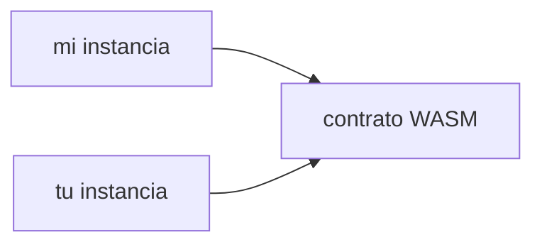

Como puede imaginar, si su instancia de contrato implementado o el código que lo respalda es archivado, no se puede cargar para ejecutar sus invocaciones. Recuerda, hay una relación distintiva de uno a muchos en la cadena entre el código de un contrato y las instancias desplegadas de ese contrato:



Necesitamos **ambos** para que nuestras llamadas de contrato funcionen.

Vamos a trabajar sobre cómo se pueden recuperar. El proceso de recuperación es ligeramente diferente por una razón conveniente: no necesitamos simulación para averiguar las huellas. En su lugar, podemos apalancar [`Contract.getFootprint()`](https://stellar.github.io/js-soroban-client/Contract.html#getFootprint), que prepara una huella con las claves de ledger utilizadas por una instancia de contrato determinada (incluyendo su código WASM).

Desafortunadamente, todavía necesitamos simulación para averiguar las _fees_ para nuestra restauración. Esto, sin embargo, puede ser fácilmente cubierto por el ayudante de SDK [`Server.prepareTransaction()`](https://stellar.github.io/js-soroban-client/Server.html#prepareTransaction), que hará simulaciones y montajes para nosotros.

:::info

Esta guía hace uso de la función `yeetTx` (nombre apropiado) que creamos en [otra guía](../transactions/submit-transaction-wait-js.mdx).

:::

```typescript
importar {
  BASE_FEE,
  Contrato,
  Keypair,
  Networks,
  TransactionBuilder,
  SorobanDataBuilder,
  Operación,
  SorobanRpc,
} de "@stellar/stellar-sdk";

async function restoreContract(
  signer: Keypair,
  c: Contrato,
): Promesa<SorobanRpc.Api.GetTransactionResponse> {
  const instance = c. etFootprint();

  const account = await server.getAccount(signer.publicKey());
  const wasmEntry = await server. etLedgerEntries(
    getWasmLedgerKey(instancia)
  );

  const restoreTx = new TransactionBuilder(account, { fee: BASE_FEE })
    . etNetworkPassphrase(Networks.TESTNET)
    . etSorobanData(
      // Establecer la huella de restauración (recuerda, debería estar en la
      // parte de lectura-escritura!
      nuevo SorobanDataBuilder(). etReadWrite([
        instancia,
        wasmEntrada
      ]). uild(),
    )
    . ddOperation(Operation.restoreFootprint({}))
    .build();

  const preppedTx = await server. repareTransaction(restoreTx);
  preppedTx.sign(signer);
  return yeetTx(preppedTx);
}

function getWasmLedgerKey(entry: xdr.ContractDataEntry): {
  return xdr. edgerKey.contractCode(
    new xdr.LedgerKeyContractCode({
      hash: entry. al().instance().wasmHash()
    })
  );
}
```
