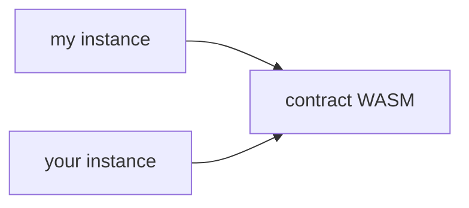

Como puedes imaginar, si tu instancia de contrato desplegada o el código que la respalda está archivado, no se puede cargar para ejecutar tus invocaciones. Recuerda, hay una relación distinta de uno a muchos en la cadena entre el código de un contrato y las instancias desplegadas de ese contrato:



Necesitamos **ambos** que estén en vivo para que nuestras llamadas al contrato funcionen.

Trabajemos en cómo se pueden recuperar. El proceso de recuperación es ligeramente diferente por una razón conveniente: no necesitamos simulación para averiguar las huellas. En su lugar, podemos aprovechar [`Contract.getFootprint()`](https://stellar.github.io/js-soroban-client/Contract.html#getFootprint), que prepara una huella con las claves del ledger utilizadas por una instancia de contrato dada (incluido su código WASM de respaldo).

Desafortunadamente, aún necesitamos simulación para averiguar las _tarifas_ para nuestra restauración. Esto, sin embargo, puede ser fácilmente cubierto por el helper [`Server.prepareTransaction()`](https://stellar.github.io/js-soroban-client/Server.html#prepareTransaction) del SDK, que hará simulación y ensamblaje por nosotros.

:::info

Esta guía hace uso de la función (bien nombrada) `submitTx` que creamos en [otra guía](../transactions/submit-transaction-wait-js.mdx).

:::

```typescript
import {
  BASE_FEE,
  Contract,
  Keypair,
  Networks,
  TransactionBuilder,
  SorobanDataBuilder,
  Operation
} from "@stellar/stellar-sdk";
import { Server, Api } from "@stellar/stellar-sdk/rpc";

const server = new Server("https://soroban-testnet.stellar.org");

async function restoreContract(
  signer: Keypair,
  c: Contract,
): Promise<Api.GetTransactionResponse> {
  const instance = c.getFootprint();

  const account = await server.getAccount(signer.publicKey());
  const wasmEntry = await server.getLedgerEntries(
    getWasmLedgerKey(instance)
  );

  const restoreTx = new TransactionBuilder(account, { fee: BASE_FEE })
    .setNetworkPassphrase(Networks.TESTNET)
    .setSorobanData(
      // Set the restoration footprint (remember, it should be in the
      // read-write part!)
      new SorobanDataBuilder().setReadWrite([
        instance,
        wasmEntry
      ]).build(),
    )
    .addOperation(Operation.restoreFootprint({}))
    .build();

  const preppedTx = await server.prepareTransaction(restoreTx);
  preppedTx.sign(signer);
  return submitTx(preppedTx);
}

function getWasmLedgerKey(entry: xdr.ContractDataEntry):  {
  return xdr.LedgerKey.contractCode(
    new xdr.LedgerKeyContractCode({
      hash: entry.val().instance().wasmHash()
    })
  );
}
```
