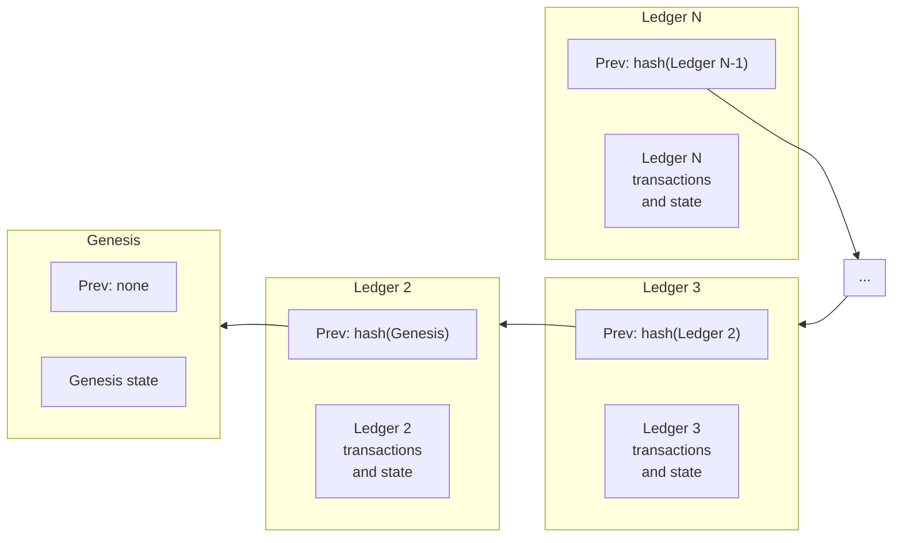

Cada ledger tiene un encabezado que hace referencia a los datos en ese ledger y en el ledger anterior. Estas referencias son hashes criptográficos del contenido que se comportan como punteros en estructuras de datos típicas, pero con garantías de seguridad adicionales. Piensa en una cadena de ledger histórica como una lista vinculada de encabezados de ledger. El tiempo fluye hacia adelante de izquierda a derecha, los hashes apuntan hacia atrás en el tiempo, de derecha a izquierda. Cada hash en la cadena vincula un ledger a su ledger anterior, lo que autentica toda la historia de ledgers en su pasado:

El ledger génesis tiene un número de secuencia de 1. El ledger que sigue directamente a un ledger con número de secuencia `N` tiene un número de secuencia de `N+1`. El ledger `N+1` contiene un hash del ledger `N` en su campo de ledger anterior.

## Campos del encabezado del ledger

### Versión

La versión del protocolo de este ledger.

### Hash del ledger anterior

Hash del ledger anterior.

### Valor SCP

Durante el consenso, todos los nodos validadores en la red ejecutan SCP y acuerdan un valor particular, que es un conjunto de transacciones que aplicarán a un ledger. Este valor se almacena aquí y en los siguientes tres campos (hash del conjunto de transacciones, tiempo de cierre y actualizaciones).

### Hash del conjunto de transacciones

Hash del conjunto de transacciones aplicado al ledger anterior.

### Tiempo de cierre

El tiempo de cierre es una marca de tiempo UNIX que indica cuándo se cierra el ledger. Su precisión depende del reloj del sistema del validador que propone el bloque. En consecuencia, SCP puede confirmar un tiempo de cierre que se retrasa unos segundos o que está hasta 60 segundos adelantado. Es estrictamente monótono: está garantizado que sea mayor que el tiempo de cierre de un ledger anterior.

### Actualizaciones

Cómo la red ajusta valores generales (como la tarifa base) y acuerda cambios a nivel de red (como cambiar a una nueva versión del protocolo). Este campo suele estar vacío. Cuando hay una actualización a nivel de red, el SDF informará y ayudará a coordinar a los participantes utilizando el canal #validators en el Dev Discord y el grupo de Google Stellar Validators.

### Hash del resultado del conjunto de transacciones

Hash de los resultados de aplicar el conjunto de transacciones. Estos datos no son necesarios para validar los resultados de las transacciones. Sin embargo, facilita a las entidades la validación del resultado de una transacción dada sin tener que aplicar el conjunto de transacciones al ledger anterior.

### Hash de la lista de objetos

Hash de todos los objetos en este ledger. La estructura de datos que contiene todos los objetos se llama la lista de objetos.

### Secuencia de ledger

El número de secuencia de este ledger.

### Total de monedas

Número total de lumens en existencia.

### Fondo de tarifas

Número de lumens que se han pagado en tarifas. Nota que esto está denominado en lumens, a pesar de que el campo de tarifa de una transacción está en stroops.

### Secuencia de inflación

Número de veces que se ha ejecutado la inflación. Nota: la operación de inflación fue desaprobada cuando los validadores votaron para actualizar la red a Protocolo 12 el 28/10/2019. Por lo tanto, la inflación ya no se ejecuta, por lo que este número de secuencia ya no cambia.

### Fondo de ID

El último ID global utilizado. Estos IDs se utilizan para generar objetos.

### Número máximo de transacciones

El número máximo de operaciones que los validadores han acordado procesar en un ledger dado. Si se envían más transacciones que este número, la red entrará en modo de precios de sobrecarga. Para más información sobre precios de sobrecarga y estrategias de tarifas, consulta nuestra [sección de tarifas](../../fundamentals/fees-resource-limits-metering.mdx).

### Tarifa base

La tarifa que la red cobra por operación en una transacción. Calculada en stroops. Consulta la [sección de tarifas](../../fundamentals/fees-resource-limits-metering.mdx) para más información.

### Reserva base

La reserva que la red utiliza al calcular el saldo mínimo de una cuenta.

### Lista de salto

Hashes de ledgers en el pasado. Intencionado para acelerar el acceso a ledgers pasados sin retroceder ledger por ledger. Actualmente no utilizado.
