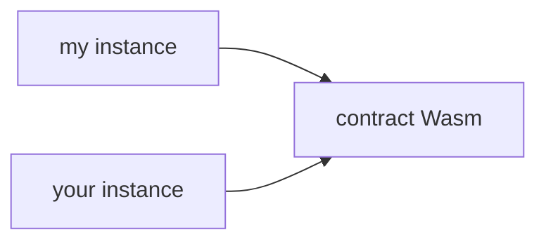

Esta sección ofrece una visión general de los contratos Stellar, describiendo sus conceptos clave sobre contratos inteligentes en la red Stellar.

Aprende a escribir tu primer contrato inteligente Stellar en la [Guía para comenzar](../../../build/smart-contracts/getting-started/setup.mdx).

## Contrato inteligente en WebAssembly (Wasm)

Un contrato inteligente en Stellar es un conjunto programable de binarios ejecutables en WebAssembly (Wasm). WebAssembly (Wasm) es un formato de instrucción binaria ligero y portátil diseñado para ejecución de alto rendimiento en diversos entornos, incluyendo blockchains, navegadores web y servicios en la nube. En Stellar, Wasm funciona como la base para los contratos inteligentes al proporcionar un entorno de ejecución seguro y eficiente.

- **Compilación**: Una vez que el contrato inteligente está escrito en un lenguaje soportado, como Rust, se compila en un archivo ejecutable Wasm. Este archivo contiene un bytecode de bajo nivel que puede ejecutarse eficientemente dentro de un entorno aislado.
- **Carga y almacenamiento**: Tras la compilación, el ejecutable Wasm se carga primero en la red Stellar, donde se almacena en una entrada de libro mayor `CONTRACT_DATA`. La entrada de libro mayor `CONTRACT_DATA` se crea para almacenar los datos binarios Wasm.
- **Se crea un hash único**: Un identificador único para esta entrada `CONTRACT_DATA` es el hash del archivo ejecutable, llamado `Wasm hash`. Cabe señalar que este ejecutable binario se almacena de forma independiente de su contrato(s) desplegado(s).
- **Múltiples instancias de contratos**: Se pueden desplegar múltiples instancias de contratos que referencian el mismo bytecode Wasm, con cada instancia manteniendo su propio almacenamiento, estado y configuraciones del contrato.

## Instancias de contrato

Después de que el bytecode ejecutable se carga en la cadena, se pueden desplegar instancias de contratos que referencian ese mismo bytecode. **Un ejecutable Wasm de contrato puede tener una relación uno a muchos con sus instancias de contrato que funcionan de manera independiente.** Esto significa que el mismo código ejecutable puede usarse en múltiples instancias de contrato que se comportan de manera idéntica debido al código compartido, mientras mantienen datos de estado separados y distintos porque los datos están vinculados a la instancia del contrato. Una instancia de contrato se almacena como su propia entrada en el libro mayor, y cualquier almacenamiento de la instancia del contrato se guarda en esa misma entrada junto con la instancia del contrato. Por lo tanto, los datos almacenados en el almacenamiento de la instancia del contrato tienen un TTL igual al de la propia instancia del contrato. Si un contrato está activo y no ha expirado, el almacenamiento de la instancia también estará garantizado.

:::info Conclusión importante

El bytecode Wasm se almacena por separado de las instancias del contrato desplegado. Esta separación permite que múltiples instancias de contrato referencien el mismo ejecutable Wasm mientras mantienen su propio almacenamiento, estado y configuraciones del contrato.

:::

## Almacenamiento del contrato

Adicionalmente a las entradas del libro mayor creadas durante el proceso de carga/despliegue del contrato, cada contrato puede crear y acceder a su propio conjunto de entradas del libro mayor. Estas entradas del libro mayor (así como el código del contrato y las entradas de la instancia del contrato) están sujetas a los períodos de [archivado de estado](./storage/state-archival.mdx), o comportamiento TTL (tiempo de vida). Cada tipo de almacenamiento tiene estructuras de tarifas distintas, comportamiento TTL (tiempo de vida) y está diseñado para almacenar tipos específicos de datos. Usar el almacenamiento incorrecto puede llevar a errores lógicos en tu aplicación, además de impactar en los costos.

| **Atributo**     | **Almacenamiento temporal**                                                                                                                   | **Almacenamiento persistente**                                                                                             | **Almacenamiento de instancia**                                                                                                   |
| ---------------- | --------------------------------------------------------------------------------------------------------------------------------------------- | -------------------------------------------------------------------------------------------------------------------------- | --------------------------------------------------------------------------------------------------------------------------------- |
| **Tarifas**      | El más barato                                                                                                                                 | El más caro (igual que Instancia)                                                                                          | El más caro (igual que Persistente)                                                                                               |
| **Persistencia** | Eliminado permanentemente cuando se alcanza el TTL del libro mayor                                                                            | Puede archivarse aunque la instancia del contrato esté activa. La vida útil es independiente de la instancia del contrato. | Comparte la vida útil de la instancia del contrato. Datos accesibles si no se alcanza el TTL de la instancia.                     |
| **Recuperación** | No puede restaurarse                                                                                                                          | `RestoreFootprintOp`                                                                                                       | `extendFootprintTTLOp`                                                                                                            |
| **Capacidad**    | Ilimitada                                                                                                                                     | Ilimitado                                                                                                                  | Limitada                                                                                                                          |
| **Casos de uso** | Datos acotados en el tiempo o fácilmente recreables (por ejemplo, precios de oráculos, firmas). No adecuado para verificaciones de corrección | Datos de usuario a largo plazo que deben persistir más allá del TTL (por ejemplo, balances)                                | Estado compartido del contrato ligado a la instancia del contrato (por ejemplo, cuentas de administrador, metadatos del contrato) |

## Invocar contratos

Ahora que aprendiste los conceptos básicos de un contrato Stellar, comprendamos algunos conceptos sobre la invocación de contratos. Cuando una transacción intenta invocar una función del contrato, primero se recupera el bytecode Wasm del libro mayor y se instancia una máquina virtual ("VM") segura y aislada para ejecutar el bytecode del contrato y luego salir. Este enfoque ofrece varias ventajas, incluida la seguridad, ya que la máquina virtual (VM) opera en un entorno aislado y proporciona ejecución determinista.

Para probar la invocación de contratos en Testnet, visita el [explorador de contratos de Stellar Lab](https://lab.stellar.org/smart-contracts/contract-explorer?$=network$id=testnet&label=Testnet&horizonUrl=https:////horizon-testnet.stellar.org&rpcUrl=https:////soroban-testnet.stellar.org&passphrase=Test%20SDF%20Network%20/;%20September%202015;&smartContracts$explorer$contractId=CB2RXGQVNGOMHW3XYCPKREXHD45M4DMJ2PTBETV6P3EMV22QLJFUQHWB;;).

## Información del contrato

El Wasm de un contrato Stellar contiene secciones personalizadas dedicadas. Proporcionan metadatos útiles que las implementaciones pueden usar para mejorar la experiencia del usuario.

- Meta del entorno
- Meta del contrato
- Especificación del contrato

 

_Explora la información del contrato en el [Explorador de Contratos de Stellar Lab](https://lab.stellar.org/smart-contracts/contract-explorer)._

### Meta del entorno

Los contratos deben contener una sección personalizada Wasm llamada `contractenvmetav0` que incluya una `SCEnvMetaEntry` serializada. La versión de interfaz almacenada debe coincidir con la versión de las funciones host soportadas. Para referencia, consulta [CAP-46-1 Env Meta](https://github.com/stellar/stellar-protocol/blob/603a55b018a8ce12ac16aa8621d189d5b78d0d02/core/cap-0046-01.md?plain=1#L508).

Para ver la Meta del Entorno, considera usar el Explorador de Contratos de Stellar Lab o el comando de Stellar CLI `stellar contract info env-meta --contract-id <contract-id>`.

### Meta del contrato

Los contratos pueden incluir opcionalmente una sección personalizada Wasm llamada `contractmetav0`, que contiene un `SCMetaEntry` serializado. Esta sección no es utilizada por la red, pero permite que los contratos incluyan metadatos arbitrarios, incluyendo nombre del contrato, versión, autor, interfaces soportadas, repositorio fuente o dominio principal. Aplicaciones y herramientas pueden leer estos metadatos para ofrecer experiencias de desarrollo más ricas, mejor indexación o mayor descubrimiento de contratos. Para referencia, consulta [SEP-46 Contract Meta](https://github.com/stellar/stellar-protocol/blob/master/ecosystem/sep-0046.md).

Para añadir metadatos a la Meta del Contrato, utiliza el comando Stellar CLI `stellar contract build --meta <meta>`, o usa el SDK de Rust (por ejemplo, `contractmeta!(key="name", val="Defi Swap Contract")`).

Para ver la Meta del Contrato, usa el Explorador de Contratos de Stellar Lab o el comando Stellar CLI `stellar contract info meta --contract-id <contract-id>`.

### Especificación del contrato

Los contratos deben contener una sección personalizada Wasm llamada `contractspecv0` que incluya una secuencia serializada de [`SCSpecEntry`]. Debe haber un [`SCSpecEntry`] por cada función, estructura y unión exportada por el contrato. Para referencia, consulta [SEP-48 Contract Interface Specification](https://github.com/stellar/stellar-protocol/blob/master/ecosystem/sep-0048.md).

Una especificación de contrato es comparable a una ABI (Interfaz Binaria de Aplicación) en Ethereum. Es una descripción estandarizada de la interfaz de un contrato inteligente, típicamente en formato JSON o XDR. Define las funciones del contrato, estructuras de datos, eventos y errores de manera que aplicaciones externas puedan entender y usar.

Cuando compilas un contrato inteligente usando el SDK de Rust, el archivo Wasm resultante incluye una sección especial que contiene una descripción completa de los tipos de interfaz del contrato. Esto se conoce comúnmente como la `spec` del contrato o "especificación de contrato". La especificación del contrato Stellar, conocida como `contract spec`, es un elemento fundamental para interactuar con contratos y crear dApps en la red Stellar. La especificación del contrato proporciona definiciones sólidas y completamente tipadas para interactuar con contratos inteligentes, ofreciendo funcionalidad equivalente a la ABI de Ethereum, abordando sus limitaciones.

La especificación del contrato sirve como una interfaz estandarizada para interactuar con contratos inteligentes Stellar. Similar a las ABIs de Ethereum, pero con ventajas clave:

- Disponibilidad en cadena: Cada especificación de contrato está almacenada en cadena
- Comentarios de desarrollador: Se preservan los comentarios del autor del contrato
- Comunicación fluida entre contratos y aplicaciones externas
- Compatibilidad con el ecosistema completo en herramientas como wallets, exploradores y SDKs

Esta estandarización simplifica las integraciones y acelera el proceso de desarrollo.

#### Definiciones de contrato completamente tipadas

La especificación del contrato garantiza definiciones completamente tipadas para todas las funciones del contrato, entradas y salidas. Esto asegura que:

- Los desarrolladores pueden definir el comportamiento del contrato explícitamente, reduciendo ambigüedad.
- Se minimizan incompatibilidades de tipos y errores en tiempo de ejecución, dando como resultado contratos inteligentes más confiables.
- Las herramientas pueden ofrecer sugerencias y validaciones inteligentes durante el desarrollo.

Al incorporar seguridad de tipos a nivel de protocolo, la especificación del contrato de Stellar crea un entorno de desarrollo más predecible y robusto.

#### Comparación con ABI de Ethereum

La especificación del contrato de Stellar comparte muchas similitudes con la ABI de Ethereum pero también introduce mejoras:

| Característica                    | ABI de Ethereum       | Especificación del contrato Stellar       |
| --------------------------------- | --------------------- | ----------------------------------------- |
| Contratos completamente tipados   | Parcial               | Sí                                        |
| Decodificación y validación       | Manual o externa      | Incorporada                               |
| Enfoque de seguridad              | Moderado              | Alto (seguridad de tipos aplicada)        |

#### Generación de especificaciones de contrato

[El Stellar CLI](https://github.com/stellar/stellar-cli) proporciona un comando para generar una especificación de contrato a partir del código fuente de un contrato. Este proceso es sencillo pero requiere que tengas el binario Wasm del contrato.

A veces, puede que no tengas acceso al código fuente del contrato o la capacidad de compilarlo. En tales casos, debes usar el comando [`stellar contract fetch`](../../../tools/cli/stellar-cli.mdx#stellar-contract-fetch) para descargar el binario Wasm del contrato y generar la especificación.

Finalmente, usamos el comando [`stellar bindings`](../../../tools/cli/stellar-cli.mdx#stellar-contract-bindings-json) para generar la especificación del contrato a partir del binario Wasm.

El Stellar Lab ofrece un [Explorador de Contratos](https://lab.stellar.org/smart-contracts/contract-explorer) que también permite ver y descargar la especificación del contrato.

:::note

Habiendo leído la introducción a un contrato Stellar, intentemos escribir un contrato inteligente siguiendo la [Guía para comenzar](../../../build/smart-contracts/getting-started/README.mdx).

:::

[`scspecentry`]: https://github.com/stellar/stellar-xdr/blob/next/Stellar-contract-spec.x
