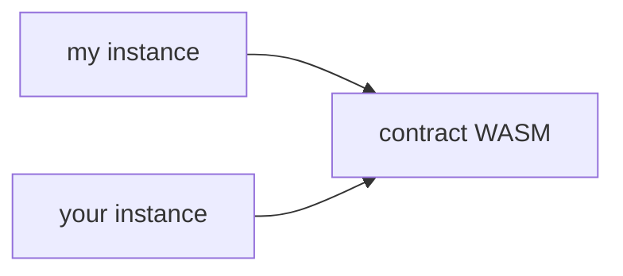

<head>
  <title>Archivado del estado de contratos inteligentes.</title>
  <meta charSet="utf-8" />
  <meta property="og:title" content="Archivado del estado de contratos inteligentes." />
  <meta
    property="og:description"
    content="Aprende cómo funciona el archivado de estado en la plataforma de contratos inteligentes Soroban."
  />
</head>

Los datos del contrato están compuestos por tres tipos diferentes: `Persistent`, `Temporary` e `Instance`. En un contrato, se acceden con `env.storage().persistent()`, `env.storage().temporary()` y `env.storage().instance()` respectivamente; consulta la [documentación de `storage()`](https://docs.rs/soroban-sdk/latest/soroban_sdk/storage/struct.Storage.html).

Aprende a elegir el almacenamiento adecuado para tu caso de uso en esta [Guía práctica](../../../../build/guides/storage/choosing-the-right-storage.mdx) y en otras guías relacionadas con el archivado de estado [aquí](../../../../build/guides/archival).

Todos los datos del contrato tienen un Tiempo de Vida (TTL) que debe extenderse periódicamente. Si el TTL de una entrada no se extiende regularmente, eventualmente llegará a 0 y la entrada será "archivada" o eliminada permanentemente dependiendo del tipo de almacenamiento. Cada tipo de almacenamiento funciona de forma similar, pero con diferentes tarifas y comportamientos de archivado:

- Cuando el TTL de una entrada `Temporary` es 0, se elimina del libro mayor y queda permanentemente inaccesible
- Cuando el TTL de una entrada `Persistent` o `Instance` es 0, se "archiva" y no puede accederse a ella hasta que se "restaure". Hay dos formas de restaurar entradas:
  - (generalmente) Automáticamente cuando una entrada archivada es accedida mediante la operación `InvokeHostFunction`
  - (rara vez) Construyendo manualmente la operación `RestoreFootprintOp`

## Descripciones de tipos de datos de contrato

El uso general e interfaz son idénticos para todos los tipos de almacenamiento. Sólo difieren en tarifas y comportamiento de archivado de la siguiente manera:

### `Temporary`

- Tarifas más económicas.
- Eliminado permanentemente cuando el TTL llega a 0, no puede ser restaurado.
- Adecuado para datos con límite temporal (por ejemplo, oráculos de precios, firmas, etc.) y datos que pueden ser fácilmente recreados.
- Cantidad ilimitada de almacenamiento.

### `Instance`

- Tarifas más costosas (igual precio que almacenamiento `Persistent`).
- Archivada cuando el TTL llega a 0, se restaura automáticamente a través de la operación `InvokeHostFunction` (o se restaura manualmente usando la operación `RestoreFootprintOp` en casos raros).
- Comparte el mismo TTL que la instancia del contrato. Si la instancia del contrato no ha sido archivada, los datos de instancia garantizan estar accesibles y no archivados.
- Cantidad limitada de almacenamiento disponible.
- Adecuado para estados "compartidos" de contrato que no pueden ser `Temporary` (por ejemplo, cuentas de administrador, metadatos del contrato, etc.).

### `Persistent`

- Tarifas más costosas (igual precio que almacenamiento `Instance`).
- Archivada cuando el TTL llega a 0, se restaura automáticamente a través de la operación `InvokeHostFunction` (o se restaura manualmente usando la operación `RestoreFootprintOp` en casos raros).
- No comparte el mismo TTL que la instancia del contrato. Si la instancia del contrato no está archivada, los datos `Persistent` pueden estar archivados y deben restaurarse antes de invocar el contrato.
- Cantidad ilimitada de almacenamiento.
- Adecuado para datos de usuario que no pueden ser `Temporary` (por ejemplo, balances).

## Restauración Automática de Datos de Contrato

A partir del Protocolo 23 ([CAP-0066: Recurso de Lectura en Memoria de Soroban](https://github.com/stellar/stellar-protocol/blob/master/core/cap-0066.md#automatic-entry-restoration)), las entradas de contrato `Persistent` o `Instance` archivadas pueden restaurarse automáticamente antes de que se ejecute una función host, pero solo si están incluidas en la lista de restauración de la transacción. En la práctica, esta lista suele completarse mediante la simulación de la invocación del contrato (a través del RPC de Stellar): si la simulación detecta acceso a una entrada archivada, la añade a la lista de restauración. Cuando se ejecuta la operación `InvokeHostFunction` resultante, esas entradas se restauran primero y luego se ejecuta la función host; los alquileres y tarifas normales aún se aplican.

:::important

Si construyes una transacción manualmente sin ejecutar la simulación (y por lo tanto no incluyes todas las entradas archivadas necesarias en la lista de restauración), la restauración automática no ocurrirá y la transacción fallará al intentar acceder a esas entradas archivadas.

:::

## Buenas prácticas para datos de contrato

Como regla general, el almacenamiento `Temporary` sólo debe usarse para datos que puedan recrearse fácilmente o sean válidos sólo por un tiempo limitado, mientras que el almacenamiento `Persistent` o `Instance` debe usarse para datos que no pueden recrearse y deben conservarse permanentemente, como el balance de tokens de un usuario.

Cada tipo de almacenamiento está en un espacio de clave separado. Para demostrar esto, mira el siguiente fragmento de código:

```rust
const EXAMPLE_KEY: Symbol = symbol_short!("KEY");
env.storage().persistent().set(&EXAMPLE_KEY, 1);
env.storage().temporary().set(&EXAMPLE_KEY, 2);

env.storage().persistent().get(&EXAMPLE_KEY); // Returns Ok(1)
env.storage().temporary().get(&EXAMPLE_KEY); // Returns Ok(2)
```

Todo el almacenamiento `Instance` se guarda en una sola `LedgerEntry` de instancia de contrato y comparte un único TTL. Esto significa que una llamada a `env.storage().instance().extend_ttl()` extenderá el TTL de todas las entradas `Instance`, así como de la propia instancia del contrato. También extenderá la entrada del código del contrato, sobre lo que profundizaremos en la siguiente sección. Para los almacenamientos `Temporary` y `Persistent`, cada entrada tiene su propio TTL y debe extenderse individualmente. La interfaz es un poco diferente y requiere la clave de la entrada a extender junto con el valor de extensión del TTL.

Una llamada a `extend_ttl(N)` asegura que el TTL actual de la entrada de la instancia del contrato sea _al menos_ N libros mayores. Por ejemplo, si se llama a `extend_ttl(100)` y la entrada de la instancia del contrato tiene un TTL actual de 50 libros mayores, el TTL se extenderá hasta 100 libros mayores. Si se llama a `extend_ttl(100)` y la entrada de la instancia del contrato tiene un TTL actual de 150 libros mayores, el TTL no se extenderá y la llamada a `extend_ttl()` no tendrá efecto.

Además de las extensiones de TTL definidas por el contrato usando la función `extend_ttl()`, el TTL de una entrada de datos de contrato puede extenderse mediante la operación [`ExtendFootprintTTLOp`](#extendfootprintttlop).

## Duración del código y de la instancia del contrato

Las entradas de código de contrato y de instancia tienen duraciones, y hay varias formas de extenderlas. Métodos como `env.storage().instance().extend_ttl()` y `env.deployer().extend_ttl()` extienden tanto el código como la instancia del contrato. La verificación del umbral y las extensiones se realizan de forma independiente tanto para el código como para la instancia del contrato, por lo que es posible que uno se extienda y el otro no, dependiendo de los TTL actuales.

Si deseas extender el código o la instancia por separado, puedes usar `env.deployer().extend_ttl_for_code()` y `env.deployer().extend_ttl_for_contract_instance()` respectivamente. Llamar a ambos con los mismos parámetros es equivalente a llamar sólo a `env.deployer().extend_ttl()`.

## Comportamiento de transacciones que intentan acceder a una entrada Persistent archivada

Aquí algunos puntos importantes que debes tener en cuenta respecto a las entradas archivadas:

1. Una transacción Soroban que tiene una clave de una entrada Persistent archivada en la huella fallará inmediatamente durante la etapa de aplicación antes de la ejecución del contrato. No importa si el contrato iba a acceder a la entrada.
2. Debido al punto anterior de que las entradas archivadas nunca llegan a la lógica del contrato inteligente, no hay razón para escribir código en tu contrato para manejar entradas archivadas. Lo mismo aplica para los casos de prueba del contrato: aunque puedas querer escribir pruebas que verifiquen si tu lógica de extensión es correcta, no necesitas escribir pruebas de archivado porque la transacción fallará antes de llegar al contrato. No obstante, es posible acceder a una entrada archivada en un caso de prueba Soroban, caso en el que el host entrará en pánico. Puedes leer más sobre esto en [Pruebas de extensiones TTL](../../../../build/guides/archival/test-ttl-extension.mdx).
3. Las entradas persistentes archivadas nunca se pueden volver a crear. En cambio, deben ser restauradas. Una vez restauradas, pueden ser modificadas o eliminadas.

## Términos y semántica

### Vivir hasta el libro mayor

Cada entrada `ContractData` y `ContractCode` tiene un campo `liveUntilLedger` almacenado en su `LedgerEntry`. La entrada ya no está viva (es decir, está archivada o eliminada dependiendo del tipo de almacenamiento) cuando `current_ledger > liveUntilLedger`.

### TTL

El Tiempo de Vida (TTL) de una entrada se define como cuántos libros restantes quedan hasta que la entrada deje de estar viva. Por ejemplo, si el libro actual es 5 y una entrada tiene `liveUntilLedger` en 15, entonces su TTL es de 10 libros.

### TTL mínimo

Para cada tipo de entrada, existe un TTL mínimo que la entrada tendrá al crearse o restaurarse. Este mínimo TTL se aplica automáticamente a nivel de protocolo.

TTL mínimo es un parámetro de la red. Consulta la [referencia de recursos](../../../../networks/resource-limits-fees.mdx) para conocer los valores actuales.

### TTL máximo

En cualquier libro, el TTL de una entrada puede extenderse hasta el TTL máximo. Este es un parámetro de red (consulta la [tabla de límites de recursos](../../../../networks/resource-limits-fees.mdx) para conocer el TTL máximo actual). El TTL máximo no se aplica basándose en la fecha de creación de la entrada, sino en el libro actual. Por ejemplo, si una entrada se crea el 1 de enero de 2024, su TTL inicial podría extenderse hasta el 1 de enero de 2025. Después de esta extensión inicial, si la entrada recibe otra extensión el 10 de enero de 2024, el TTL podría extenderse hasta el 10 de enero de 2025. La función `max_ttl()` puede usarse para determinar el TTL máximo permitido actual.

## Operaciones

### ExtendFootprintTTLOp

#### Semántica

XDR:

```
/*
    Threshold: low
    Result: ExtendFootprintTTLResult
*/
struct ExtendFootprintTTLOp
{
    ExtensionPoint ext;
    uint32 extendTo;
};
```

`ExtendFootprintTTLOp` es una operación Soroban que extenderá el valor de live until ledger de las entradas especificadas en el _conjunto de sólo lectura de la huella_. El conjunto de lectura-escritura debe estar vacío. La extensión asegurará que el TTL de las entradas sea al menos extendTo libros mayores a partir de ahora.

Veamos este ejemplo a continuación.

```
Ex. Last closed ledger (LCL) = 5, Current Ledger = 6, liveUntilLedger = 8

entry1.liveUntilLedger = 10
entry2.liveUntilLedger = 14
entry3.liveUntilLedger = 10000

entry1.liveUntilLedger will be updated to 14 so it will live for 8 more ledgers, including
the current ledger, and the entry can be accessed in ledgers [6, 13].

entry2 and entry3 will not be updated because they already have an
liveUntilLedger that is large enough.
```

#### Recursos de la transacción

`ExtendFootprintTTLOp` es una operación Soroban y, por lo tanto, debe ser la única operación en una transacción. La transacción también debe completar la extensión de transacción `SorobanTransactionData` explicada [aquí](../contract-interactions/stellar-transaction.mdx#transaction-resources). Para completar `SorobanResources`, usa la simulación de la transacción mencionada en el enlace proporcionado, o asegúrate de que `readBytes` incluya la clave y tamaño de entrada de cada entrada en el conjunto `readOnly`.

### RestoreFootprintOp

`RestoreFootprintOp`, en general, ya no es necesario a partir del Protocolo 23, ya que las entradas archivadas se restauran automáticamente cuando aparecen en una huella durante `InvokeHostFunctionOp`.

`RestoreFootprintOp` todavía puede usarse en casos de uso raros, tales como:

- Si la restauración automática hace que una transacción sea demasiado grande para ajustarse a los límites de la red, la restauración puede realizarse por separado mediante `RestoreFootprintOp`
- Si los desarrolladores de contratos quieren asegurarse de pagar las tarifas de restauración (en lugar de sus usuarios), pueden restaurar sus entradas bajo demanda con `RestoreFootprintOp`

XDR:

```
/*
    Threshold: low
    Result: RestoreFootprintOp
*/
struct RestoreFootprintOp
{
    ExtensionPoint ext;
};
```

`RestoreFootprintOp` es una operación Soroban que restaurará las entradas archivadas especificadas en el _conjunto de lectura-escritura de la huella_ y las hará accesibles nuevamente. El conjunto de sólo lectura de la huella debe estar vacío. Una entrada archivada es aquella cuyo liveUntilLedger es menor que el número de libro actual. **Sólo las entradas persistent y instance pueden ser restauradas.**

La entrada restaurada tendrá su live until ledger extendido al [mínimo] que la red permite para entradas recién creadas, que es `current_ledger_number + 4095` para entradas persistent. El valor mínimo de TTL es un parámetro de configuración de la red y puede actualizarse (probablemente aumentado) mediante actualizaciones de red.

[mínimo]: https://github.com/stellar/stellar-core/blob/2109a168a895349f87b502ae3d182380b378fa47/src/ledger/NetworkConfig.h#L77-L78

#### Recursos de la transacción

`RestoreFootprintOp` es una operación Soroban y, por lo tanto, debe ser la única operación en una transacción. La transacción también debe completar la extensión de transacción `SorobanTransactionData` explicada [aquí](../contract-interactions/stellar-transaction.mdx#transaction-resources). Para completar `SorobanResources`, usa la simulación de la transacción mencionada en el enlace proporcionado, o asegúrate de que `writeBytes` incluya la clave y tamaño de entrada de cada entrada en el conjunto `readWrite` y que `extendedMetaDataSizeBytes` sea al menos el doble de `writeBytes`.

---

## Ejemplos

Hemos hecho lo posible para construir herramientas alrededor del archivado de estado tanto en el servidor RPC de Stellar como en el SDK de JavaScript para facilitar su uso, y este conjunto de ejemplos demuestra cómo aprovecharlo.

### Resumen

:::info

La operación manual (`RestoreFootprintOp`) ya no es necesaria en la mayoría de los casos a partir del Protocolo 23, ya que las entradas archivadas se restauran automáticamente cuando aparecen en una huella durante `InvokeHostFunctionOp`. `RestoreFootprintOp` puede usarse en casos raros descritos [arriba](#restorefootprintop).

:::

Tanto restaurar como extender el TTL de entradas del libro sigue un proceso de tres pasos, sin importar su naturaleza (datos de contrato, instancias, etc.):

1. **Identificar las entradas del libro.** Esto generalmente significa obtenerlas desde un servidor RPC Stellar como parte de la simulación inicial de tu transacción (consulte la [documentación de simulación de transacciones](../contract-interactions/transaction-simulation.mdx) y el método RPC [`simulateTransaction`](../../../../data/apis/rpc/api-reference/methods/simulateTransaction.mdx)).

2. **Preparar tu operación.** Esto implica describir las entradas del libro mayor dentro de la operación correspondiente (es decir, `ExtendFootprintTTLOp` o `RestoreFootprintOp`) y su huella del libro mayor (el campo `SorobanTransactionData`), y luego simularla para completar la información de tarifas y uso de recursos (al restaurar, normalmente ya se tienen los resultados de la simulación).

3. **Enviar la transacción** y empezar de nuevo con lo que querías hacer en primer lugar.

Cada uno de los ejemplos siguientes seguirá una estructura similar. Trabajaremos con dos escenarios diferentes:

1. [un dato persistent en mi contrato está archivado](#example-my-data-is-archived)
2. [mi instancia de contrato o el WASM están archivados](#example-my-contract-is-archived)

Recuerda que, sin embargo, cualquier combinación de estos escenarios puede ocurrir en la realidad.

### Preparación

Para facilitar la estructuración del código, reutilizaremos la función básica de sondeo de transacciones con reintentos habilitados `submitTx`, que describimos en [otra guía](../../../../build/guides/transactions/submit-transaction-wait-js.mdx).

En el siguiente código, también aprovecharemos [`Server.prepareTransaction`](https://stellar.github.io/js-stellar-sdk/module-rpc.Server.html#prepareTransaction). Este es un método útil que, dado un transaction, lo simula, luego modifica la transacción con los resultados de la simulación (tarifas, etc.) y devuelve eso. Luego, sólo puede firmarse y enviarse. También usaremos [`SorobanDataBuilder`](https://stellar.github.io/js-stellar-sdk/SorobanDataBuilder.html), una abstracción conveniente que nos permite usar un [patrón Builder](https://es.wikipedia.org/wiki/Patr%C3%B3n_builder) para establecer las huellas de almacenamiento apropiadas para una transacción.

### Ejemplo: ¡Mis datos están archivados!

Comenzaremos con la ocurrencia más probable: mi dato persistent está archivado porque no he interactuado con mi contrato en un tiempo. ¿Cómo puedo hacerlo accesible de nuevo?

En este ejemplo, asumiremos dos cosas: el contrato en sí sigue activo (es decir, otros han estado extendiendo su TTL mientras no estabas) y no sabes cómo se representa tu dato archivado en el libro mayor. Si lo supieras, podrías saltarte los pasos a continuación donde lo averiguamos y simplemente preparar la huella de restauración directamente. El proceso involucra tres pasos discretos:

1. Simula nuestra transacción como normalmente lo harías.
2. Si la simulación lo indica, realizamos la restauración a través de [`Operation.restoreFootprint`](https://stellar.github.io/js-stellar-sdk/Operation.html#.restoreFootprint) usando sus sugerencias.
3. Reintentos para ejecutar nuestra transacción inicial.

Veamos eso en código:

```typescript
import {
  BASE_FEE,
  Networks,
  Keypair,
  TransactionBuilder,
  SorobanDataBuilder,
  rpc as StellarRpc,
  xdr,
} from "@stellar/stellar-sdk"; // add'l imports to preamble
const { Api, assembleTransaction } = StellarRpc;

// assume that `server` is the Server() instance from the preamble

async function submitOrRestoreAndRetry(
  signer: Keypair,
  tx: Transaction,
): Promise<Api.GetTransactionResponse> {
  // We can't use `prepareTransaction` here because we want to do
  // restoration if necessary, basically assembling the simulation ourselves.
  const sim = await server.simulateTransaction(tx);

  // Other failures are out of scope of this tutorial.
  if (!Api.isSimulationSuccess(sim)) {
    throw sim;
  }

  // If simulation didn't fail, we don't need to restore anything! Just send it.
  if (!Api.isSimulationRestore(sim)) {
    const prepTx = assembleTransaction(tx, sim);
    prepTx.sign(signer);
    return submitTx(prepTx);
  }

  //
  // Build the restoration operation using the RPC server's hints.
  //
  const account = await server.getAccount(signer.publicKey());
  let fee = parseInt(BASE_FEE);
  fee += parseInt(sim.restorePreamble.minResourceFee);

  const restoreTx = new TransactionBuilder(account, { fee: fee.toString() })
    .setNetworkPassphrase(Networks.TESTNET)
    .setSorobanData(sim.restorePreamble.transactionData.build())
    .addOperation(Operation.restoreFootprint({}))
    .build();

  restoreTx.sign(signer);

  const resp = await submitTx(restoreTx);
  if (resp.status !== Api.GetTransactionStatus.SUCCESS) {
    throw resp;
  }

  //
  // now that we've restored the necessary data, we can retry our tx using
  // the initial data from the simulation (which, hopefully, is still
  // up-to-date)
  //
  const retryTxBuilder = TransactionBuilder.cloneFrom(tx, {
    fee: (parseInt(tx.fee) + parseInt(sim.minResourceFee)).toString(),
    sorobanData: sim.transactionData.build(),
  });
  // because we consumed a sequence number when restoring, we need to make sure
  // we set the correct value on this copy
  retryTxBuilder.source.incrementSequenceNumber();

  const retryTx = retryTxBuilder.build();
  retryTx.sign(signer);

  return submitTx(retryTx);
}
```

Observa que cuando la restauración es necesaria, **la simulación aún tiene éxito**. La forma en que sabemos que algo debe restaurarse es la presencia de la estructura `restorePreamble` en la respuesta del RPC. Esto contiene tanto la huella como la tarifa necesarias para la restauración, mientras que el resto de la respuesta contiene la simulación de la invocación **como si** la restauración se hubiera hecho primero.

Esto es genial, ya que significa menos viajes para comenzar de nuevo.

### Ejemplo: ¡Mi contrato está archivado!

Como puedes imaginar, si la instancia de contrato desplegada o el código que la respalda están archivados, no pueden cargarse para ejecutar tus invocaciones. Recuerda que hay una relación distinta de uno a muchos en la cadena entre el código de un contrato y las instancias desplegadas de ese contrato:



Necesitamos que **ambos** estén activos para que nuestras llamadas al contrato funcionen.

Veamos cómo se pueden recuperar. El proceso de recuperación es un poco diferente: mientras que no necesitamos simulación para determinar las huellas, sí necesitamos hacer una consulta adicional a la entrada del libro mayor. Podemos usar [`Contract.getFootprint()`](https://stellar.github.io/js-stellar-sdk/Contract.html#getFootprint) para obtener la clave del libro usada por una instancia de contrato dada, pero eso no nos dará su código WASM de respaldo. Para eso, recrearemos [este ejemplo](../../../../data/apis/rpc/api-reference/methods/getLedgerEntries.mdx#requesting-a-contracts-wasm-code) aquí.

También necesitamos la simulación para conocer las tarifas de nuestra restauración. Esto, sin embargo, puede cubrirse fácilmente con el ayudante [`Server.prepareTransaction`](https://stellar.github.io/js-stellar-sdk/module-rpc.Server.html#prepareTransaction) del SDK, que hace la simulación y el ensamblado por nosotros:

```typescript
import {
  BASE_FEE,
  Contract,
  Keypair,
  Networks,
  TransactionBuilder,
  SorobanDataBuilder,
  Operation,
  rpc as StellarRpc,
} from "@stellar/stellar-sdk";

async function restoreContract(
  signer: Keypair,
  c: Contract,
): Promise<StellarRpc.Api.GetTransactionResponse> {
  const instance = c.getFootprint();

  const account = await server.getAccount(signer.publicKey());
  const wasmEntry = await server.getLedgerEntries(
    getWasmLedgerKey(instance)
  );

  const restoreTx = new TransactionBuilder(account, { fee: BASE_FEE })
    .setNetworkPassphrase(Networks.TESTNET)
    .setSorobanData(
      // Set the restoration footprint (remember, it should be in the
      // read-write part!)
      new SorobanDataBuilder().setReadWrite([
        instance,
        wasmEntry
      ]).build(),
    )
    .addOperation(Operation.restoreFootprint({}))
    .build();

  const preppedTx = await server.prepareTransaction(restoreTx);
  preppedTx.sign(signer);
  return submitTx(preppedTx);
}

function getWasmLedgerKey(entry: xdr.ContractDataEntry):  {
  return xdr.LedgerKey.contractCode(
    new xdr.LedgerKeyContractCode({
      hash: entry.val().instance().wasmHash()
    })
  );
}
```

Lo bueno de este método es que restaurará tanto la instancia como el código WASM subyacente si es necesario, omitiendo cualquiera si ya están en el estado del libro mayor.

[`restorefootprintop`]: #RestoreFootprintOp
[`extendfootprintttlop`]: #ExtendFootprintTTLOp
