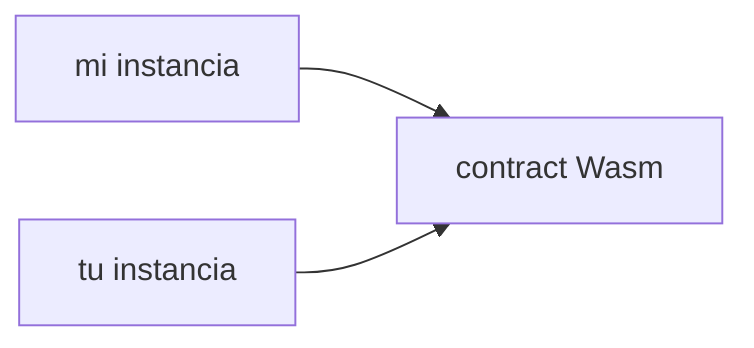

:::note

Stellar ha integrado una plataforma de contratos inteligentes llamada "[Soroban](../../../build/smart-contracts/getting-started/README.mdx)" en el protocolo central.

:::

Un contrato inteligente es un conjunto programado de código ejecutable y estado que puede ser invocado o utilizado en la red Stellar.

## Desperdicio

Una vez que un desarrollador ha escrito un contrato inteligente y compilado en un archivo ejecutable de WebAssembly (Wasm) puede ser "instalado" en la red Stellar. Se crea un `CONTRACT_DATA` [entrada ledger](./ledgers.mdx) para almacenar estos datos binarios y su identificador único es el hash del archivo ejecutivo. Este ejecutable binario se almacena independientemente de el(los) contrato(s) desplegados. Cuando una transacción estelar intenta invocar una función de contrato, el bytecode Wasm es recuperado por primera vez del contador y una seguridad, la máquina virtual de tiempo de ejecución aislado ("VM") es instanciada para que pueda ejecutar el código de byte para el contrato y luego salir.

## Contrato de instancias

Después de que el bytecode ejecutable se instale en cadena, se pueden desplegar instancias de contrato que hacen referencia al bytecode aformtionado. Un ejecutable de contrato inteligente puede tener una relación de uno a muchos con "instancias de contrato" que funcionan independientemente. Esto significa que el mismo código ejecutable puede ser usado por múltiples instancias de contrato que todos se comportan de forma idéntica (debido al código ejecutable compartido), mientras se mantienen datos de estado separados y distintos (porque los datos están vinculados a la instancia del contrato). Una instancia de contrato se almacena como su propia entrada de notario, y cualquiera de los [almacenamiento de instancias](#instance-storage) del contrato se almacena en esa misma entrada de ledger junto a la instancia del contrato.

## Almacenamiento de Contratos

Además de las entradas registradas que se crean durante el proceso de instalación/despliegue del contrato, cada contrato puede crear y acceder a su propio conjunto de entradas del libro de notas. Estas entradas del libro principal (así como el código del contrato y las entradas del libro de cuentas de la instancia del contrato) están sujetas a [archivo de estado](. /../encyclopedia/storage/state-archival.mdx) Lifetimes (una entrada de ledger "TTL ledger"). Si bien todos funcionan de forma similar, cada tipo tiene su propia cuota y comportamiento TTL.

### Almacenamiento temporal

- Cuotas incómodas.
- Eliminado de forma permanente cuando se alcanza su libro superior TTL, no se puede restaurar.
- Adecuado para datos de tiempo límite (es decir, oráculos de precios, firmas, etc.) y datos fácilmente recreados.
- Cantidad ilimitada de almacenamiento.

### Almacenamiento persistente

- Tarifas más caras (mismo precio que el almacenamiento `Instance`).
- Recuperable después del archivo, puede ser restaurado usando la operación [`RestoreFootprintOp`](../transactions/list-of-operations.mdx#restore-footprint).
- No comparte la misma vida que la instancia del contrato. Si la instancia del contrato no ha alcanzado su contador TTL, los datos `Persistent` pueden ser archivados y necesitan ser restaurados antes de invocar el contrato.
- Cantidad ilimitada de almacenamiento.
- Adecuado para datos de usuario que no pueden ser `Temporary` (es decir, balanzas).

### Almacenamiento de instancias

:::info

Mientras que aquí estamos haciendo una distinción entre almacenamiento "persistente" e "instancia", el almacenamiento de instancias es realmente sólo un tipo de almacenamiento persistente y abstractado. Bajo el capó, el almacenamiento de la instancia funciona igual que el almacenamiento persistente, excepto que su TTL está vinculado a la instancia del contrato.

:::

- Tarifas más caras (mismo precio que el almacenamiento `Persistent`).
- Recuperable después del archivo, puede ser restaurado usando la operación [`extendFootprintTTLOp`](../transactions/list-of-operations.mdx#extend-footprint-ttl).
- Comparte la misma vida que la instancia contratada. Si la instancia del contrato no ha alcanzado su contador TTL, se garantiza que los datos de la instancia sean accesibles.
- Almacenamiento limitado disponible.
- Adecuado para el estado del contrato "compartido" que no puede ser `Temporario` (es decir, cuentas de administración, metadatos del contrato, etc.).
