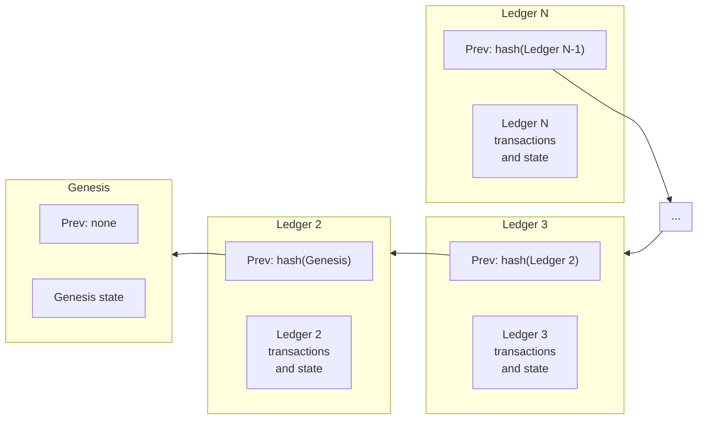

# Lederes

Un libro de contabilidad representa el estado de la red Stellar en un momento determinado. Se comparte entre todos los nodos principales de la red y contiene la lista de cuentas y saldos, órdenes en el exchange distribuido, datos de contratos inteligentes, y cualquier otro dato que persista.

:::note

Las blockchains suelen referirse al **ledger** como el registro completo de todas las transacciones en la blockchain y a los **blocks** como unidades individuales de datos que contienen una colección de transacciones. En Stellar, "ledger" puede referirse a ambos.

:::

En cada ronda del Stellar Consensus Protocol, la red alcanza consenso sobre qué conjunto de transacciones aplicar al último libro de contabilidad cerrado, y cuando se aplica el nuevo conjunto, se define un nuevo “último libro de contabilidad cerrado”. Cada libro de contabilidad está vinculado criptográficamente al libro de contabilidad anterior único, creando una cadena histórica que se remonta al libro de contabilidad génesis.

Los datos se almacenan en el libro de contabilidad como entradas de libro de contabilidad. Las posibles entradas de libro de contabilidad incluyen:

- [Cuentas](./accounts.mdx)
- [Saldos reclamables](../../../build/guides/transactions/claimable-balances.mdx)
- [Pools de liquidez](../../fundamentals/liquidity-on-stellar-sdex-liquidity-pools.mdx)
- [Datos del contrato](../../fundamentals/contract-development/storage/persisting-data.mdx#ledger-entries)

## Encabezados del ledger

Cada ledger tiene un encabezado que hace referencia a los datos de ese ledger y del ledger anterior. Estas referencias son hashes criptográficos del contenido que funcionan como punteros en estructuras típicas de datos, pero con garantías de seguridad añadidas. Piensa en una cadena histórica de ledgers como una lista enlazada de encabezados de ledgers. El tiempo avanza de izquierda a derecha, los hashes apuntan hacia atrás en el tiempo, de derecha a izquierda. Cada hash en la cadena vincula un ledger con su ledger anterior, lo que autentica toda la historia de ledgers en su pasado:

El ledger génesis tiene un número de secuencia de 1. El ledger que sigue directamente a un ledger con número de secuencia `N` tiene un número de secuencia de `N+1`. El ledger `N+1` contiene un hash del ledger `N` en su campo del ledger anterior.

## Campos del encabezado del ledger

### Versión

La versión del protocolo de este ledger.

### Hash del ledger anterior

Hash del ledger anterior.

### Valor SCP

Durante el consenso, todos los nodos validadores en la red ejecutan SCP y acuerdan un valor particular, que es un conjunto de transacciones que aplicarán a un ledger. Este valor se almacena aquí y en los siguientes tres campos (hash del conjunto de transacciones, tiempo de cierre y actualizaciones).

### Hash del conjunto de transacciones

Hash del conjunto de transacciones aplicado al ledger anterior.

### Tiempo de cierre

El tiempo de cierre es una marca temporal UNIX que indica cuándo cierra el ledger. Su precisión depende del reloj del sistema del validador que propone el bloque. Consecuentemente, SCP puede confirmar un tiempo de cierre que se retrasa unos segundos o que puede adelantarse hasta 60 segundos. Es estrictamente monótono: se garantiza que es mayor que el tiempo de cierre de un ledger anterior.

### Actualizaciones

Cómo la red ajusta valores generales (como la tarifa base) y acuerda cambios a nivel de red (como el cambio a una nueva versión del protocolo). Este campo suele estar vacío. Cuando hay una actualización a nivel de red, el SDF informa y ayuda a coordinar a los participantes usando el canal #validators en el Discord de desarrolladores y el Grupo de Google Stellar Validators.

### Hash del resultado del conjunto de transacciones

Hash de los resultados de la aplicación del conjunto de transacciones. Estos datos no son necesarios para validar los resultados de las transacciones. Sin embargo, facilitan a las entidades validar el resultado de una transacción dada sin tener que aplicar el conjunto de transacciones al ledger anterior.

### Hash de la lista de buckets

Hash de todos los objetos en este ledger. La estructura de datos que contiene todos los objetos se llama lista de buckets.

### Secuencia del ledger

El número de secuencia de este ledger.

### Total de monedas

Número total de lumens en existencia.

### Fondo de tarifas

Número de lumens que se han pagado en tarifas. Nota que esto está denominado en lumens, aunque el campo de tarifa de una transacción está en stroops.

### Secuencia de inflación

Número de veces que se ha ejecutado la inflación. Nota: la operación de inflación fue descontinuada cuando los validadores votaron para actualizar la red al Protocolo 12 el 28/10/2019. Por lo tanto, la inflación ya no se ejecuta y este número de secuencia ya no cambia.

### Fondo de IDs

El último ID global usado. Estos ID se utilizan para generar objetos.

### Número máximo de transacciones

El número máximo de operaciones que los validadores han acordado procesar en un ledger determinado. Si se envían más transacciones que este número, la red entrará en modo de precios dinámicos. Para más información sobre precios dinámicos y estrategias de tarifas, consulta nuestra [sección de tarifas](../../fundamentals/fees-resource-limits-metering.mdx).

### Tarifa base

La tarifa que la red cobra por operación en una transacción. Calculado en stroops. Consulta la [sección de tarifas](../../fundamentals/fees-resource-limits-metering.mdx) para más información.

### Reserva base

La reserva que la red usa al calcular el saldo mínimo de una cuenta.

### Lista de omisión

Hashes de ledgers anteriores. Diseñada para acelerar el acceso a ledgers anteriores sin tener que retroceder ledger por ledger. Actualmente no se utiliza.
